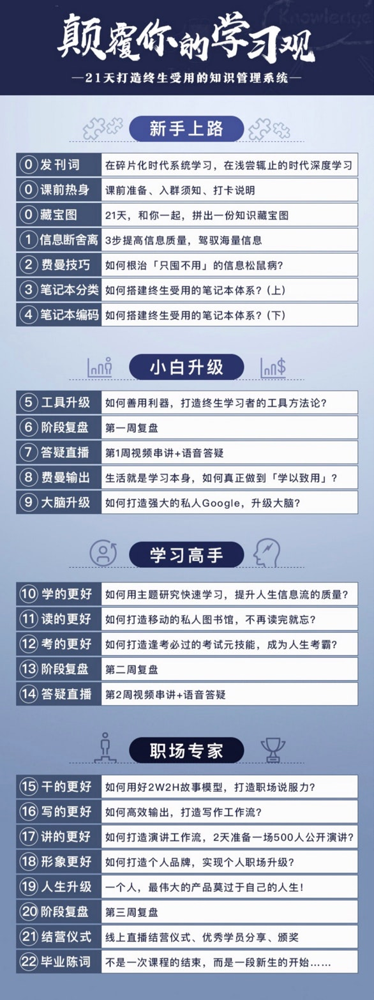

# 00 发刊词 - 在碎片化时代系统学习，在浅尝辄止的时代深度学习

上篇文章，我总结了这个课程的内容，接下来我们来看看**作者怎么介绍他的课程**的，以及课程可以学到什么，然后我们再去看看是否需要学习~

前方预警：这句话是核心，会被反复提到：**在碎片化时代系统学习，在浅尝辄止的时代深度学习。**




## 1. 课程安排
课程时间：**21天** ```(其实是15天的课程内容，有6天是复习+答疑)```

## 2. 课程表
21天做什么？**打造终生知识OS**```( 知识 管理 系统)```

## 3. 提了些问题并进行了解答
- 什么是学习？
- 为什么我们**付费**买来的不是知识而是**焦虑**？
	
2016是知识付费的元年，"得到"，"樊登"，”喜马拉雅FM“ 等崛起。
现在还有 通过微信 链接 **知识星球，小鹅通** 等方式。
	
付费交的是"智商税"？只是眼袋多长了一点，头发多掉了几根，**然并卵**，生活还是原来的样子。
因为，我们**做不到**像文章说的那样，于是**焦虑**了。

### 为什么花钱买的只是和道理不能转化成自己的力量？如何转化成自己的力量？

#### 1. 学习策略，没有跟上这个碎片化的信息时代
	
-> 以前在学校，有大块的时间学习
-> 现在只有**碎片化**的时间，学习的时间和环境变了
-> 但你的思维还**停留**在学生时期，没有长大 
-> 你总会想：什么时候有大块时间，然后啥也没学成 
-> **只有彻底适应这个碎片化的时代，化整为零，变成一个整体性的主题研究，变成一个知识树，才有可能解决学习成果问题**
  
#### 2. 学习方法，没有构成整体性的学习体系
	
碎片化信息时代，需要科学的学习方法论，停留在不成体系，非科学化很难解决“碎片化时代系统性学习”这个宏大主题 
你需要的是一个精巧的系统，见效慢，单一劳永逸真正解决问题的学习系统，用21天掌握一个学习科学化的的解决方案
    
#### 3. 学习工具和自我管理(工具论)

印象笔记(EverNote)：可检索，可同步，迭代，随时查阅，快速手机，化整为零
番茄钟：科学管理时间，可查看(番茄工作法系列内容)

---

知识管理训练营，21天构建个人知识体系，为你赋能，伴你成长，自我实现

收藏成千上万干货文章，不看弃之可惜；
学习了很多东西，用不起来；
深受信息焦虑侵害，无法克服；
 
用21天的努力，42个番茄时间的严肃学习，打造碎片化时代的系统化学习解决方案。
