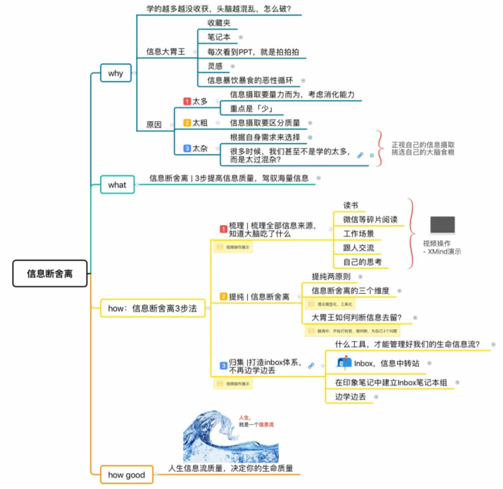
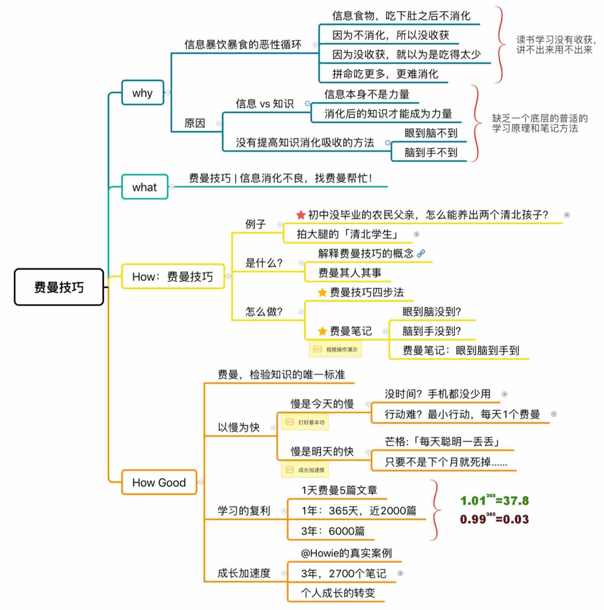
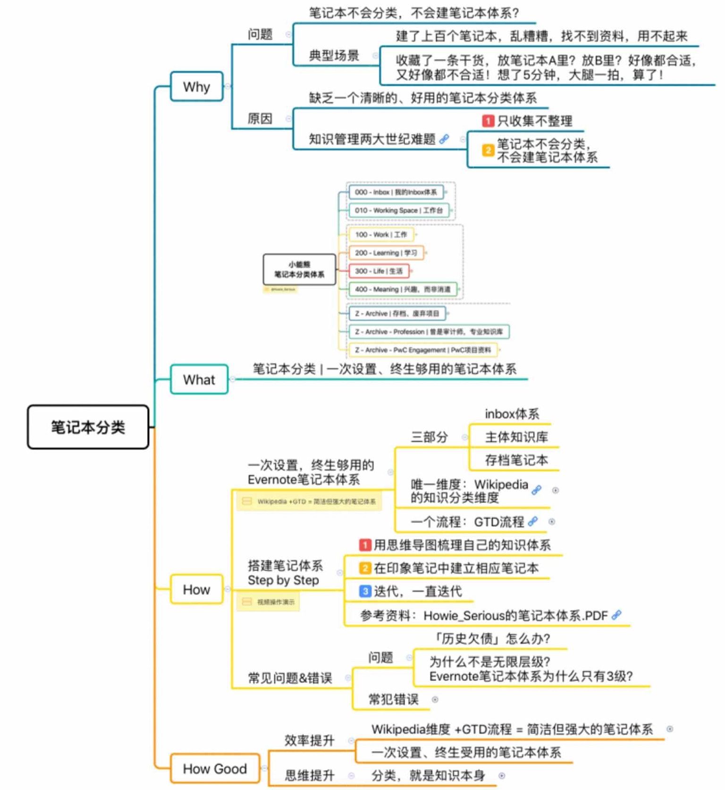
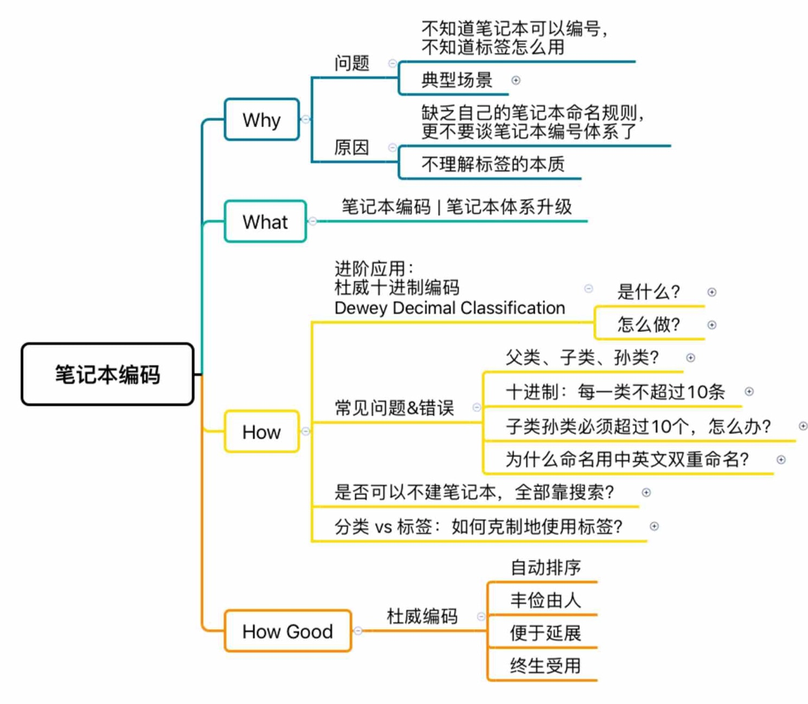
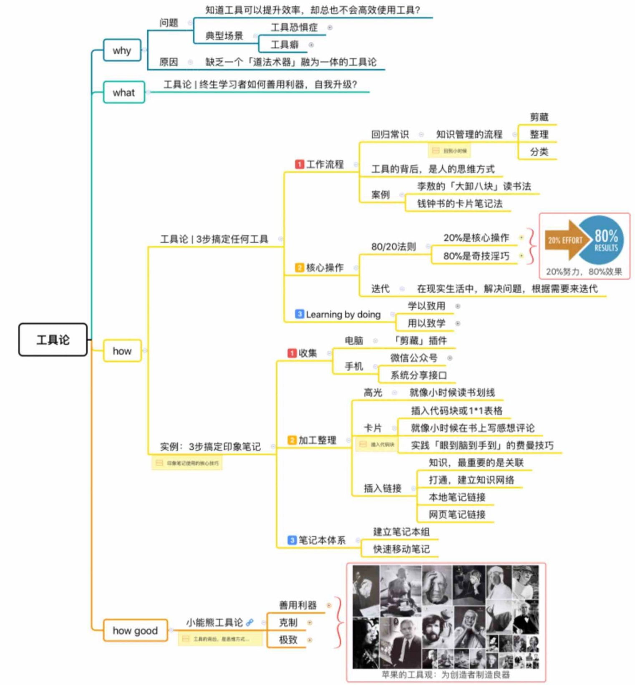

 # Day 06：第 1 阶段复盘(Day 1 - 5 思维导图)

温习本周课程每一课的思维导图（在每日课程末尾
「今日总结」部分，每张图总计了当日课程要点）

## Day01 信息断舍离

[01.信息断舍离](./01.信息断舍离.md)

## Day02 费曼技巧

[02.费曼技巧](./02.费曼技巧.md)

## Day 03.笔记本分类

[03.笔记本分类](./03.笔记本分类.md)

## Day04 笔记本命名和编码

[04.笔记本命名和编码](./04.笔记本命名和编码.md)

## Day05 工具方法论

[05.工具方法论](./05.工具方法论.md)

