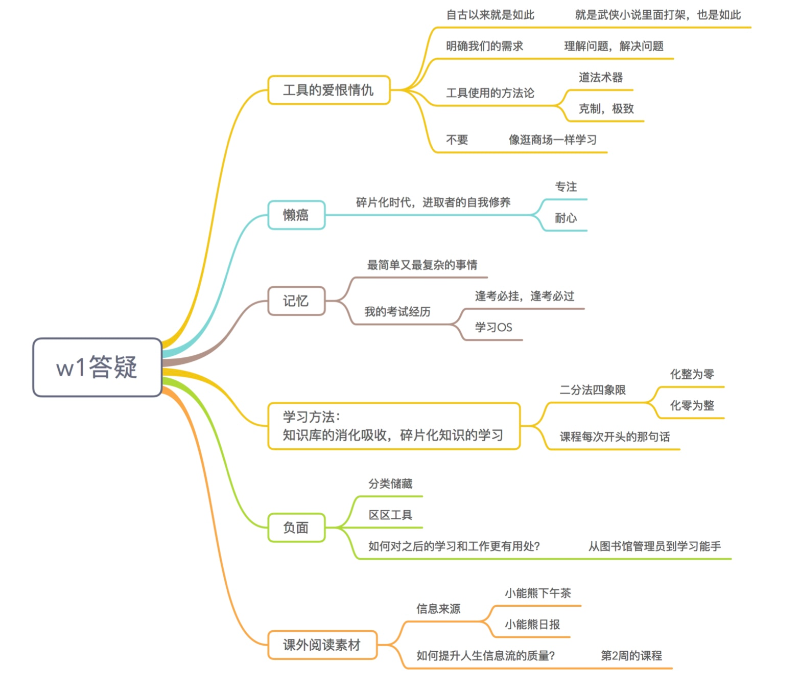
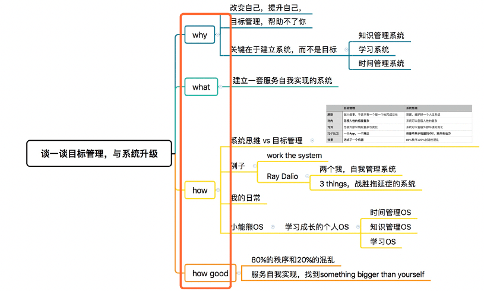

# 07.第1周答疑+串讲

##答疑

### 第1周答疑-思维导图

---

以下为 写作工作流的部分内容，先预先分享一下，后面会有完整文章

### 1.用XMind画思维导图

XMind使用自己设计的主题样式和思考框架（费曼模型），5分钟时间搭建了一篇文章的骨架

- Why：场景引入，你为什么要听我说
- What：我说的是什么，明确概念和主题，一句话总结自己的观点
- How：我认为要怎么做
- How Good：做了之后效果有多好

### 2.录音宝/讯飞语记/讯飞听见

打开了「录音宝」，对着这个XMind文件，口述文章，讲了10分钟
即：将思维导图转成文字

### 3.打开Forest做番茄
属于我今天「3 things」中的一项，计划投入4个番茄

### 4.写作工作流的下一步，是用OmniOutliner搭框架
直接在XMind的文章思考框架上精简
每一段都是费曼技巧，用Markdown语法来写作

#### 文章内容的进一步修饰
加入案例，加入数据、他人观点、故事等素材，要精炼语言

如何快速而准确地引用这些素材？
这又得靠Evernote这个外脑加上脖子上的这个内脑了

#### 文章后期和排版
PS: 135编辑器，创客贴……

#### 图片素材都用Eagle管理
（每个人都付费，不便宜），在Google Drive里面同步

#### 图片素材都用Keynote制作
由于已经整理好了模板，几秒钟就做出我想要的图片。

#### 图床
自动上传工具iPic+七牛云图床，实现图片一键上传，以Markdown语法的形式粘贴为图片链接

