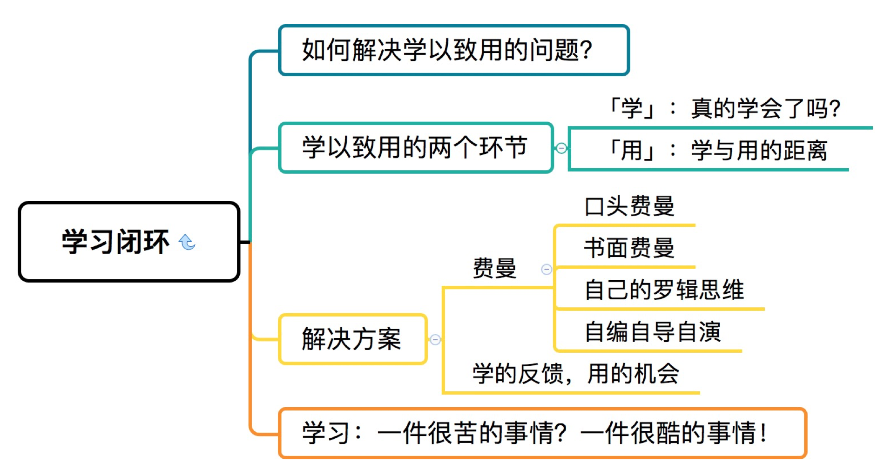
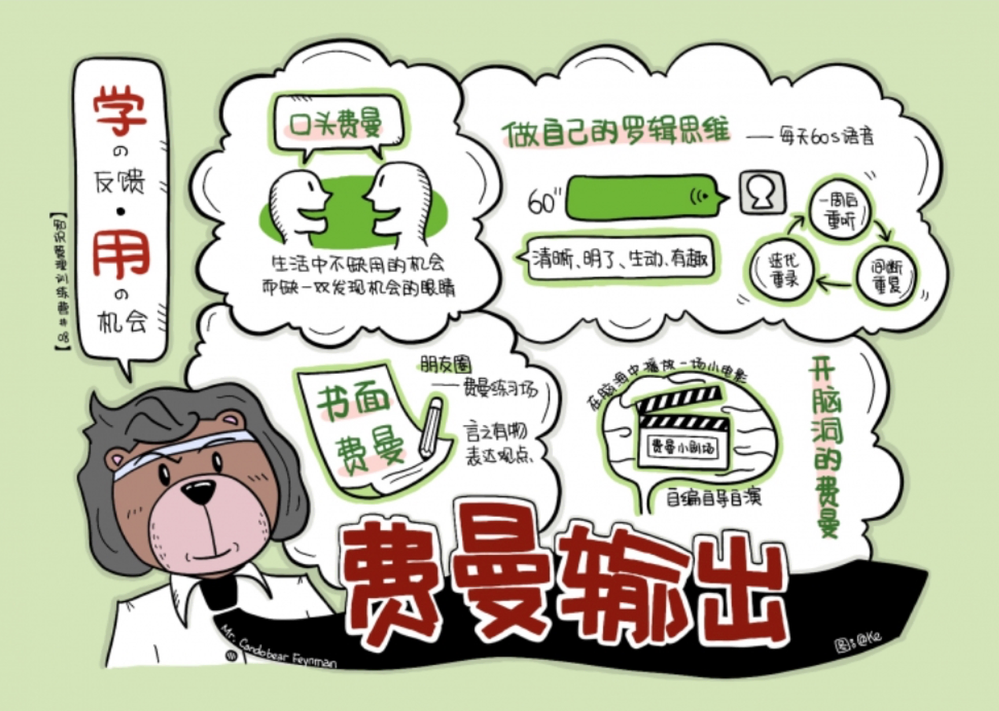
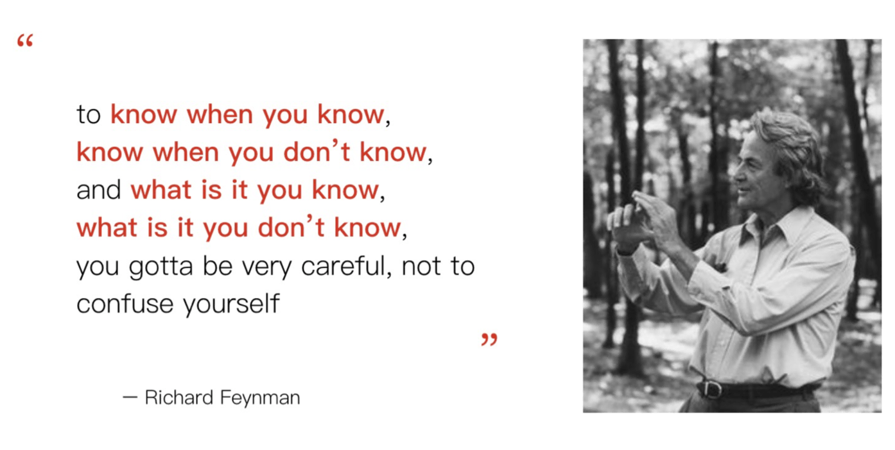
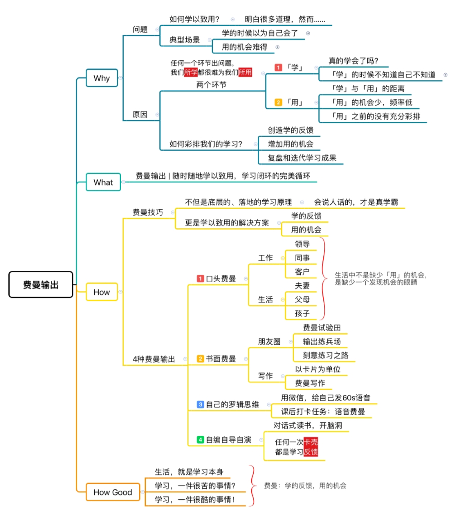

#Day08：费曼输出：生活就是学习本身，如何真正做到「学以致用」？

我们的学习，不是为了学习而学习；
知识管理，不是为了管理而管理。

第1周《场景篇》，讲的是「知识管理，做好了之后是什么样子？有什么效果？」；
第2周《流程篇》，讲的是打造一个闭环的知识管理流程，从输入到输出，具体每个步骤怎么做？你的行为，是否发生了改变？
第3周《输出篇》，讲得就是如何通过学习能力解决问题，如何输出。

今天，我们的主题就是「学以致用，用以致学」。

## 1.如何解决学以致用的问题？
其实我们都知道，学的最终目的是用。同样我们的老板、客户，他们在意的，也只是结果，也就说我们学以致用的效果。

### 学以致用的两个环节

所学不等于所用。如何让我们的所学为我们所用？其实很简单。
学以致用嘛，两个环节，一个是「学」，一个是「用」。

这两个环节中任何一个出问题，所学就很难为我们所用。

####「学」：真的学会了吗？
先看看「学」的环节。有一种「冷」，叫做「妈妈觉得你冷」；
有一种「懂」，叫「你觉得自己懂了」。
学的最大问题，就是一句话：你不知道自己不知道。

费曼在一个访谈纪录片里讲过一句非常拗口的话，但是很经典：

简单翻译一下，就是：你得学会区分，知道什么时候自己知道，什么时候自己不知道，什么是自己知道的，什么是自己不知道的，`你要非常小心，不要自己把自己给骗了。`

就是说，很多时候我们可能学都没有学会，只不过我们不知道自己有没有学会。

我们工作以后，如果不是那种CPA那种职称类、应试类学习，就没有人给我们考试了，没人让我们站起来回答问题。

所以，我们读书、听课，先是遵循本能，被别人煽动了焦虑情绪，就花钱买下很多的课程；

但是，除了随手翻翻书，出耳朵听了课程，我们怎么评判自己的学习效果呢？

有的人，`选择跟着感觉走`，觉得自己非常有获得感，被颠覆了认知，原来还可以这样！

完全是你自己如何觉得，就是如何。你觉得自己学的好了，那就好呗；
你觉得你读了这本书，很有收获，那很好啊。反正你满意了，别人钱包鼓了，两边都很满意。

但实际上真的是这样吗？服务感官，那是消费，消费知识产品和消费物质商品都只是生意而已，让你舒服，让你满意，不会让你走出舒适区。
但是，如果你的目的是学习成长，这种情况下，就不能靠感觉，想舒服，而要看真实有效的学习反馈。

我的一个朋友，跟我总结了「遵循本能」的可怕之处。
如果你不读好书，嘴上不说但是心里瞧不起学习，还遵循本能，再不注重别人的感受，你很可能会去跳广场舞。
还有其他一系列问题，都是不学习，反而遵循本能的后果。
`没有客观且有效的学习反馈，遵循本能，就不可能学以致用。`

####「用」：学与用的距离
学以致用的第二个环节，就是「用」。
为什么我们有时候学了用不出来？因为，学和用之间，有一段距离。
简单说，用的机会少，频率低。

现实生活中，即使你真的学会了，要去用也是很难的。
因为，`真正「用」的时候，你的行为是有后果、失败是有成本的。`
例如，一个医生，学了医学知识和看病技能，不能在病人身上直接去用，因为要考虑到病人的安全，所以用的机会往往非常少。
因为，一旦没学到位，「用」错了，就会造成金钱、时间甚至生命损失，很多情况下，双方都承担不起。

在工作中也是如此。
对于关键任务，领导不会一开始就放手让我们「学以致用」，而要看我们真有学以致用的能力了，才给我们「学以致用」的机会。
但是这是一个悖论，`没有用的机会，怎么才能真正学会？不学会，就更没有学以致用的机会了。`
这简直就是个人发展的恶性循环。

所以，「用」的环节，最大问题就是：机会少，频率低。

学以致用，用以致学，简直就是鸡生蛋蛋生鸡的问题。
而破局的关键，就是主动创造用的机会，为关键战役提前做好学以致用的彩排。
所谓熟能生巧，我们谁也不是学了就能用的天才，而是靠反复练习，才有可能关键时刻不掉链子。

在正式应用之前，创造更多彩排，刻意寻找、创造应用的机会。

**简单说，无法学以致用，就是学的环节没有反馈，不知道自己不知道，不知道自己没学会；
在用的环节，机会少频率低，没有彩排，没法熟能生巧，也缺少针对性的复盘和迭代。**

## 2.学以致用的解决方案-费曼技巧

解决方案是什么呢？很简单，`费曼技巧`。

在学的环节，费曼技巧帮助我们真正学会；
在用的环节，费曼技巧帮我们主动创造应用知识的机会，是我们彩排自己对知识的掌握和应用。

简单回顾一下，什么叫做费曼技巧？

给它下一个定义，学任何东西，如果你能：
`用简单的话、用自己的话说出来、不带行话术语，说给八十岁的老太太听，说给八岁的小孩子听。`

如果这些人都听懂了，你就真的懂了。
一句话来说，「`会说人话的，才是真学霸`」。
说到费曼技巧，很多人会说，我做不到。

费曼的本质是「以教促学」，我不是老师，我也不想当老师，没人听我费曼，怎么办？
其实，每个人每天都得费曼，费曼无处不在。

就以杨洋博士为例，他是个医生，但他时刻都得实践费曼技巧。
他要跟病人或家属解释病情的时候，必须用普通人能听懂的话来说，不能只是冒一些医学专业术语。
而且，病人的文化层次不同，从没上过学的到大学教授甚至院士，你都得用他们所能够理解的语言、他们习惯的语言跟他们说。

如果你不能做到这一点，不靠术语就没法说出来，说出来对方不明白，这说明实际上你对这个概念的理解不够深刻，不够全面，得去补充相应的知识，终生学习。

`费曼，是学的反馈，是用的机会。`普通人在日常生活中的费曼，有下面这几种方式：

口头费曼：来！给我们费曼一下！

### 1.口头费曼

在我们团队，有一些黑话，例如「说人话」，「费曼一下」！
如果聊天时，杨博士说，「我看了什么什么书，非常好，推荐你们也读一下」。
得到的回应基本就是：「说人话」，或者「来，费曼一下！」
其实，我们都抱着`空杯心态`，我自己看过这本书也不会说，先听ta来费曼，费曼的是否清晰，费曼的是否精彩，是否有说服力？

`我作为听众的感受就是最直接的反馈。`然后，我们再费曼自己的理解，费曼他费曼出来的内容。
而且，对于重要的主题，这次费曼还是一个引子，我们会立项研究，各自回去做主题研究，画知识树，然后，下次继续费曼，不会顾及面子，糊弄过去。

在工作沟通中，费曼非常重要。
很多时候你以为你说清楚了，对方以为他听明白了，但实际上是路唇不对马嘴。
等到工作交差出了问题，就会相互推卸责任。「我当时是这个意思，我当时是那个意思。」

其实，工作沟通只要做好费曼就可以，说的人费曼一遍，听的人费曼一遍，双方在用思维导图或邮件备忘录的形式`确认一下`，以后一点麻烦都没有。

做工作总结，提方案，对团队目标、愿景本质的理解，都是要用自己的话说出来，都要费曼。
费曼和读书一样，也是有层次分段位的。
`低段位`要求是说明白，清晰；
`中段位`是有说服力，实用；
`高段位`的费曼，得精彩。
费曼的`顶级高手`，把1句话能费曼成1本书，精彩但一句话都不多余，听众沉醉其中，佩服得五体投地。

例如，历史上很多大师，他们无数作品都在费曼一句话，他们对世界、对人生的观点，就是1句话。
例如托尔斯泰，一辈子的作品和行动，都在费曼他对一个问题的回答：「什么样的人生，才值得过？」
除了工作中的费曼，在生活中费曼也很有意思。
这样的费曼也能提升我们男女朋友、夫妻、亲子之间的亲密关系。

制作自己的《舌尖上的中国》

我们团队的杨博士跟我说，他在生活中是这么费曼的：
回到家，不要除了财米油盐这些鸡毛以外，觉得和妻子无话可说。

- 有一次，我和妻子主动费曼我意外发现的一家小馆子的烤串特别好吃；
    我不会只是说「那家的羊肉串特别好吃，相信我，你去吃了就知道」；
    而是会费曼为什么好吃，好吃在什么地方，和别人家有什么区别；
    当我和妻子这样的互动之后，我们就讨论开了，甚至讨论到「东北烧烤、南方烧烤、日本烧烤的不同」，「文化、地域对烧烤文化的影响」……费曼不仅能提高我们的表达能力，让我们能够发现生活中这样美好的细节，增进亲密关系。

- 和父母偶尔打电话，也不会觉得他们离我们的生活太远，生活没有交集而无话可说。
    举个例子，父母老了，很多父母不会用电子产品，儿女教父母用这些电子产品好费劲，很容易不耐烦。
    但是你把这个当成一个费曼的好机会，换个角度，世界完全就不一样了。
    
    你会发现你要费曼清楚「在微信里怎么发照片"在淘宝上怎么购物"这些看似很简单的内容，真的能说清楚，也挺需要水平的。

- 孩子春游回来，你关心他一天都发生了什么，他往往就说一句「挺好玩的」，然后就没有然后了。
    你可以用问题引导孩子费曼，「去哪里了"玩什么了"……这些增加的细节，不就是训练孩子费曼吗？会了这些，孩子以后的高考作文还会成问题吗？
    `生活中不是缺少「用」的机会，是缺少一个发现机会的眼睛。`怎么样才能够说明白，怎么费曼呢？请大家重温费曼那一课的内容。

### 2. 书面费曼

除了口头费曼，我们还可以书面费曼。
简单说，用卡片作为最小的输出单位，一次用200个字以内，费曼清楚一个概念，一件事情，一个想法。而且，用最平常的工具：微信朋友圈。

朋友圈除了发假期旅游照片，怎么也得加句描述，写一段话吧。朋友圈的基本款，就是你发美食，说「好吃」，发美景，说「好看」，发旅游照片，说「没意思」，那就不是好的费曼。

稍微高级一点的，就是「落霞与孤鹜齐飞，秋水共长天一色」，或者转发文章摘抄两句精彩的话。

其实大家都看的出来，这是别人提炼好。

公众号文章都很功利的，文章结构开头就是结论，中间是动图，结尾是广告。

所以，转发别人在开头提炼好的内容，比「好吃好玩没意思」也高明不到哪里去。

朋友圈的另一种可能性，就是你的费曼试验田，是你的输出练兵场，是你的刻意练习之路。

不要摘抄别人的话了，那时中学生干的事情，说自己的话，说人话，表达自己对这个世界的观点。
是什么样的人说什么样的话，做自己嘛。哪怕不精彩，但是真实嘛。

所谓真善美，真是一切美德的前提，也是学习者最重要的态度。
而且，我相信每个人的朋友圈，都有一两个特别搞笑的朋友，我称他们为「朋友圈段子手」。

他们总是能把非常生活中平凡的事情，费曼到让你捧腹。这其实就是非常高明的费曼。
朋友圈既是刻意练习，也是和朋友社交互动的场合，用互动和反馈，让我们的生活变成学习本身。
并且，这种输出实践还是可迭代的。

我在《流程篇》信息收集那里分享了将微信朋友圈同步收集到印象笔记中的方法，其实就是为了迭代。

过几个月以后，你再去看看你的朋友圈的那个状态，或者你在写文章时在印象笔记里搜索到当时的朋友圈状态，你会发现当时的理解可能是不到位，甚至是错误的，或者当时描述不清晰不精彩，你都可以用下一个朋友圈状态来迭代。典型的刻意练习！

当你勤于输出，有进步地输出，朋友圈就是不是相互攀比、酝酿焦虑、各怀鬼胎的战场，而是你学习系统的一部分，是你学习闭环的一环。

而且，我们写高考作文厌恶，写学术论文拖延，都是输出缺少实践。
但是发一条朋友圈状态，只是写一张卡片，只是费曼清楚一个概念，一张卡片就不到200字，内容少难度低反馈快，不会恶性拖延。

但是，只要每天发一次，日积月累，对我们的帮助甚至比上课学习还要大。
它们帮助我们把自己的知识真正内化，真正输出，学以致用。

### 3. 自己的罗辑思维

除了口头和书面费曼，我们还可以做一个自己的罗辑思维。
我相信很多朋友都听过罗辑思维，很棒的一个节目，每天60s语音，1s不多1s不少，死磕自己，给你讲清楚一个概念。

罗胖做的，其实就是费曼技巧，只不过罗胖的费曼功力实在深厚。
他不仅给你讲清楚一本书、一个现象或一个故事，什么是什么？而且，他会告诉传递想法，跟别的事情建立联系，是非常生动的费曼，能让别人听明白、愿意听下去的费曼。

但是，输出不是一种天才，不是一种有能力的人的特权，而是每个学习者对自己的责任，是主动学习者的制胜武器。
那么，我们为什么不能做一个自己的罗辑思维呢？为什么只是听罗辑思维作为输入，而不能主动做自己的罗辑思维作为输出呢？`实际上方法很简单，就是用你每天都在用的微信，给你自己，每天发一个60秒语音。`

在这个语音中，你可以用费曼技巧去解释，你曾经看过一本书，学习的一个概念，甚至是你和同事的矛盾，你要尽量把它讲的清晰、明了、生动、有趣，就发给你自己，听众就是你自己。

相信我，你会发现原来说60s的话说如此不容易。这60s里，会有一堆「嗯、啊，然后……」这样的口头禅和没用的废话。但是没关系，只要刻意练习，你就会突飞猛进。

这么做之后呢，过一两个星期，你可以去回听。首先，这是一次「`间断重复`」，会加深你对知识的印象。
可能你一个星期再去听这个东西的时候，你可能都对这些细节可能不太记得了，这可以加深记忆；
第二，你会发现自己之前讲的可能有点不太对，或者讲得不够生动。
这时候，你该怎么办呢？你可以迭代，重新再录一个60秒，发给你自己，当你这么录下来的时候，`一个概念就可以不断迭代。
`
当然，你也可以注册一个分答，自己当答主来回答问题，没人提问就让你男朋友或老公来提问，你来费曼，严格60秒限制。
第三种，就是我们今天的课后任务，我们采用专门的微信小程序，设计了让你用60s语音费曼的任务，你这次打卡了，别人还可以用语音和文字来费曼点评，自己迭代的语音也以评论形式保留下来，这就会积累出一个自己的语音格式资料库。
这种形式，是我发现最适合做语音费曼的工具。

所以，我们看到，费曼不是一次完成，一蹴而就的。
`把东西讲得简单清晰又有趣，需要我们不断前进，这也是我们个人对概念的理解不断深入，自己不断成长的过程。`
所以，每次当我听语音，发现以前费曼不完美，我心里是很高兴的。
而且，这样的练习，配合我们读书学习、思考做笔记，形成了一个完美闭环，更有意思，效果也更好。
很小的东西能讲清楚，做工作汇报，做演讲也会变得更容易。
因为，1分钟的费曼练习，是工作汇报和演讲的基础。

### 4. 自编自导自演

我们还可以怎么实践费曼技巧呢？甚至，我们可以自编自导自演，或者说，「`开脑洞`」。

当我们看了一会书，读到一个故事，我们不仅仅可以尝试说清楚写清楚，甚至可以自己在脑子里演戏。

想象一下，如果我们自己要当导演，场景是怎么布置的，剧情是怎样的，怎么用他们的语言去表现这个故事？

你可以在头脑中放这种电影，这样过一遍比你单纯记忆来的效果好得多，而且是非常生动的。
这个开脑洞的费曼，既是用的机会，也是学的反馈。

## 今日总结 & 思维导图

好，我们总结一下今天的课程。

学了多少、学得多好，都不是最重要的。最重要的是用起来。

但是，学和用有距离，用的机会少，用的机会宝贵，我们需要彩排。

费曼，就是学的反馈，用的机会。费曼无处不在，每个人每天都在费曼。

怎么实践费曼呢？有四种方法，口头费曼、书面费曼、打造自己的罗辑思维，还有开脑洞。

学习理念是：生活就是学习本身。真正的人生学霸，肯定是费曼高手。

对人生学霸来说，学习不是一件很苦的事情，反而是一件很酷的事情！

