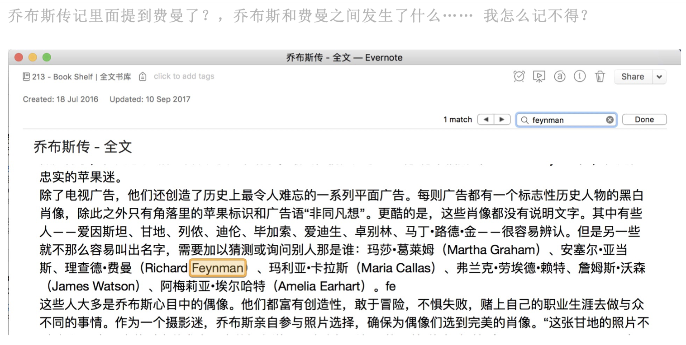
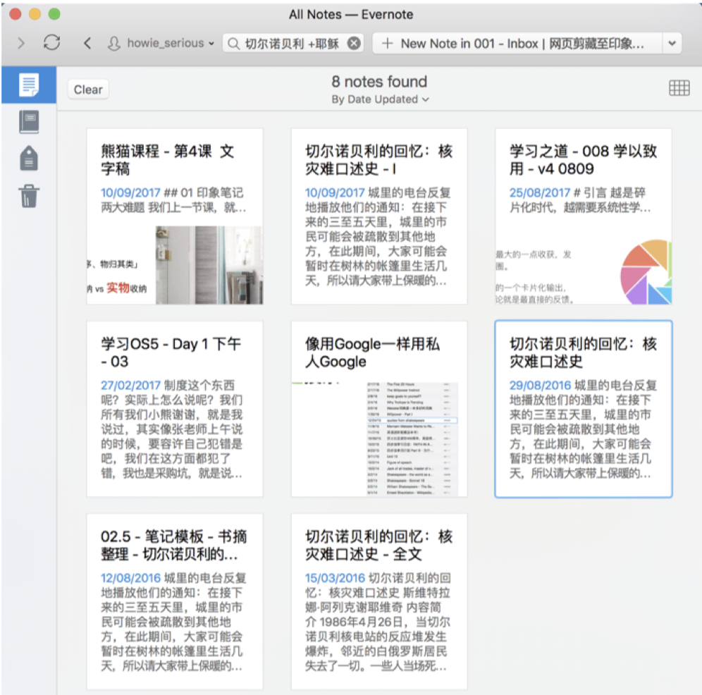
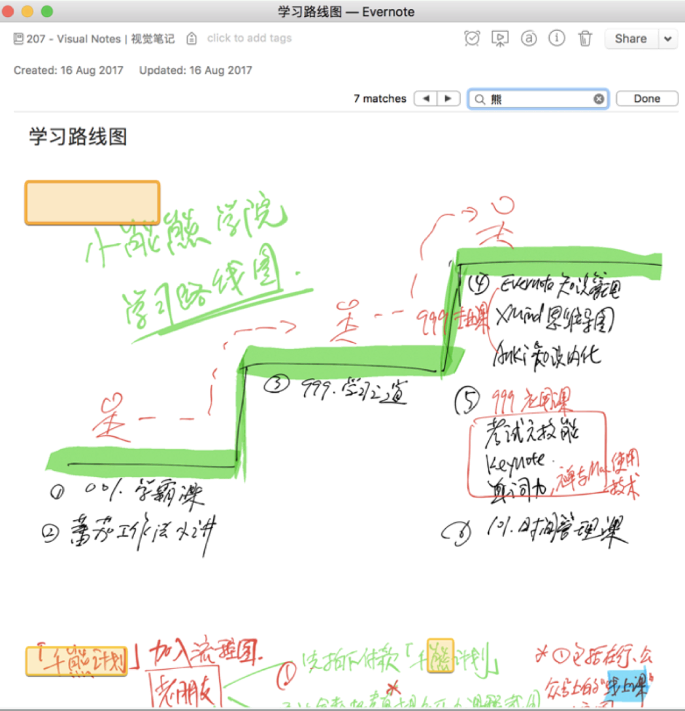
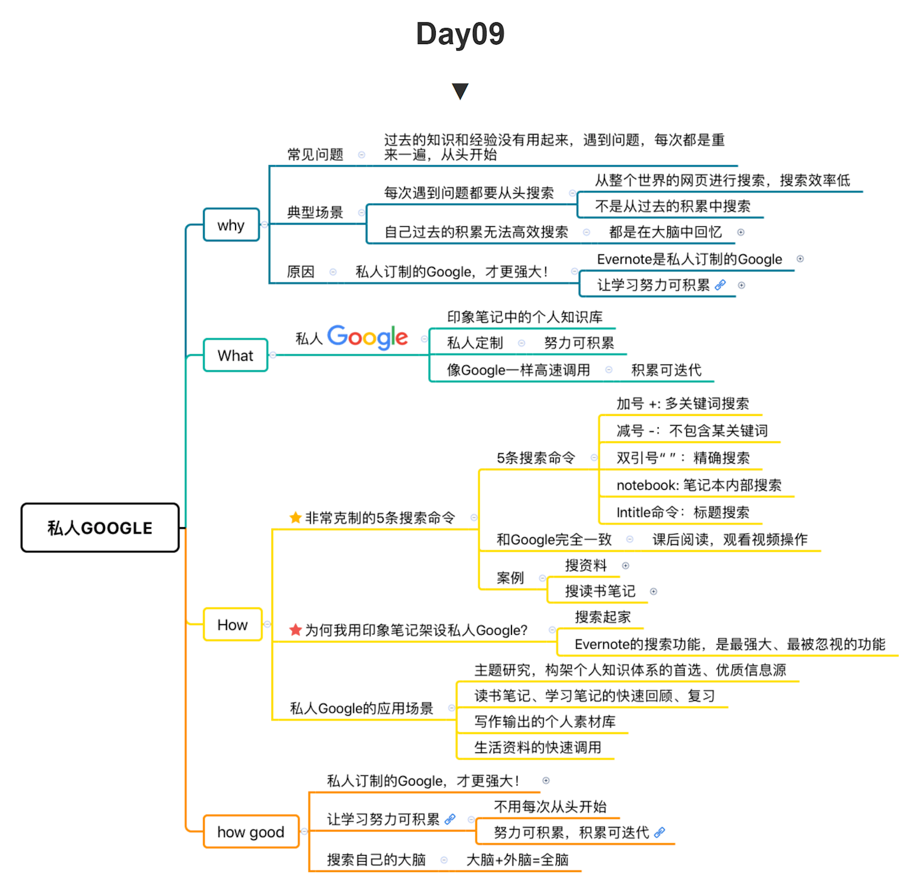

# Day 09：如何打造强大的私人Google,升级大脑

今天我们来聊聊「`搜索`」这个话题。

一听到这个，你可能会觉得「`搜索谁还不会啊`」，谁每天还不搜索个几十遍啊？
不就是在搜索框里输入你的关键词，一按回车，不就行了吗？

同样是人人都用的信息搜索，但是效率和效果的差别是天上地下，甚至被自己搜索到的资讯害了性命，这是因为，搜索工具和搜索技巧不同的原因。

对于知识工作者而言，搜索这个技能可以说是渗透到学习闭环的各个环节。

`搜索看病信息`，善用搜索能维护你的健康，保护你的生命安全。

对于知识管理而言，`善用搜索`能帮助你节省时间，节省你之前努力的积累，也是爱惜生命。

下面，我就从`搜索的工具和搜索的技巧`两个方面，来和大家分享这个很容易被我们忽视的搜索技能。

## 1. 寻找「费曼先生」

首先，我来谈谈搜索的工具。

我们最常用的搜索工具就是`搜索引擎`。

- 如何获取高质量信息？
- 靠搜索呀！
- 用哪个搜索引擎呢？
- 不都一样吗？

不是的。搜索引擎与搜索引擎之间的`差别`，比人和狗之间的差别还大。

举个例子。

假设我听说费曼很厉害，于是我搜集资料，想要了解这个叫「`费曼`」的物理学家。

于是，很自然地，我打开了搜索引擎：

`百度，必应，Google` 搜索：“费曼” 的结果(图略，自行搜索)

同样的关键词在不同的搜索工具中得到的结果`差别是非常大`的：

各个搜索引擎的搜索结果不同，信息获取效率、大脑获得的信息食粮，是不同的。

百度和bing的搜索结果，出现了很多同姓费曼的信息，原来吴镇宇的儿子叫费曼。 

而Google上面，则全是我想看的理查德·费曼的结果。 

出现同姓费曼的结果本来无可厚非，但是大量娱乐新闻、耸人听闻、迎合用户娱乐心理的图片和标题，往往将我们本来的资料搜索，变成好奇心、娱乐心主导下的浏览和浪费时间。

而Google的结果，则比较`纯净`，都是Wikipedia、知乎、豆瓣读书以及一些高质量的谈论费曼的博客文章，可以说是指哪打哪。

高质量的搜索结果，可以节约你的生命。

`PS`:以上内容只是告诉你用google搜索比较好，结果没那么大干扰。

在自己的知识管理系统里搜索「费曼」，结果又会如何呢？

搜索的范围`不再是`全世界的网页，而是高效搜索自己的知识积累。

得到的都是我过去在课程、文章中提到费曼的内容，是我搜集、学习、输出过的关于费曼的资料。

简单说，印象笔记就像我的`外脑`，我可以迅速搜索我自己的大脑，`高效搜索`自己过去的知识积累，把自己过去的

学习努力快速调用起来。不仅仅`节约你的生命`，更是让你的生命有厚度，知识有沉淀。


## 2. 私人订制的Google，才更强大！

大象里搜索 和 用搜索引擎 直接搜索 `有什么不同呢`？

百度、Google这类搜索引擎，无论搜索结果质量高低，它们都是成品化、标准化的信息入口，`任何人用同样的关键词进行搜索，得到的结果都是一样的，不是因人而异的`；

他们就像市面上卖的成衣，固定几个尺码，能穿，但是不合身；
而我们现在是强调个性的时代，强调量身定制、私人定制，大象里的搜索结果就是为你个人`量身定做、独一无二，不仅能穿而且合身`。

我猜绝大多数人和我一样，都不是记忆天才，不可能立刻回忆起来过去所有看过关于「费曼」的文章，做过的关于「费曼」的笔记。
而有了印象笔记这类电子化的工具，立刻在这点上`缩短`了你我和天才的`差距`。

如果没有这样强大的大脑搜索功能，即使你之前了解了很多关于这个主题的知识，你怎么去搜索自己的大脑，怎么样把这个东西`快速地呈现出来`，对它进行迭代、修改？

所以，千万`不要忽视`工具的力量，在这个时代还顽固地呆在自己早习惯了「用纸笔学习」的舒适区，在这个时代还依然延用刀耕火种的方式打怪。

使用印象笔记这类的电子笔记不仅能够帮你`节省时间`，更是帮你的知识有沉积，努力可以积累。

这时候，印象笔记，成了你量体裁衣、私人订制的私人 Google (PS: 搜索引擎)。

## 3. 五条命令，像搜索Google那样搜索外脑(印象笔记)

像搜索Google那样，搜索外脑。

上面说的是搜索的工具，下面介绍的是`搜索的技巧`。

在积累出自己的知识库之后，你只要做1件事情：用5分钟，掌握5条简单的搜索命令。

你就可以用私人google，搜索自己的大脑，调取学习存档。

就是下面这5条命令：

- 加号`+`:多关键词搜索
- 减号`-`：不包含某关键词
- 双引号`“”`：精确搜索
- `notebook`:笔记本内部搜索
- `intitle`:标题搜索

### 案例1：搜索资料「费曼技巧」 

花了几分钟学了搜索命令，搜索效率立刻提升很多倍。 
下面，我就一一为大家详细介绍。

#### 用「+」实现多关键词搜索

回到开头「寻找费曼先生」的例子，

在我的大象里，我会这么搜索：用「+」实现多关键词搜索：费曼+”richard feynman”

利用+号搜索，关键词为「`费曼`」这两个汉字 + `richard feynman` 这个英文名，软件就会搜索包含有“费曼”，`同时还包含`英文“richard feynman”的笔记，因此，搜索结果立刻从363条精确到45条。

再简单浏览标题和笔记概览，我立刻能找到我曾经阅读过的、做过笔记的、现在要找的资料。

点开笔记，在笔记内部再搜索关键词，我能迅速定位。

找到内容后，我一看`黄色高光`的部分，快速准确调用素材。

二看`卡片`(卡片代表 1 * 1 的表格)内文字，里面都是上一课介绍过的“费曼笔记”。

费曼笔记里不仅仅有这篇文章的内容，更是有我平时不断迭代的思考结果。

这样一来，我就立刻站在过去学习积累的肩膀上，进一步迭代了。

甚至，在搜索 EverNote 这个外脑时，还会有奇遇。(PS：`EverNote`为`印象笔记`国际版的名称)

例如，搜索结果中有一篇笔记是《`乔布斯传`》全文。



赶紧点开，原来是乔布斯在90年代回归苹果后做的「`Think Different`」广告里面有费曼。

原来，费曼也被乔布斯作为偶像而钦点过，乔布斯也认为他「`富有创造性，敢于冒险，不惧失败，赌上自己的职业生涯去做与众不同的事情`」。

这种搜索大脑的体验，就是如此神奇。

#### 用「-」号排除特定关键词

用「-」号排除特定关键词：费曼-吴镇宇

例如，明星吴镇宇的孩子也叫费曼，如果我只想搜索大物理学家费曼，而不想其中还`混杂`了吴镇宇孩子的笔记，我只要用「费曼`-`吴镇宇」，笔记软件就去会只搜索笔记中`不含有`「吴镇宇」这三个字但是`却有`「费曼」这两个字的笔记，那么自然就只是关于大物理学家费曼的帖子啦。

#### 用「””」实现精确搜索
用””实现精确搜索：”`费曼技巧`”+”`feynman technique`” 加引号也很容易理解，就是`精确搜索`，一个字也不能错。

我经常用加引号的方式，来搜索特别确定的关键词，或者我直接复制一句原文搜索。

例如，我用「”`费曼技巧`”+”`feynman technique`”」的多关键词搜索，得到的结果就从363条精确到17条。

图略~


#### 搜索特定笔记本（类似Google用Site：命令实现单一网站内搜索）

如果我们搜索的范围只想限定在特定的笔记本，该怎么办呢？

我按快捷键 `Command+J` `跳转到特定笔记本`(Command 是 Mac 的快捷键，对应 Windows 的 Ctrl 键 )

例如「`历史文章存档`」笔记本，然后搜索费曼。

你就可以立刻得到在这个笔记本里所有关于「费曼」的素材，搜索结果从363条精确到19条；

图略~

#### 搜索标题：intitle

如果我只想搜索标题含有「费曼」这两个字的笔记，
我会在搜索框里面输入「`intitle:费曼笔记`」
搜索结果立刻从363条精确到9条。

图略~


### 案例2：一个男人牙疼的故事

再举一个例子：如何利用搜索，把过去的读书、思考、学习积累都用起来。 

有一次写文章，忽然想起，我过去读书时看过的一个故事。

是`阿列克西耶维奇`写的报告文学，我大概记得书名是《切尔诺贝利核灾难回忆录》，得过诺贝尔文学奖。

我想引用书里面一个关于`耶稣和牙疼男人`的故事。

我们都知道，圣经里的耶稣对人类历史发生了巨大的影响。 

试想如果你生活在`2000多年前`和耶稣同时代的耶路撒冷，全城都在说着耶稣的事迹，大家都在争相看耶稣，谁也不会错过这么重大的历史时刻吧？

但是这个哥们，因为牙疼，却呆在家里，`错过`了这么重要的时刻……



要是靠脑子来回忆，这是极其痛苦、低效、不准确的。好在我有外脑。

我在搜索框里面输入关键词「切尔诺贝利+耶稣」，一下子就从9000多条笔记里面精确筛选出了8个笔记。

而我一眼就在搜索结果里看到了这本书的全文笔记，还有书摘笔记。 

打开书摘笔记，在笔记内部搜索关键词「`耶稣`」，我要的故事立刻出现。

我大脑记的书名，是《切尔诺贝利核灾难回忆录》，我的外脑告诉我，这叫《切尔诺贝利的回忆：核灾难口述史》；

我的大脑对这个素材的记录很模糊，写出来不精彩，我的外脑，让我1秒钟立刻引用原作者的精彩描述。

因为，我1年多前已经用`高光标记`了。

然后，下面还有一个 `1*1` 的表格，看这个卡片里面的内容，里面是我当时的理解和思考。

我立刻就可以用起来，我也可以站在历史的肩膀上，速准确地调用或迭代这些素材，用到我的文章里。


「当一个男人看到耶稣降临时，他开始牙痛」。多好的一个故事。 

这个男人，他住在2017年前的耶路撒冷，他本可以见证影响人类历史进程的伟大事业。

```就在他的房子前面，耶稣被人抓住了，他耳闻目睹了当时发生的一切。
但是与此同时，他的牙痛得厉害。他眼看着耶稣背着十字架，倒了下去，他听到，耶稣在临死前大声喊叫。
但是，他的牙痛得厉害，所以他并没有跑出去。
两天后，他的牙不痛了，人们告诉他，耶稣又活了。
这时，他想：我原本可以成为这件事的见证人，但是，当时，我的牙痛。
```

其实，2017年后的我们，不也是经常如此么？

最近5年，互联网、人工智能和生物技术的进步，可能已经从根本上颠覆了人类的历史进程。

但是，我们还是因为朋友圈里的炫耀性社交，因为娱乐明星的狗血事件，而顾不上想一想真正重要的事情。

什么是牙疼问题？

什么是耶稣问题？

我是否一直在关注、谈论或纠结牙疼问题，而没时间思考耶稣问题？

我是否本可以见证一些真正重要的、大过于牙疼的耶稣问题？你看，上面这段文字，就是一个典型的例子。 

我引用了阿列克西耶维奇的原始描述，我也在我过去思考、和作者对话的基础上，发表了我自己的观点。

在现实生活中，要解决现实问题时，需要快速而准确地调用各种素材，包括数据、观点、事实。这个速度，这个准确率，你靠大脑肯定不行，而且很累。

也许，你在那儿`抓耳挠腮`，想也想不起来具体细节，而写作的灵感和状态，早已灰飞烟灭。 

有了印象笔记，解决问题就像`搭乐高`在印象笔记中做知识管理，在工作、学习、生活中解决具体问题的过程，就像在搭乐高。

知识的模块，快速拼装；
你阅读、写作、做PPT的时候，要用到很多素材、资料。
而这些都被你用平时的时间，早已加工整理成「`费曼笔记`」了。 

这些卡片式的费曼笔记，像一个个模块式的乐高组件，当你输出的时候，只要利用软件强大的搜索功能，不费脑力地迅速调用，然后将这些早已是现成的乐高组件拼接成你想要创作的作品。 

这时候的创作是不是容易一些了呢？这样只要专注于创作，而不用忙于翻墙倒柜地寻找资料的体验，是不是更能帮助我们享受创作的「心流体验」呢？

不用每次从头开始，从头生产知识的乐高模块。
在你的知识管理系统里，有你过去全部的储备。
你可以快速的把它用起来，组装起来。

对比之下，大脑是无法搜索的，每次都得从`头`开始。

## 4. 大象关于搜索的其他强大功能

### 1、关键词建议

大象的搜索框，还有一点特别强大：「`关键词建议`」

比如，你用谷歌搜索的时候，它会根据别人在搜什么以及你过去搜过什么，给你提供搜索的关键词建议，它了解你想要什么东西。

公开版的、标准版的搜索引擎尚且有搜索建议，在大象里面，它的搜索建议`更加强大`。

它会根据你过去存的笔记，积累的内容来建议关键词，哪怕这些干货你收藏完早就忘记了，但它会提醒你。

比如，我Feynman这个英文人名，假如费曼这个`单词我不会拼`，假如我也不知道他叫理查德·费曼，但是，只要我输入`Fey`这个`开头`，大象就会建议出跟费曼相关的一系列关键词，我只要选中它，就可以搜索，真的就像搜索自己的大脑一样，而且更好。

这些知识存封在你的大脑里，而你却没有`钩子`把它钩出来，而用印象笔记，就有一个会自动地出现的钩子。

### 2、相关内容推荐

搜索到具体一篇笔记之后，大象还会根据你的这篇笔记，推荐你本地笔记中的其他相关笔记。 

例如，我关于费曼笔记的这篇笔记，下面就推荐了我本地存储的5篇相关笔记。


除了推荐本地笔记，印象笔记开放了`API`，接口丰富，和外部各种内容平台和工具平台都有打通，形成了一个非常强大的知识管理`生态系统`。

你在大象的搜索框里搜索，找到相应的笔记之后，大象还会搜索`推荐`网络上最相关的内容给你。

大象不仅搜索你的大脑，让你的知识库存有了系统的`打通`，还帮助你和外部的世界建立有效的连接。

### 3、搜索图片、Office文档和PDF文档(付费功能)

印象笔记的`付费版`(7周年的时候 是半价，淘宝 大概400块5年，需要迁移数据到新号)
还支持搜索 `图片`、Office 文档和 PDF 文档里的文字。 

我搜关键词「费曼」，不论是图片格式的手写笔记或者PPT截图，都能搜索出图片中的文字。

`WORD、EXCEL、PPT、PDF`，这些文档里面的内容，同样可以搜索。 

更神奇的是，即使我在大象里`随手写`下的笔记，虽然字很丑，大象也能很温柔地立刻搜索识别出来。



使用 iPad Pro 配上 Apple Pencil，在大象里面写写画画，也是非常愉悦的体验。


所以，我们看到，大象里的搜索，比强大还强大，比你自己还更了解自己。 

我可以从近万条笔记里面，`秒搜`我想要的任何内容。 

而且，随着你的使用，大象里面记载的内容越来越多，大象越来越强大，我们必须靠、也只能靠搜索的方式来调用。

可以预见，再过两年，或者再过20年，或早或晚，我的笔记数量肯定会超过10W条。 

那时候，我的外脑，会被调教得越发高效，越发懂我，它会成为我非常强大的生产力助理。

总结一下：

- 微信秒回，不一定代表效率，或许是你在玩手机。
- 知识积累秒搜，更容易代表专业和效率。

## 5. 私人Google的应用场景

所以，有了私人 Google，我做主题研究，构建个人知识体系时，首先会搜索印象笔记，这是最适合我的信息来源，也让过去的积累不白费；

当我发现我的印象笔记中没有相关内容的时候，我才会去 Google 这样的搜索引擎上进一步搜索。

我的读书笔记，包括电子书全文，随时可以快速调用，精准定位，重看部分章节；

在写文章的时候，我会从历史文章笔记本、读书笔记等个人素材库中，`快速准确地调用素材`，而且是我已经写过的，立刻能用起来，花几分钟就能进一步`迭代`。

在生活中，我也能通过搜索命令，精准定位我要找的那一张发票、银行账号、wifi密码等等，方便快捷。

## 6. 私人订制的Google必备3要素

简单总结一下，你需要一个私人订制的Google，它要能做到：

1. `稳定可靠`。像我这样的重度用户，上万条笔记，每天都用，但不崩溃，极少出错；

2. `随时同步`。使用9年，在Mac、iphone、iPad 和 网页端 同步使用，极少出现同步问题；

3. 像 Google 一样的搜索语法。
    
    信息爆炸的时代，搜索技术上的优势，能带来极大效率提升。
    你根据需要的喜好，选择合适的知识管理系统。
    剩下要做的事情，只有一件，就是：用自己的时间和努力，不断的去培养这个大象，打造出一个自己的生产力助理，让它变得越来越个人化，越来越懂你适合你，比强大更强大！

## 7. 今日总结

最后，我再给你总结一下今天的内容。

今天我们介绍了知识生产方面搜索工具和搜索的技巧，具体是以下几点：

第1点，搜索引擎之间的差别，比人和狗之间的差别还大。

第2点，再好的搜索引擎，也是标准化的；而大象这一类知识管理系统，是私人订制的Google；

第3点，打造私人Google并不难，掌握5个搜索命令，大海捞针，轻而易举；

第4点，私人Google，让学习努力可积累，让搭乐高式的学习成为可能，你需要这个生产力助理，比强大更强大！




## 8.今日作业

下载课程资料包并导入印象笔记

- https://share.weiyun.com/6f43eebc13513a6f7f997bbdee658fd3
- https://pan.baidu.com/s/1nvIcrw9

练习课程介绍的5条核心搜索命令，立刻秒搜，体验私人Google

搜索练习：

- 加号+:多关键词搜索|搜索+时间管理
- 减号-：不包含某关键词|搜索-莎士比亚
- 双引号“”：精确搜索|“莎士比亚”
- notebook:笔记本内部搜索|高效学习
- intitle：标题搜索|自由

自己尝试任意关键词和搜索命令组合。


