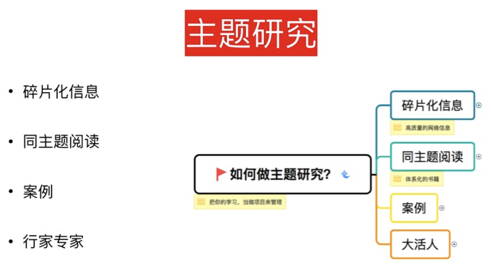
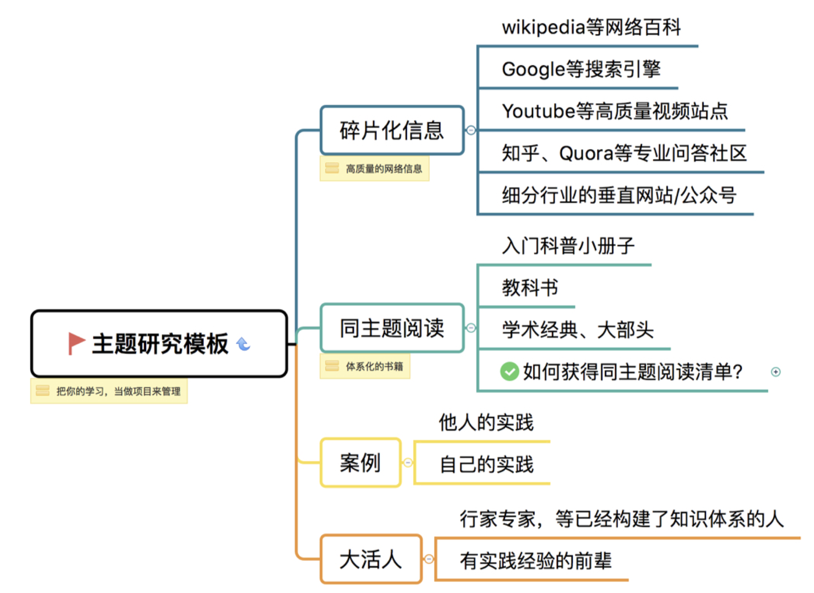
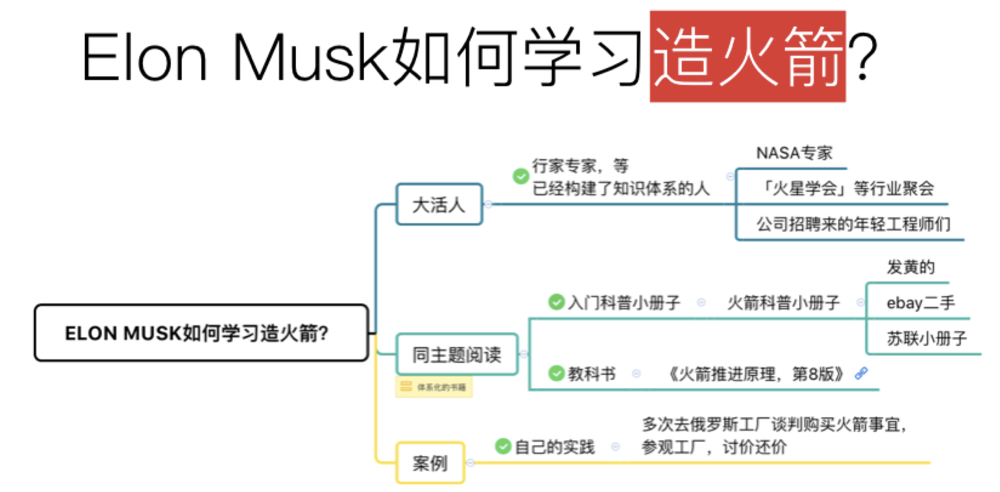
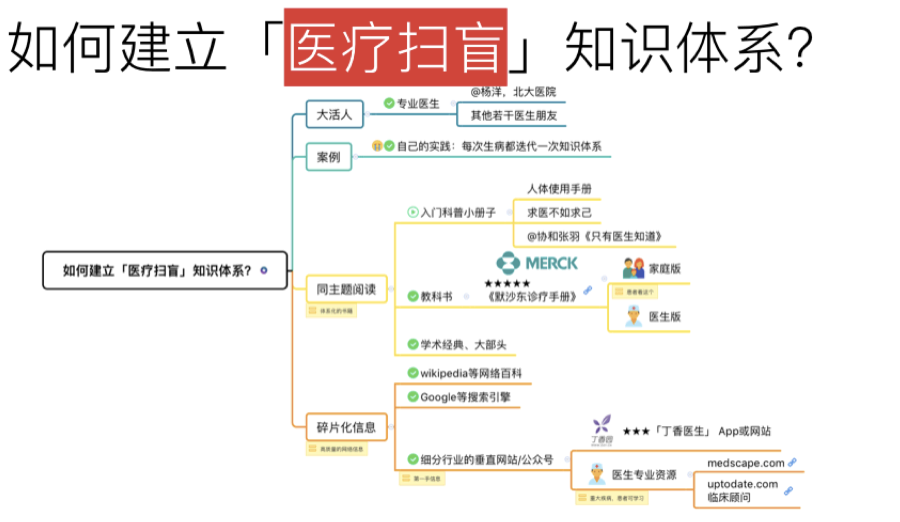
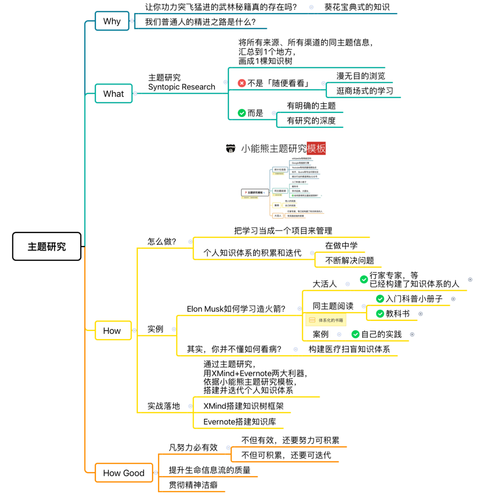

# Day10：如何用主题研究快速学习,提升人生信息流的质量

人生，就是一个`信息流`。
第一节课，我们就讨论了如何搭建一个Inbox体系，驾驭海量信息。

这节课，我们谈谈：
如何在建立Inbox的基础上，在知识管理的输入环节更进一步，`利用主题学习来提升人生信息流的质量`。

在武侠小说的世界里，主人公的突飞猛进，往往是来源于一本`绝世秘籍`：

一个我有你无，得到就能称霸武林的`葵花宝典`，提高了主人公信息输入的质量，带来了屌丝的逆袭或者实力的降维打击。

但是，在`真实世界`里，葵花宝典式的知识真的存在吗？知识管理也是如此吗？
不为人知、不明觉厉的知识分享，真的是我们普通人的精进之路吗？

提高我们信息输入质量的办法，是不是靠着一系列罕为人知的书单，不是靠资源丰富的网站或者某些深度内容的论坛？
并不是！而是「`主题研究`」。

当我们离开浅尝辄止的学习，对某一个主题进行深入研究，非常有意思的事情就发生了，这些信息，放在网上，每个人都可以获取，但是由于你学习的深入，你会发现，非常多`高质量`的书、网站、软件、人等资源，就好像被磁铁吸引了过来一样，自己跑来找你了。

## 1.漫无目的浏览vs主题研究

举个例子，知乎这个网站里，最起码初期有不少高质量内容，业内人士第一手深度经验的`无保留`分享，涉及的领域也非常广；

如果我们好好梳理知乎里的信息来源，follow 一些高质量的专栏或者高质量的人，软件就能自动推送高质量的信息给我们，会很有收获感，感觉也学习到了一些东西，经常一`刷知乎`就是1-2小时。 

但是这样像是在「知识商场」里，逛街式的学习`真正有帮助吗`？
当你要输出的时候，真的用得起来这些以往输入的高质量信息吗？

我们可能看到了琳琅满目的知识产品，像`买菜`一样，我们也看了看，甚至动手也捏了。
但是，离开以后，我们只是`「到此一游」式的学习而`已。 

这是为什么呢？因为没有主题研究。

主题研究和上面这种闲逛式的浅层学习有两点`不同`：

- 有`明确`的主题
- 有研究的`深度`

### 缺乏明确的主题

缺乏主题的时候，信息的获取变得没有目标，成了`闲逛`。 
这些信息，即使质量再高，因为不是一个领域范畴的，结果，获取的知识是分散的，学习的时间是分散的，同一个领域的信息输入，拉长到了几年，只能成为`碎片`；
而碎片是没有力量，只有`成系统的知识体系才能输出，才能解决问题`。

### 缺乏研究的深度

有深度，才有力量。 

如果我们`明确学习主题`，在一个短的时间内集中钻研，大量涉猎同主题的高质量信息，`高强度地做费曼笔记`，搭建这个领域的知识架构。 

这样，短时间内我们就能迅速了解一个领域，为今后的知识迭代更新和进一步深入研究打好了坚实基础。 
主题研究，是一个从0到1的过程，是后面一切学习有积累的基础。

## 2.如何做主题研究

如何做主题研究，其实就是`把你的学习当成一个项目来进行管理`。

在做主题研究的时候，我们的信息来源可能包括好几个渠道，我这边列出来了，分别包括`碎片化信息，同主题阅读，案例和行家专家`。

- 碎片化的信息
    主要就是来自于`网络的信息`；
- 同主题阅读
    就是`体系化`的书籍；
- 案例研究
    案例也特别特别重要，费曼特别强调要`活生生的具体的例子`，不要僵化的定义；
- 行家专家
    就是一定要`把人利用起来`，很多人就是特别高质量的信息来源，这就是为什么我们的朋友圈、微信群、同学会等，也是你积累信息的一个渠道。 

主题研究，就是将所有来源、所有渠道的同主题信息，`汇总`到1个地方，画成 1 棵`知识树`。

个人知识体系的积累费时费力，需要大量纯时间投入。
我们遇到的问题，大多是过于发散，每次学习的碎片知识没有办法积累下来，没有办法迭代。

`最怕的情况`，就是主题研究变成了发散浏览，甚至变成了随便看看。

所以，为了防止大家总是随便看看，这里必须提供一个具体而明确的、`通用的主题研究模板`，帮助我们把严肃主题研究的可能性再提高一丢丢。

在快速搭建知识树框架的时候，你就可以根据这个模版、根据你特定的需要去`筛选`出一些适合你的信息来源。

选上二三个来源，研究十几分资料，可能几小时你就`快速地搭建`起来这个框架了。

### 2.1碎片化的信息

比如碎片化信息，就包括 Wikipedia 等网络百科，Google 等搜索引擎，YouTube 等高质量视频站点，知乎等专业问答，知乎上一定得找到真货，`如何辨别`呢？

    例如知乎上一个人回答了三百多个回答，涉及了几十个领域十几个身份，这种人的回答肯定是不可信的吧。
    你得找到第一手资料，他也是干这个的才能回答这个问题。

还有就是`细分行业的垂直网站和公众号`，比如你是学财务的你肯定知道`MBA百科`吧，你想了解医学的知识那你肯定得知道`丁香园`吧，这些垂直的网站也是高质量信息来源。

我们要把网络的信息利用好，它碎片化也没有关系，关键在于质量，因为我们会画知识树，把它变成一个整体性的学习。

### 2.2同主题阅读

而第二个呢，就是`同主题阅读`。 

同主题阅读是大部分人常做的一件事，你要学习任何一个新东西，亚马逊或者豆瓣上去找书单，一下子买上十本八本，甚至去图书馆或者通宵二十四小时书店，一口气看好几十本相关主题的书，然后再从中精选出来的一些好的信息。

总之，同主题的阅读也是一个特别好的方式，但是它会更慢一点。

然后是案例，他人的实践和自己的实践。 
国外最好的商学院，哈佛商学院都是案例教学，因为案例可以让你用很短的时间把别人多少年的经验教训都了解了。 
甚至我认为，像托尔斯泰等大师的小说，为什么伟大，也是因为他以小说的形式，通过主人公一生的故事，给我们提供了如果严肃度过一生的优秀案例。

最后就是大活人。 
很多时候，活人是特别好的信息来源，你直接找到那个正确的人，他就能够让你的做事效果事半功倍。
 就像我上节课提到过的，我有的男学员，不会买衣服，其实只需要找个穿衣搭配的行家，把需求说出来，人家立刻就帮你搞定。

如果你去在行或者其他的平台预约一些行家专家的时候，你就带着问题去，怎么样去搭建一个领域的知识框架？
不是它给你分享几个套路就可以了，你要不断地围绕着这个问题、围绕你自己的目标去主导这次传授。 
通过这种方式你也可以验证这个行家的真正水平，如果只是分享几个套路、分享几个技巧，那就意义不大。

只有他对这个领域有扎实全面的实践、有很深入的思考，他才有一个知识体系。 
这个知识体系是普遍适用的，它可以让你入门，可以让你进阶，可以让你突破瓶颈期，可以让你看到更远的前景。
这就是，很多时候要找有实践经验、已经构建了知识体系的人，这个人，才能够帮你大量地节约精力。

所以，主题研究就包括了这4个模块：
碎片信息，同主题阅读，案例和大活人。

## 3.个人知识体系的积累和迭代
在构建个人知识体系的时候，可以从主题研究模板出发，收集一些高质量的信息，保存到印象笔记中，然后你用「眼到脑到手到」的费曼笔记来提取和掌握其中的概念，搭建个人知识体系，把这么多来源的内容，变成一张思维导图，你在这个领域的知识结构就越来越清晰了。

在此基础上你再不断地进行迭代，那么你的个人知识体系就会变得越来越庞大、越来越茂盛。

如果再走完知识内化和输出实践的后续环节，你就会发现，学习其实是一件非常简单的事情。

## 4.主题研究案例
	
下面我们来看一个实例，看看高手是如何进行主题研究的。

### 4.1马斯克学习造火箭

`埃隆·马斯克(Elon Musk)`如何学习造火箭？

如果大家读过Elon Musk的传记《`钢铁硅谷侠`》，这本书非常非常棒，一定要读一下，你就会知道他是怎么学习的。

Elon Musk作为一个外行，一个民营企业家，怎么能有这样的野心，竟然能去造火箭？竟然敢去登火星？

他确定了要研究的主题，就是火箭发射。我们看看他是如何进一步主题研究的。

他的主题研究，先是从大活人入手，先找人，很多有钱人或者是厉害的人的做法都是`先找人`。

 Musk对火箭产生了兴趣，然后就直接搬家到NASA的所在地，每天去参加`NASA`专家的聚会，火星`协会`等行业聚会。

他的出现让所有人都特别激动，因为知道这是个有钱人，所以就有科学家过来跟他套近乎，他就借机跟科学家们交流，跟他们学习，这样搭建知识树框架必然很高效。

后来他的公司招了很多`斯坦福的年轻工程师`，Musk一有机会就抓住他们问自己遇到的技术问题。 

通过大活人，他快速地帮助自己去完善已有的知识框架。 

通过和高手的沟通，他迅速了避开了初学者容易掉进的一些坑，规避了一些弯路，找到了一个路径。

另外呢，他也做了些同主题研究，传记里面写到，有一次他的朋友们忽然发现他坐在咖啡馆里面，拿着一本`小册子`看的津津有味，他们就知道一定是Musk又有什么想法了。

这个小册子是一本发黄的、从ebay上二手买的、苏联造火箭的小册子。 

所以我们说，当你想去搭建知识框架的时候，不要上来就去读《火箭推进原理》这样的大部头，而是要读小册子。

就像你对汽车感兴趣，但你不要上来就去看汽车制造专业的教科书，你要去找一本类似于《汽车为什么会跑》这样的图文并茂的小册子， 
或者去看看YouTube上面那些有趣的科普小视频，这是帮助你去建立whole picture、建立框架的一个方式。

同时你也要去`主动构建体系`，用思维导图或Excel表等各种合适的方式去梳理你的知识积累。

像Elon Musk，他先通过二手小册子构建了个火箭领域的知识体系框架。

后来，他也让NASA专家把他们的教科书搬了一大摞子给他，他就关起门来学了三个月，包括《火箭推进原理》、《热动力学》这一类的教科书，去完善自己的知识体系。

最后，他还一定通过案例，自己的实践和别人的实践，通过具体解决问题来提高自己。

他亲自跑了好几趟去俄罗斯工厂谈判购买火箭，后来才决定要自己造火箭。 

他在从俄罗斯回程的飞机上，自己整理了一个excel表，一个`火箭制造成本明细表`。 

这让同行的NASA科学家非常震惊，这么一个新了解这个行业的人，竟然能对火箭这个领域有如此深入的认识。

对比之下，他们干了几十年，在整体知识框架和具体细节专业上，都达不到Musk的程度。

这就是Elon Musk怎样去构建知识框架，怎样做主题研究的例子。

### 4.2看病这一件小事
	
另外一个例子，是我自己。

我女儿2岁了，有一次她发烧，我和很多家长一样看着孩子这么`难受`非常`着急`；

不知道该做些什么。只好`心急火燎`地全家折腾去医院急诊看病；

医院都是人，等待了一个多小时才轮到，见到医生我不知道如何向医生描述病情，不知道如何利用和医生短短的`5-6分钟高效沟通`，最后医生让孩子多喝点水，就让我们回家了。

这个过程，让我意识到我急需「`医疗扫盲`」，对这些医疗常识有了主题研究。

有了基本的健康常识体系，在以后家人生病的时候才不会一次次的重复以往的错误，才能真正关爱我的家人。

医疗是非常专业的领域，而且网上的信息`良莠不齐`，作为非专业人士，我也`无法鉴别`哪些信息是正确的，哪些是错误的。

因此进入这个陌生的主题，我第一步是去在行`找行家进行咨询`。我当初是去找全国顶级医院的医生，北大的医学博士杨洋咨询。(PS：在行是一个问答网站，以前叫：分答，可以预约专家/讲师进行 一对一问答)

他也在分答的小讲栏目里有关于「如何高效看病」的专题；

他介绍了「如何选医院」、「看病如何挂号」、「`如何`高效和医生沟通」、「应该如何描述自己的症状」。

还介绍了《默克诊疗手册》等适合非专业人士的`靠谱`的医疗书籍，迅速让我有了医疗的`基本框架`；

他之后还介绍了儿科专业的医生，给我科普了儿童发烧的一些知识。

在有了框架和路径之后，我就开始了`同主题研究`。

我同时看了育儿类的教科书《希尔斯育儿宝典》和一本学术经典大部头《美国儿科协会育儿百科》。

但是，建立`自己的`知识体系是最重要的。

我凡主题研究，必用思维导图建立知识体系，包括如何看病，包括儿童发烧。

在这之后，我看到网上的一些关于健康方面的帖子，也`有了基本的判别能力`；
对于靠谱的帖子，我学习了就可以将费曼后的内容，`迭代`到我之前建立的知识树上。

虽然有了这个知识，我还是无法像专业人士一样给自己的孩子看病，但是我`不再是`医疗文盲了。

我知道如何观察我的孩子，知道在家可以做什么处理，知道什么情况就要赶紧去医院了。 

这样的投入，是一劳永逸的，不用每次碰到生病都手足无措，心里没有底，不会看到关于健康的帖子也不再没有判断能力了。

`这就是主题研究的力量`，这才不是浅尝辄止的学习。

## 5.今日总结

好，我们总结一下今天的课程。

在梳理完信息来源，知道大脑吃了什么后，我们发现：

聪明人`不是因为`他掌握了别人没掌握的知识来源，有葵花宝典，
而是他克服了碎片化时代的浅尝辄止，用主题研究的方法，做到了深度学习。 

也就是说，`靠的是勤学苦练真功夫，同时努力可积累`。

大到 Elon Musk 造火箭，小到我们看病 或 买个手机，主题研究的方法都是类似的。 

选择合适的信息来源，包括碎片信息、同主题阅读、案例和大活人，提升人生信息流的质量。

选择真正值得投入时间的一个领域，构建你的个人知识体系，用印象笔记这样的知识管理软件积累，用XMind这样的思维导图软件不断梳理迭代。

让你的人生信息流，不要发散成没有方向没有力量的毛毛雨，而是汇聚成一股强有力的洪流。

## 6.今日作业

开始你的学习之旅，尝试进行主题研究。

- 在印象笔记中建立一个你感兴趣的主题笔记本
- 在至少 3 个不同的渠道中收集 5 篇主题相关的文章

