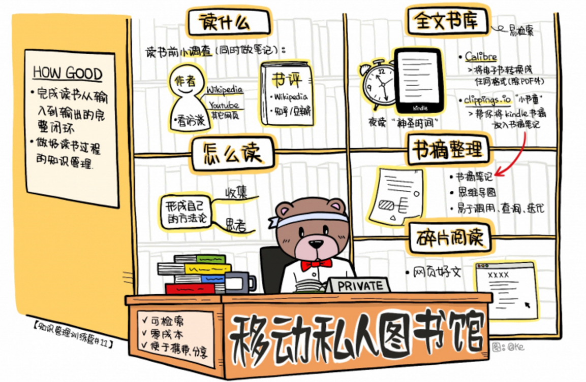
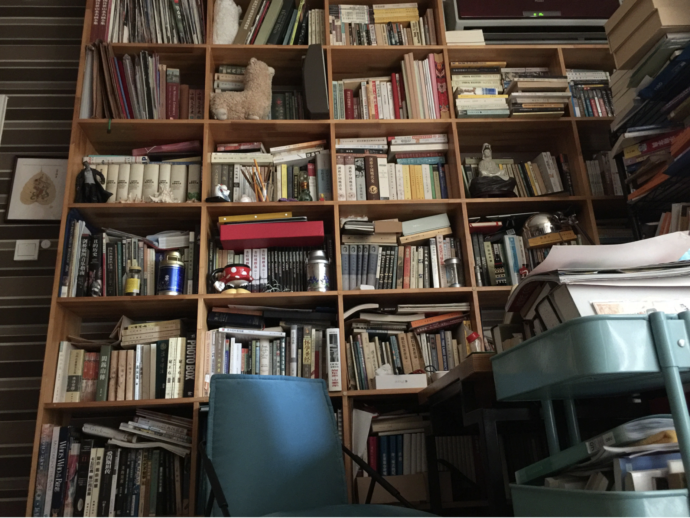
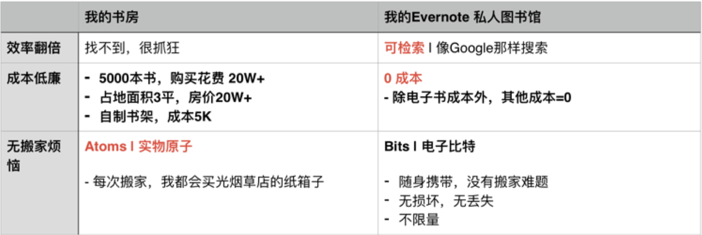
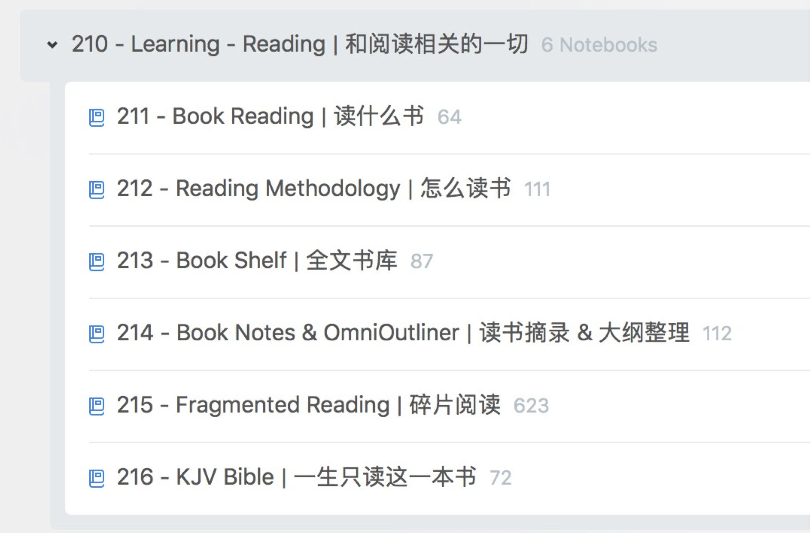
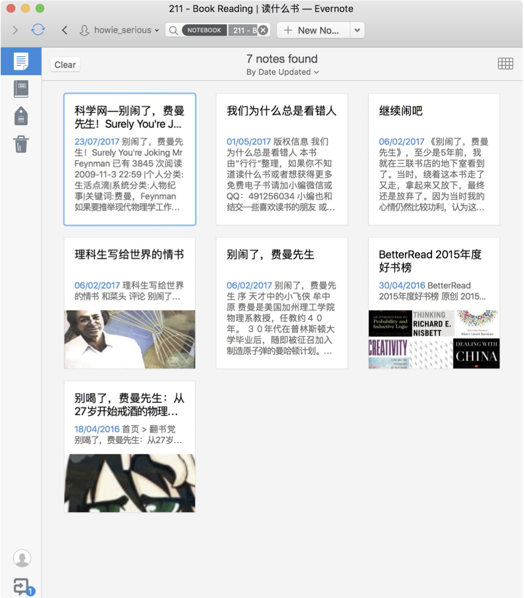
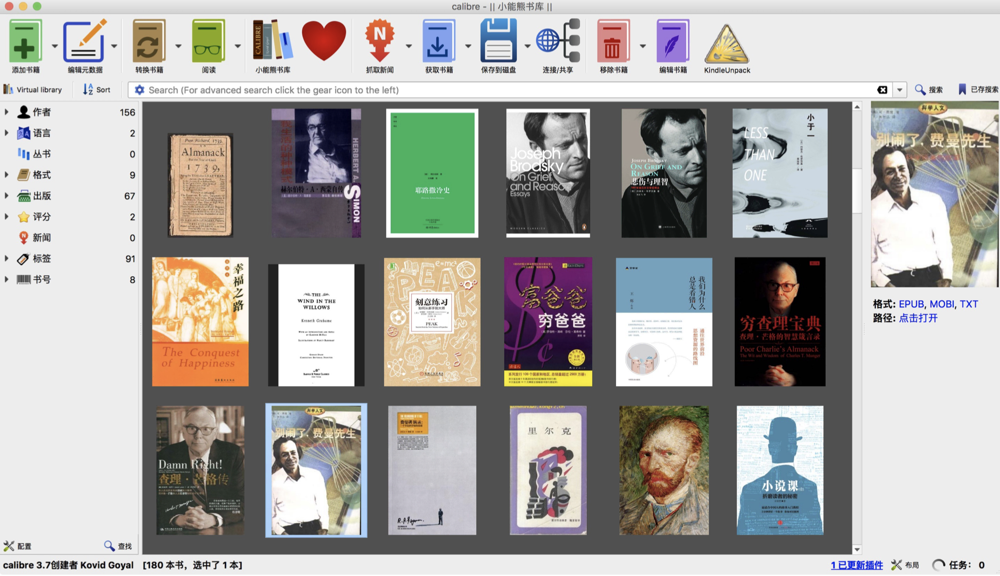
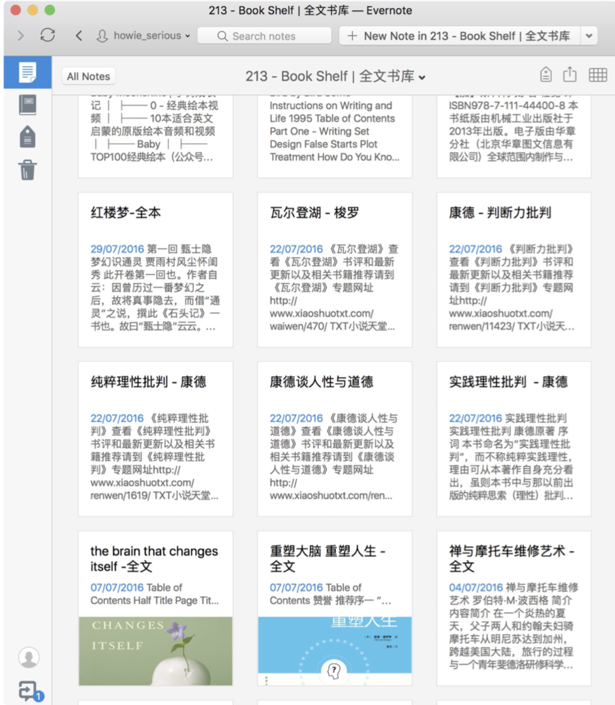
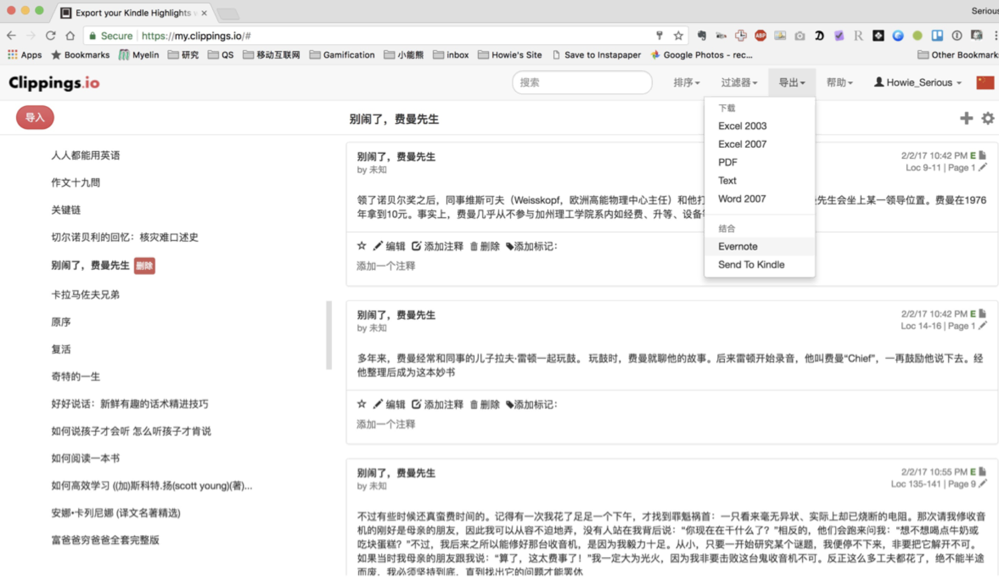

# Day11：如何打造移动的图书馆，不再过目就忘？

如何打造移动的私人图书馆？ 解决书读完就忘， 记不住， 用不起来的难题。

## 1.读书的三个悲伤故事

先跟大家讲三个真实的、悲伤的、关于读书人的小故事。

我称为「`记不住、用不上、累断腰`」。

看你有没有也遇到过类似的情况。

### 1.1记不住

16年春节的时候， 我跟一个朋友在咖啡馆聊天。 
他说， 回想过去一年， 读了五六十本好书， 可是现在怎么也想不起来读了哪些书， 收获了什么， 就好像水流过的石头一样， 风一吹， 太阳一晒， 什么都没有留下。

他之前在IBM做过很多年咨询， 现在也是上市公司高管， 学习能力很强。
爱读书爱知识， 却有如此感受。 

过年期间， 这样的聊天， 确实有点悲伤。

这就是， 「`读书如水过大石， 什么 都没有留下`」的记不住悲剧。

### 1.2找不到

之前一个在行学员， 他也是特别爱读书爱思考的人， 平时读了很多 书， 都很认真地在书上画了很多道道， 还做了笔记。 

平时感觉自己「才高八斗学富五车」， 但是在写文章要快速准确引用之前读书的资料时候， 才发现了问题——书到用时不仅仅是 方恨少， 更是找不着。 

他就在书架上面心急火燎地一本一本的翻， 却抓耳挠腮地翻来翻去找不到。

结果五分钟过去了， 还是翻不到， 立刻思绪就断了， 写文章的情绪下去了， 整个的写作 过程就特别不顺畅。 

把笔一扔， 「老子不写了， 还是来盘Dota爽快」！

人脑不适合记忆和知识存储， 更适合做创作的工作。 

在创作的时候， 整个创作是一个很长的 思维链条， 它涉及到很多， 包括记忆、联想、迁移等等等等， 
是很复杂的， 它必须要很流畅 才行， 否则灵感也就灰飞烟灭， 一下就没有了。

就像我们上节课说的大厨炒菜， 每次都要`重新`现场准备食材， 非常悲伤。 

这就是读书有思考， 有收获， 但是难于用起来的问题。

### 1.3累断腰

「买书如山倒， 读书如抽丝， 搬书累断腰」。

我家里 面有5000本纸书， 一次搬家得用好几十个烟箱子。

搬书， 我都搬出经验来了， 都是直接去卖烟的小店里面一口气买上几十个烟箱子。

最近一次 搬家之前， 我先淘汰了一轮纸书， 给楼下漫咖啡送了几百本对我没有留存价值的书。

结果， 到最后， 还是搬了30多个烟箱子。

以至于， 我搬到新家之后， 头都要炸了，直接把它们扔到了卫生间里面，门一关， 再也没有打开过。

现在这个时代， 除非你要经常翻阅或者工作或考试要用， 绝大部分情况下， 电子书比纸书更 方便， 学习效果也可以做到更好。

这三个悲伤故事， 其实用`1个方案， 就可以轻松解决`。

## 2.如何打造移动的私人图书馆？
做好知识管理， 很重要的一个场景， 就是用印象笔记给你： 打造一个私人图书馆。

纸书有香味， 摸起来有感觉， 这个我们都知道。

但是， 架在大象上的私人图书馆， 与传统的 书房相比， 有三个明显的差异， 我总结了一个表格：

### 2.1效率问题

首先， 就是效率问题。
传统的纸书， 不方便查找内容， 而我的私人图书馆， 是可检索的， 而且能像Google那样搜索，
完成复杂、精确的关键词搜索。

### 2.2成本低廉

另外一个， 就是成本低廉。

我的5000本纸书， 最贵的书上千块， 数百本英文原版书， 很多都 要好几百， 平均就算40块一本吧， 也那是很多钱。

而且， 纸书要占地方， 就算只占地3平 米， 考虑北京的房价， 那也是很可观的。

买书架的成本， 也都让人头疼。

对比之下， 除了购 买成本， 电子书其他成本为0。

### 2.3没有搬家难题

除了可检索， 0成本之外， 电子书的第三个优势， 就是没有搬家难题。

因为， 电子书那是 Bits 嘛，是电子比特， 不像纸书是实物原子。

由于是虚拟物品， 所以， 携带方便， 无损坏， 不丢失， 容量无限， 还便于分享。

## 3.口袋里的私人图书馆

用Evernote来打造私人图书馆，非常简单。

### 3.1和阅读相关的一切

我的印象笔记里，有一个笔记本组，叫做「`和阅读相关的一切`」，这就是我私人图书馆。 

笔记本组里包括一系列笔记本，分别是：

- 读什么书？|书评库
- 怎么读书？|读书方法等碎片文章
- 全文书库书摘&大纲整理|书摘笔记本
- 碎片阅读|微信、网页、博客好文

这是图书馆的几个分馆。下面我就带领大家参观各个馆是做什么用的。
关于阅读的一切,从选书、读书、书里知识内化为自己的知识,到解决自己的问题,这个私人图书馆都帮我提高效率和效果。

`举个栗子`

拿我读费曼的传记《别闹了,费曼先生》举例。

在我读任何书之前,我会先做些小调查。 
例如,我会看这本书和作者的Wikipedia页面,看看Youtube上的作者访谈视频,或者其他相关网页。 
如果对书的质量还拿不准,我会看一下知乎和豆瓣上关于这本书的讨论。
这些资料,我都是收集到「读什么书」这个笔记本里面看的

### 3.2全文书库

其次，`全文书库`。我会下载电子书，关于如何搜索电子书，我们课后资料会提供一个立刻上手的清单。 

下载的书我会放进我的私人图书馆，就是「全文书库」。就是你过去读过的每一本书的全文。 

如果是纯文本的，你把它转成txt，如果你是带图片的富文本，就把它转成word格式。 

怎么转换电子书的格式呢？ 这里给大家推荐一个神器，叫 `calibre`，中文是「校准校对」的意思。

这个软件，可以把除PDF以外的任何电子书转化成`任何格式`，你就可以方便地把它复制粘贴到印象笔记里面去了。

### 3.3 开始读书

有了书，下面我们就要`开始读`啦。 

我们往往买书很积极，读书成问题。
没有时间读书，半年也读不完一本书。 

我是怎么解决这个问题的呢？
我把晚上睡前的半小时作为每天夜读、维护精神一亩三分地的「`神圣时间`」。

这半小时我只能带kindle上床读书，不准带手机、iPad上床，这样就没有其他的干扰，我就可以安静地边读边画线。 

用了Kindle，养成睡前夜读的习惯，一周就能读完一本，而且，还治好了失眠的毛病。

有人可能会说「我为什么一定要用kindle，读纸书不也可以吗？」

我要告诉你一个用Kindle读书才有的好处。
推荐一个神器，叫`clippings.io`，只要绑定印象笔记账号，在浏览器里登陆clippings.io<http://clippings.io>。

它能够以书为单位，将这一整本书的书摘全部导出到印象笔记里面去，每本书的书摘划线单独生成一个笔记，
而且多次导入同一本书它也不会重复生成，会把它合并成为一个笔记，非常非常棒，再也不要像读纸质书做笔记那样，还要摘抄书中的大段文字了。
导出来的书摘我就存放在「`书摘和大纲整理`」这个笔记本里。

以后如果你想把这些书再做进一步的深入内化和理解，你把它做成`Anki`卡片。 

或者你把它写成`读后感`，存到Evernote里面，建立一个专门的写作存档笔记本。

### 3.4怎么读书

最后，我还有一个笔记本「`怎么读书`」。 

其实就是在读书的时候，你会有很多读书方法论资料的收集和学习思考，这个时候就把它全部放到「怎么读书」这个笔记本里面去。
这是你自己的一个关于读书的学习思考的过程，最终要形成一套自己的方法论。

这时候，你发现，读书不仅仅是读而已，而是一个学习的闭环，是一个从输入到到输出的全流程。

有了印象笔记，做好了读书过程的知识管理，就能做好从选书，看书评，到阅读、做书摘、做笔记整理的全流程。

这样只要回顾书摘笔记，就可以浏览书中的`精华`；
当输出的时候，要引用书中的内容，你只要在残存的记忆碎片中回想起几个关键词，在全文书库里一检索，就迅速定位到相应的章节。
这样，这一整本书，哪怕第一次读，这本书只收获了30%，但是，你能用起来，在需要的时候，能进一步迭代。

学习是一个从输入到输出的闭环。我们可以看到大象在输入到输出的各个环节都「`身大力不亏`」。

## 4.今日总结&思维导图

每个人都读书。 
但是，很多人读书，如水过大石，平时才高八斗，写文章时抓耳捞腮，搬家时，买光烟店的烟箱子。

都是悲伤的读书人的故事。

其实，你完全可以，0成本拥有一个更强大的、更有利于学习的、移动的、私人图书馆。
爱读书爱学习的你，再也不用像我曾经，那么悲伤。

而且，这样的图书馆，实际上是你大脑里的一个读书操作系统，让你的读书不是浅尝辄止，而是走完学习闭环，在浅尝辄止的时代，深度学习。

## 5.今日作业

课后阅读材料：

- 1个短清单，帮你找到99%的电子书 <http://t.cn/Rpal0vN>
- 如何将Kindle中的标注内容导出至Evernote？<http://t.cn/R6VbA6a>

