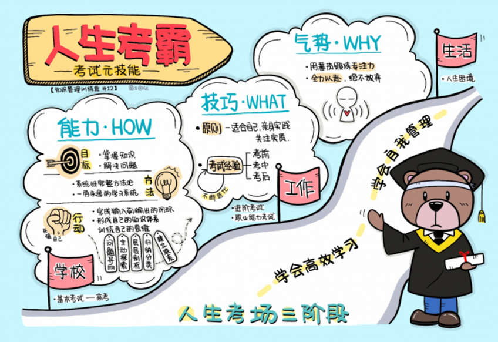
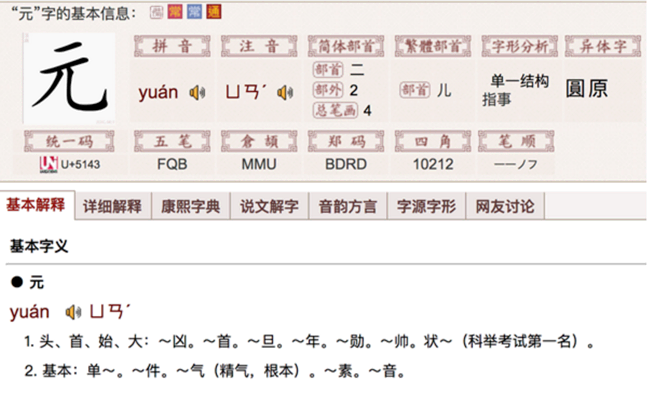
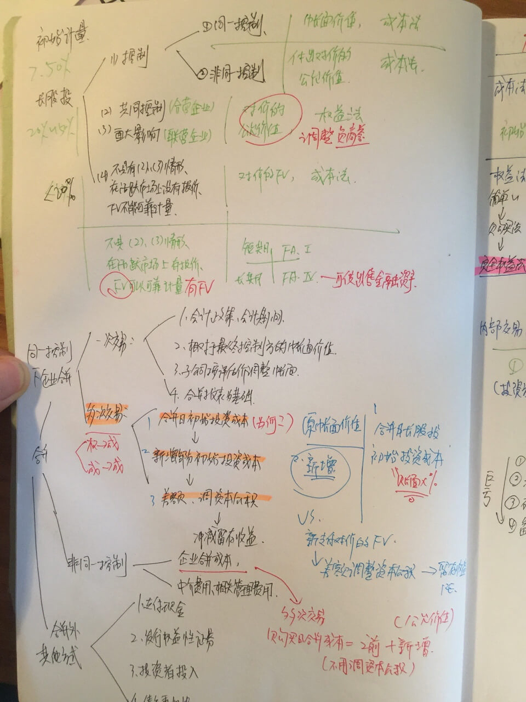
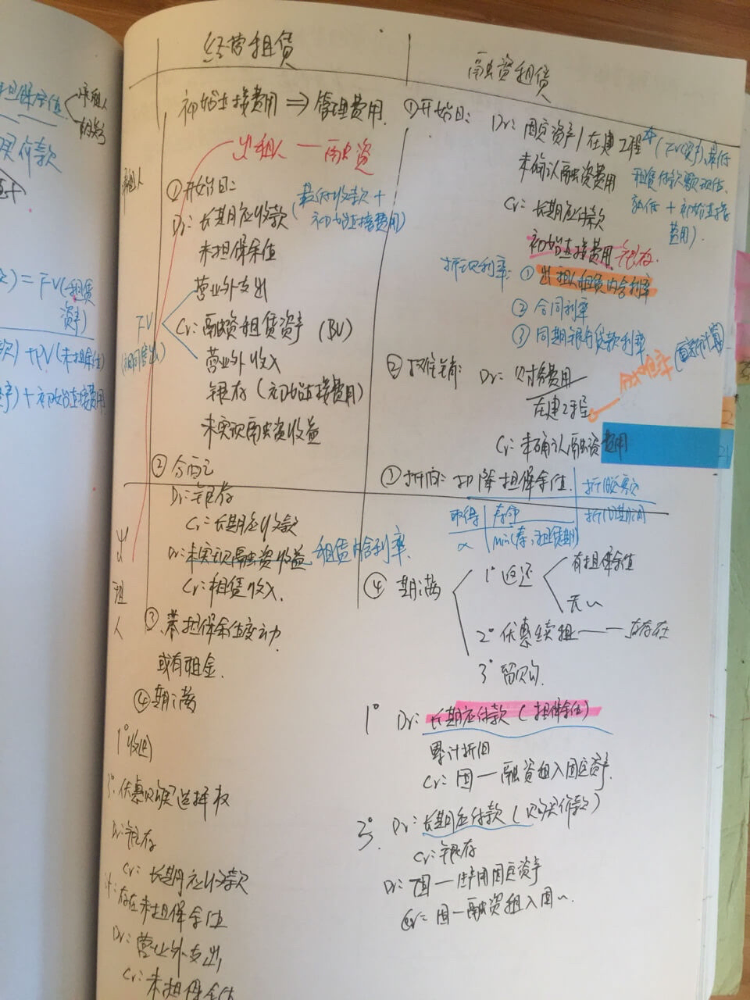
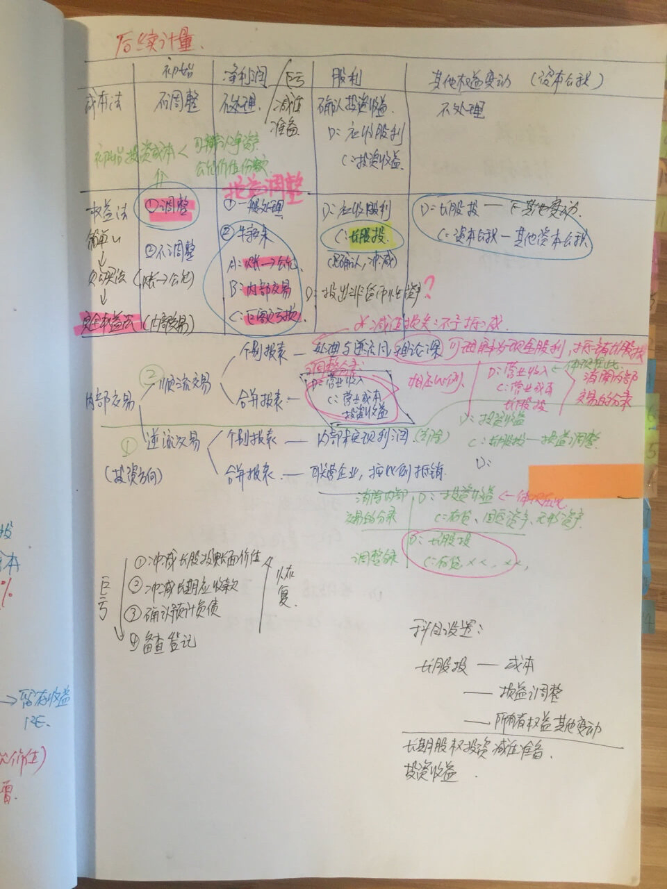
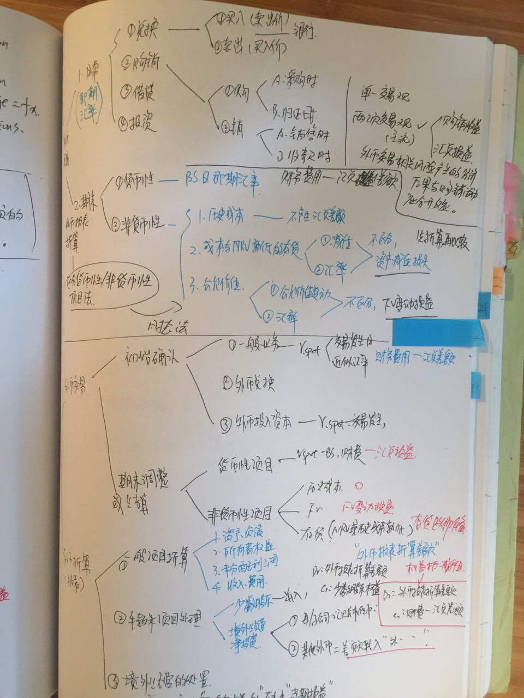

# Day12：如何打造逢考必过的考试元技能，成为人生考霸？

作者在知乎的回答：你有什么值得分享的高效学习方法？
https://www.zhihu.com/question/50343728/answer/237505641

---

这节课，我们的主题是`考试`。

小时候，经常会有这样的想法：
大人们不用每天去学校上学，实在太幸福了。
上课好无聊，要是不用上学就好了……

后来发现要等到不用上学那一天的到来，实在是太久远了。

所以，我的愿望变得更加实际：要是上学不用考试就好了。

是啊，上学但不考试，简直就是我当时能想象的最具体的天堂景象。

当然，或许是因为很小的时候心理就有这样愚蠢或懒惰的种子埋下，
所以后来它萌芽，成长，终究结出了一长串的红通通的挂科的果实。

## 一、从逢考必挂到逢考必过的考试复盘

我一直有一个原则：

我提供的学习和自我管理解决方案，如果有价值，只能是因为我们做过，有失败教训也有更多成功经验，有足够多咨询成功案例，然后，我们将解决方案科学化、产品化，变得可落地、可复制。

所以，谈考试的时候，必不可少的就是从我自己的考试经历出发，通过复盘自己的考试经历，从中提炼出有价值的经验，成为考试能力培养方案。

我把自己31年的人生分成了3个阶段。

分别是从`平淡无奇`的第1阶段，`逢考必挂`的第2阶段，以及`自我拯救`的第3阶段;

## 二、什么是考试元技能？

要对任何问题进行深入而有成效的讨论，不沦为(为了争辩而)争辩，我们需要界定论题的本质，我们讨论的是什么？
它的边界在哪里，外延和内涵在哪里？所以，我们先定义考试，再谈谈元技能。

### 2.1定义「考试」

经历了专业领域的多次考试，尤其是经历了人生的一次次大考，我越发认识到，考试这件事情是无处不在。

从学校里的考试，到工作后的考试，到人生里的考试，我们一辈子都逃不掉考试。
但是，如果我们一直被考试，一辈子都没有培养出逢考必过的考试元技能，那是多么可惜、多么浪费生命的局面？

如果写一本《考试大全》，这里面肯定有成千上万种： 
有规范的、科学的考试；
也有胡乱出题的不科学的考试有检验知识点是否掌握的考试；
也有检验实际解决问题能力的考试；
有中文的考试，有英文的考试；
有不会做就选C的客观题考试，也有写到手软的主观题考试；
有好的考试，有不好的考试；
有有用的考试，也有没用的考试，有必要的考试，也有没必要的考试。

对于考试，如果是一个科学的、有效的、标准化考试，就可以这么定义：

在限定时间内在一个领域的限定范围内，建立扎实而全面的个人知识体系，并且用这些知识去解决纸面上的或者真实的问题。

所以，(有意义的)考试对考生提出的要求，是真实的具体的个人知识体系和实际解决问题的能力。
 当你具备这种高阶能力时，面对低级的解决书面考题的考卷，那就很简单了。

### 2.2什么是「元技能」？

但是，应对所有这些考试，有一个元技能。 

「元」(meta)是一个非常重要也很有趣的概念。 
Physics（物理学）加上meta就是形而上学(meta-physics），超越了物理学的形而下；
Cognition（认知）加上meta就是元认识，关于认知的认知，用大脑来认识大脑；
Learning（学习）这件事，加上meta就是meta-learning，元学习，就是关于学习的学习，就是「学习如何学习」；
而元技能(meta-skill），就是关于技能的技能，考试元技能，就是「掌握考试技能的技能」。

## 三、如何打造「逢考必过的考试元技能」？

所以，关于考试元技能的打造，我分为三部分讲：

- How：打造考试能力
- What：积累技巧与经验
- Why：考试和自我的关系，培养精神力

### 1.考试元技能的How

要素能力培养框架：

任何严肃的系统性追求，我们都可以用一个三要素框架来分析，衡量自己做的够不够：`目标、方法、行动`。

考虑因素太多就失去了重点，而这三个要素又是任何严肃追求所`不可或缺`的。

我们逐个分析。

培养考试元技能的目标：是考试能力，以学习掌握知识、解决问题的能力为基础，而`不是应试能力`；

不是为了考试而考试，而是`为了解决问题`，培养了能力顺便通过了一些考试； 

所以，不能停留在考试的技巧层面，而是关注逢考必过这个现象背后的能力层面；

一个掌握考试元技能的人，ta应该是目标明确的，也就是心明眼亮，知道自己真正需要的是什么；

培养考试元技能的方法：不是零碎的技巧堆砌，而是系统性的完整方法论； 

不是药到病除的神奇药方，「不会的都选C」，而是一个见效慢、但是一劳永逸、真正解决问题的学习系统；

这个方法不是只为考试，而是为了解决问题，通过掌握知识和打造学习思考能力来解决问题。

一个掌握考试元技能的人，ta应该是方法论科学而系统的，也就是训练有素。

有一个人曾经说过，一个真正的牛人，不是靠每天的奇思妙想，而是靠`训练有素`。
比如，凡读一本书必做笔记，凡有所收获比分享讨论，凡失败犯错必有`书面总结`。 
更进一步，将这个考试变成系统性的学习方法和知识管理系统，这就是考试元技能的`牢固基石`。

培养考试元技能的行动：`死磕自己`。
最简单的道理，大师们在传记里一再强调：哪有什么天赋，不过是我每天都要「做工」。

法国雕塑大师罗丹的工作哲学就是：「`应当做工。只要做工。还要有耐心。`」

做工的背后，就是在训练有素的基础上，每天死磕自己，而不是靠奇思妙想，靠天赋和灵感。
 
读书学习的时候，必完成从输入输出的闭环，在问题的引导下主动探索知识，层层剖析，归纳分类，建立联系，形成自己的知识体系。

看起来这很简单，其实这是自我的思维训练。

所以，一个掌握考试元技能的人。
如果给ta画像，他应该是心明眼亮、目光纯净而明确的，他应该是沉着冷静，有着系统学习方法论的人，ta也是步伐坚定，每日前行，死磕自己的人。 

900个番茄通过CPA3门的复盘我在2012年用900个番茄考完了CPA3门考试，也是遵循目标方法行动这三个基本要素。

`准备`：在具体考试之前，快速搭建框架：我先做了很多信息收集和调查的工作，我咨询有考试经验的人，在网上看了一些考试经验贴，也翻了书和参考资料。

`目标`：确定可量化的目标：对这个考试有了初步的整体认识后。
我给自己定了一个符合SMART原则的目标：在三个月时间内用1500个番茄通过CPA3门；

`方法`：费曼+知识树：备考的战线很长，我不希望每次重复低品质努力，每次学习都从头开始，我要自己的努力可积累，能不断迭代。

所以，我在打印店用A4纸张制作了6个大笔记本，每本用3M贴纸按照目录和知识结构做好了分隔。

这时候，我就是在做一本自己的书。

翻到每一章的笔记，里面都是我自己手画的整体知识结构图，一个树状的思维导图。

每一个核心知识点，我都用表格、关键词、导图的方式自己梳理，自己口头费曼；

每一个错题，我都会把对应的没掌握知识点迭代到对应笔记里；

每一次看书和资料，我都会迭代到对应笔记里；

所以，这一个本子，从头到尾被我用各种颜色的笔写的很花。 

但是，我无形中用纸和笔的方式做了知识管理，我后来在工作中遇到问题还是喜欢立刻翻一下笔记，用几分钟的时候就能快速回顾这些知识；
在考大综合的时候，我完全抛弃了书本，只用我几年前的笔记和真题做参考资料。

用这种记笔记的方法，我甚至把CPA里面《战略与风险管理》这个科目上百万字的内容，浓缩成了不到10页的PDF。
通过考试后，我在工作中遇到相关专业问题，我都可以在印象笔记里直接找出来，快速翻一翻，效果比去wikipedia上现搜索要好得多。

行动：用番茄死磕自己：90天1500个番茄，每天按15个算，3门课每天每门课学习5个番茄。

我用A4纸做成月度的学习打卡表格，画正字，每个番茄一笔，每天要写满3个正字才是15个番茄。

由于高强度做番茄很累，我当时每天下午都得去健身房跑步一小时来提高体力。由于还需要做翻译挣钱，最终我只完成了60%的番茄目标。

但是，结果却令人满意，3门全部都通过了，还有2门取得了接近80分的成绩。

### 2.考试元技能的What：单独关于考试的经验积累

考试元技能的how，讲的是能力。
考试元技能的what，对应的就是考试技巧。 

而各种考试相关的资料中，最不缺的就是技巧，甚至包括选择题不会就选C的这种。
经过了这么多考试，我觉得积累考试技巧很重要，但是要用一系列原则来把握：

考试技巧必须是适合自己的，而不是照搬别人的；

例如，考试前如何调整睡眠，考场上如何提振精神。
有的人喜欢红牛，有的人喜欢咖啡。 

这些技巧都要自己筛选总结； 

考试技巧必须是经过实践验证过的，是自己的「经验」，不是听过有用。
例如，如何分配第一次做题和交卷前检查的时间比例，如何处理自己不会做或者没有把握的题目。
 
考试前老师会告诉你，你当时觉得道理都懂，但是，这些经验只有实战过才能用得上，用得好。
例如，我个人的时间分配，一般就是：
像CPA考试等专业资格考试，题目比较难，我都是做题一次过，不抢时间，做过的题也不检查，因为基本上我做完题最多提前十几分钟。

除非绝对确信或者是发现第一遍做题犯错了，否则不会修改已经做过的题目。
而在不会的考题的时间分配方面，资格类考试的目标很明确，就是通过，所以，基本上不会做的，我绝对不猜，全部留空白，做好标记。

等把会做的做完，有时间了再慢慢做空白的题目。
因为你瞎做的肯定不得分，浪费了时间，还干扰了你有时间后重新做题的效果。

考试技巧必须是关注实质的，是服务内容本身的。 

例如，考香港CPA考试时，主观英文题目，题量很大，3个小时要完成近10个案例，答题的作业本有20多页A4纸。 
时间极其有限，根本写不完。 

我看了官方发给考生的历年真题和参考答案，我发现官方的参考答案写的太细致了，洋洋洒洒一大张，因为是主观题，结果就变成了一个个英文小作文。
但是，我一想，光10篇英文作文，自己光抄答案估计都做不完。
 
所以，我放弃了追求完美答案的想法，自己设定了答题原则：
- 1）用列要点的方式答题，突出关键词； 
- 2）每个要点基本上是句子就可以了。

我把我能找到的近10年真题全部打印出来，一个个分析答案，找出每个答案里有哪些得分点。

然后，在考试的时候，只要不是得分点的内容，我就不写，凡是写上去的文字，肯定是言之有物的，是考官要给分的。

因为我相信，一个科学的有品质的考试，肯定不是比谁写字多。
所以，到最后，考卷交上去，我写的答案是最少的，但是我花了最短的时间，用了最少的复习资料，也顺利通过了考试。 

考试经验很多，可以通过考试论坛、师兄师姐、咨询老师等各种方式获得。 
但是，根据上面的原则，真正对你有用的考试经验没那么多。

最有用的做法：
- 1.画一张名字叫考试经验的思维导图
- 2.从备考、做题、考试时间安排、精力管理、临考检查清单、考试现场的错题检查等等方面，
    对考前、考中、考后各个阶段的自己的经验总结出来。
- 3.不断迭代，每一次考试就迭代一轮；

这样的思维导图，就像你自己写了一本关于考试的手册。
而且，让你的考试经验可积累、可迭代，变成一个帮你解决问题的工具。

关于香港CPA考试，我能够5天复习并通过2门课，用88个番茄通过一次考4门课的大综合，我觉得在专业知识的基础上充分利用考试技巧是功不可没的。 
具体经验，我写成了一篇文章，大家可以在课后阅读资料里查看。

虽然是英文的注册会计师考试，但是在技巧层面，其他考试也是可以借鉴。

### 3.考试元技能的Why精神力层面：考试，是一场精神战斗
考试元技能的How是学习能力，What是考试技巧和经验，而Why是相对不好传递，到最后，你怎么应对每一次考试，你就是什么样的人。 

考试，就是自我的一部分。
久经考验，我最后得出一个非常唯心主义的结论： 考到最后，拼的就是气势。 

我称之为精神力量，或者是架势足，有气势。
贾平凹的一本小说里提到过他们村有个男人，不管多笨的猪、多调皮的驴或者多凶恶的狗，所有动物一看见他就发抖，战战兢兢，变得非常安静，连逃跑都不敢。 

因为，这个男人当了一辈子屠户，身上有一股气场。 
电影里面也是如此，一号大坏蛋和非主角的好人打架时，拼的往往不是技能或工具，而是在精神力、在气势层面早就分出高下了。 
装备再精良、准备再充分，气势不够，也会被大反派像切菜一样立刻消灭掉。

所以，一次次考试就是一次次打怪升级，有萌萌的、人畜无害的小考试，什么期末考试、四六级啥的，也有张牙舞爪、残害百万考生的万里长征式考试， 
像会计师的CPA考试或者医生的职业医师资格考试。

面对这样的一个个怪兽，人挡杀人佛挡杀佛的考生，和还没考心理上已经输了的考生，同样的准备程度，结果却会差异很大。

就举我自己的例子。我考CPA经济法的时候，看了一周之后发现时间不够，得把全部精力放在更难的两门上，
所以，我就战略放弃了经济法：我去考，但是我不复习。在进经济法考场前5分钟，我还在看会计。最后，考了个67分。

我`事后总结`：

以前的话，我不复习就不会去考，理由是：何必浪费了3小时呢。
但是，经过了900个番茄，经过了高强度的复习(虽然是其他科目的），我的态度发生了变化，
一是我知道自己的时间没那么宝贵，以前只是懒惰和逃避；
二是要全力以赴，不论结果，哪怕是积累经验值都很重要；

我发现考试的基本面还是知识本身和解决问题。
而经济法这个学科，不过是企业运作过程中涉及的相关法律常识。
而法律我是比较感兴趣的，大学的时候唯一没有逃课的课程就是选修的大学法律，而且，法理即人情，我只要按常识判断，就能应付选择题。 

例如，我接了杨博士家的牛耕地，牛在我家生了小牛，杨博士和我闹起来，小牛到底是谁的，如何补偿对方，在法律上是「孳息」问题，在生活中就是常理和常识。
物权法、公司法、知识产权商标法，全都是如此，一个有法律常识的人对付客观选择题完全没问题。

而主观题，我完全依靠关键词+费曼的方法，洋洋洒洒每一题都讨论一大篇，
先写相关法条，再结合题干内容论述，最后提出解决方案，拿不了高分，但是能通过考试也是不那么意外。

考试的基本面是一个人在这个领域的知识积累、能力培养和气势的积累。

考雅思更是如此，这种能力型考试，周六的考试，我只是在周四的时候才临时抱佛脚，打印了一份真题来看看。
结果发现，原来听力的题型的这样的，原来有两篇作文。

但是，对考试的准备也就如此了，真的考的还是你的英语能力。
如果你把能力考试用专场培训的方式去解决，
四级六级托福雅思GRE，每一次都要别人教你怎么学怎么考，说明我们肯定是错过了一些东西，
把主动权移交给了培训机构，等待他们帮我们解决问题。

所以，如何培养这样「人挡杀人、佛挡杀佛」的考试气场？

我个人的训练方式：

- 	1.做番茄，做大量的番茄；锻炼自己专注学习的能力； 
- 	2.每一次考试，绝对不自我放弃，每一次都全力以赴。
哪怕是临时抱佛脚，哪怕只能突击考试，也要把气势扎得很足。

而在高中的时候，我没有这些认识的时候，虽然平时成绩在一千多人的年级里非常靠前的，
但是，结果在高考那一次接连出状况：感冒极其严重，考一场试能用完一包纸巾；

整夜失眠，脑袋昏昏沉沉；数学试卷的难度和题型出人意料，结果就慌了，每个题都答一点，
每个都做的不彻底，没把握，结果分数直接从平时的130以上变成了不及格。

而我现在考前也是睡不着，但是我不是紧张，而是稍微带点兴奋。 
睡不着就睡不着呗，一夜不睡，考前灌一杯黑咖啡。别人带着拉杆箱去考试，我的资料只有别人的十分之一，
别人上来就拼命写，我就慢慢的一题题回答，留空就留空，反正考试不是比谁写得多。

有了面对考试人挡杀人佛挡杀佛的气势，别说失眠感冒，哪怕路上被车撞了， 
只要手没断，也能发挥出应有的水准。这个，是我们最求的终极状态。

### 4.一个考生的自我修养
所以，你肯定已经发现了，考试的背后，是学习本身，是个人自我成长本身。
每个人都是考生，一辈子都要经过3个阶段的考试。

- 第一阶段，是学校的考试，基本款，最重要的一次就是高考。 
- 第二阶段，是资格考试和专业考试，是你在专业领域之所以能安身立命、体现你知识积累和解决问题能力的考试，包括英语能力、会计法律医生和各种专业认证。
- 第三阶段，是人生的大考。
    生活是考场和考官，你要自己给自己出题，自己用时间和行动去答题，
    自己给自己打分。而从基本款考试到专业考试，再到人生考试，就是一个终生学习者的自我修炼。
    而考试元技能，就是一个终生学习者的自我修养。

## 四、今日总结

好，我们总结一下今天的课程。

考试元技能的培养，可以通过目标、方法和行动这三个要素，通过实践经验积累，来搭建自己的考试方法论。
还要积累适合自己的考试技巧和经验。
最后，培养出在考场上人挡杀人佛挡杀佛、舍我其谁的气势来。
到最后，怎么考试，实际上是怎么学习的问题，是怎么管理自我的问题。 

课后阅读资料
- 5天复习2门HKICPA是怎样一种体验？http://t.cn/RCX9YdZ
- 一次公开的快速学习实验 http://t.cn/RCYlNKK
- 关于雅思裸考8分的英语学习复盘 http://t.cn/RC6HFbO
- 示例：CPA战略科目的笔记 http://t.cn/Rl1aUzo

## 五、今日行动

知道很多道理，却仍然过不好这一生，因为，道理光知道没有用，关键要做到。

下一步行动是：
- 每个人都考试，从小测试到人生大考。 
- 关于考试，请分享你做的好的一点，还有做的不好的一点。
- 并且，阅读并讨论评论区其他同学的作业，相互照照镜子。