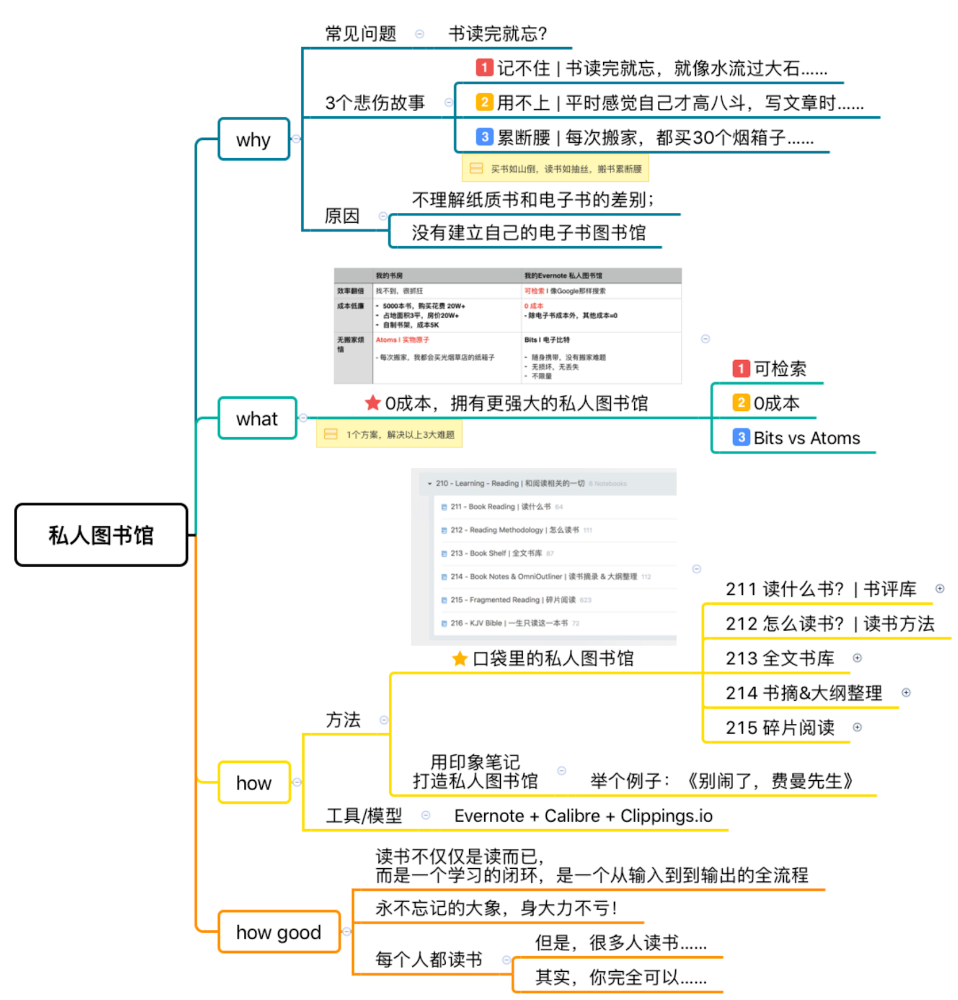
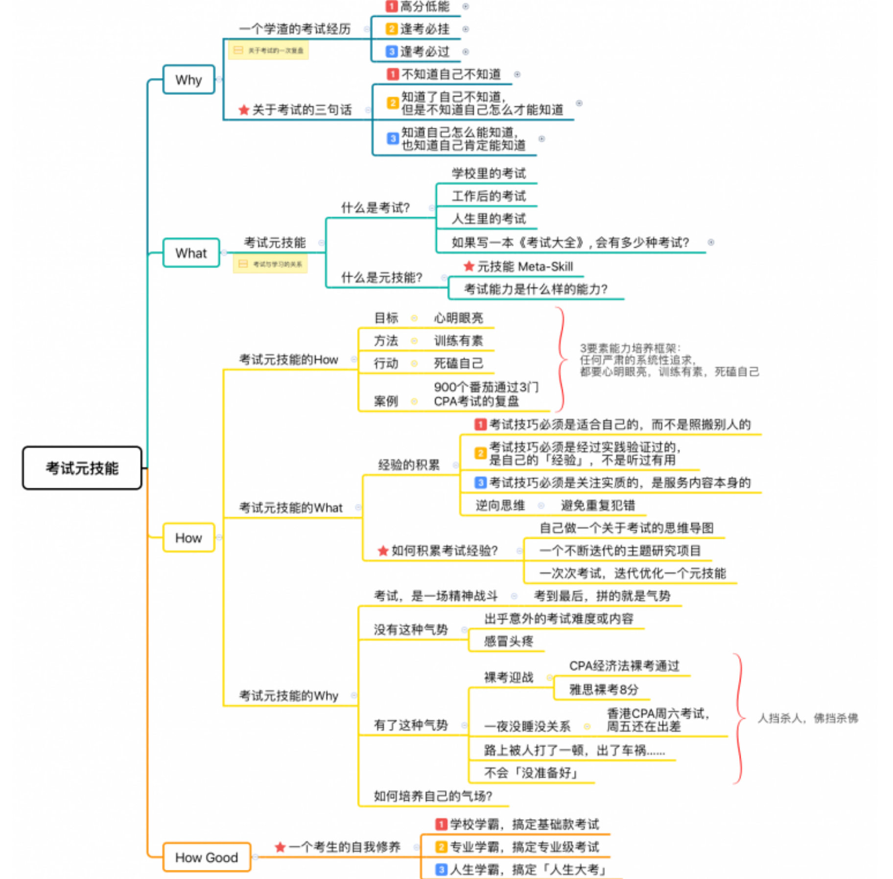

# Day13：第2阶段复习

温习本周课程每一课的思维导图（在每日课程末尾
「今日总结」部分，每张图总计了当日课程要点）

## 08.学习闭环

[08.费曼输出,如何真正做到学以致用？](./08.费曼输出%2C如何真正做到学以致用？.md)

## 09.大脑升级

[09.如何打造强大的私人Google,升级大脑](./09.如何打造强大的私人Google%2C升级大脑.md)

## 10.主题研究

[10.如何用主题研究快速学习,提升人生信息流的质量](./10.如何用主题研究快速学习%2C提升人生信息流的质量.md)

## 11.私人图书馆

[11.如何打造移动的图书馆,不再过目就忘](./11.如何打造移动的图书馆%2C不再过目就忘.md)

## 12.考试元技能

[12.如何打造逢考必过的考试元技能,成为人生考霸](./12.如何打造逢考必过的考试元技能%2C成为人生考霸.md)
./
