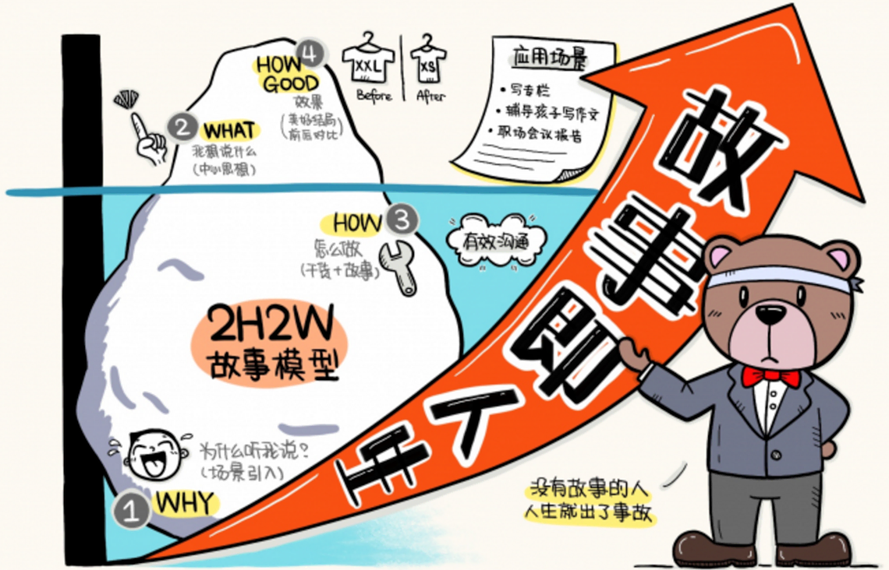
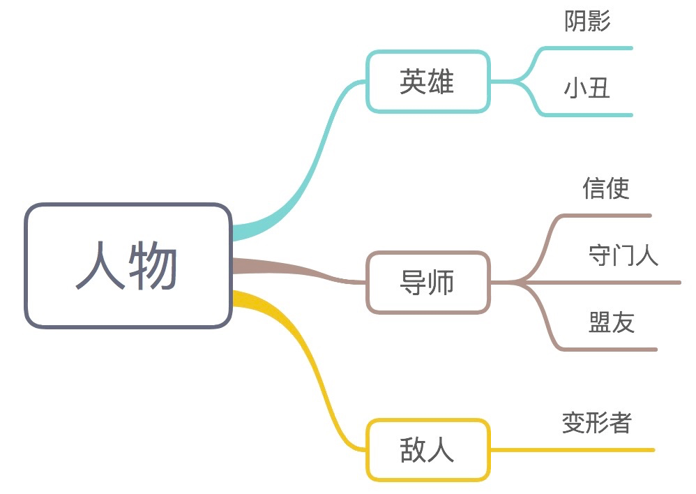
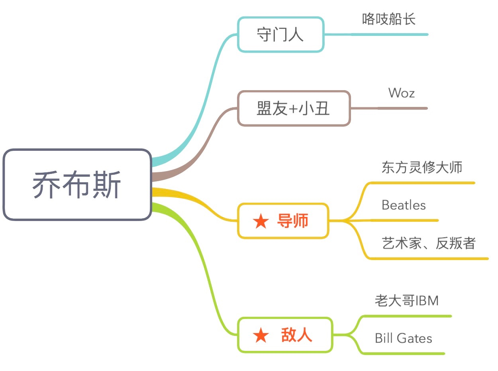
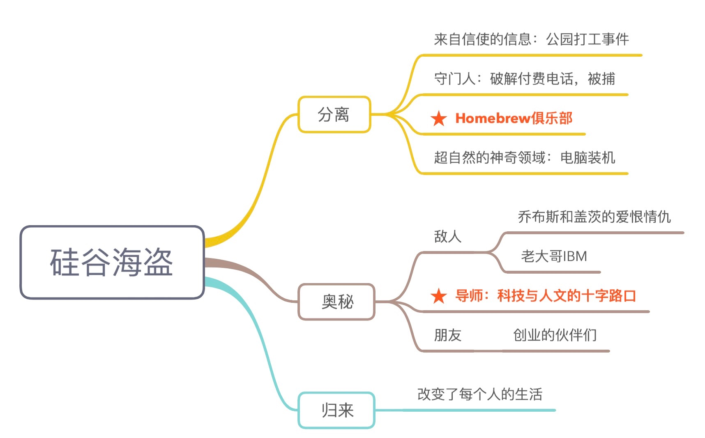

# Day15：如何用好2W2H故事模型,打造职场说服力

今天的主题， 是`讲故事`。



## 一、400万册畅销书作者告诉我

故事得从1年前说起。  

那时候， 我通过在行刚好认识了@协和`张羽`。 

她是协和医院的专家医生， 微博大V，但她的另一个身份就是畅销书作者，她的医疗扫盲系列科普书《只有医生知道》123册， 卖了超过400万册。 
虽然是科普书， 但是却用了讲故事的方式，大家喜闻乐见，相比起纯干货，对医疗常识的科普效果也更好。


## 二、2W2H基本款故事模型

于是， 我给她分享如何用 Evernote 做个人知识管理，打造一个个人知识库、写作素材库，她教我写书的秘诀。

她说，她的所有书，都是在讲故事。

但是，`故事一定要简单`， 干货大家不愿意看，看了还记不住，但是好故事人人都爱听。

她讲故事的基本模式， 就是2W2H： 
- Why：你为什么要听我说？
- What：一句话总结，我想说的到底是什么东西。
- How：怎么做。
- How Good：做了之后有多好。

对于《只有医生知道》这样的医疗扫盲书。 

- Why：就是故事里的各种场景，不知道如何爱护自己身体、不知道怎么看病而陷入的困境；
- What：就是一句话，医生知道你不知道，但是医生觉得你应该知道因此讲给你听的话；
- How：就是干货了，和故事交织在一起；
- How Good：就是故事的美好结局，前后对比，`授人以渔`。

讲故事不是写虚构小说，不是文学创作，而是为了`有效沟通`。
关键点在于把事情的`前因后果`理顺弄清楚，

按照why、what、how、how good组织好，费曼出来，用故事把你的想法串起来，更流畅地实现你的诉求。

简单， 再简单一点，`说人话`，回归常识，把故事讲清楚，这就是畅销400万册背后朴实无华的原理。

小到1分钟的电梯面试，10分钟的分享汇报，大到写一本书，回答一生的主旨问题，2W2H这个方法都是`普适的`。

## 三、专栏作者们怎么讲故事？

后来的一年多，我一直在观察、学习、实践、思考这个基本款的讲故事模型，
越发觉得这个方法`很受用`， 这也成为我平时说话、分享学习方法论的基本模式。

我还发现这个方法为很多人`普遍使用`。 
例如《得到》专栏的很多作者， 包括《5分钟商学院》的`刘润`，讲故事高手老罗罗永浩。

刘润的专栏文章，就是典型的2W2H。
每篇文章在2000字以内，
分成4个部分：

- 场景引入
- 指出错误
- 解决方案
- 总结提炼

场景引入是 `Why`：一个笑话，一个现实场景，告诉你为什么你要听他说，把你带到这个语境里；

指出错误是 `What`：一句话总结，颠覆你过去的观念， 你错了， 问题 的本质是这个。

解决方案是 `How`：放干货，一二三点。
而且，干货是放在具体的场景和案例中的，还是故事。
怎么解决问题，用什么方式来解决？

总结提炼是 `How Good`：让你带走的结论和效果对比。

其实， 2W2H就是我们实践费曼技巧的主要方式之一。 

费曼是说人话，但是不是只讲一个概念，沦为`飘在空中的大道理`，或者正确但空洞听不进去的定义，
而是讲清楚why、what、how和how good， 别人才`愿意听`，听了才可能明白。
大家平时也可以观察一下，用2W2H来费曼，是很多高手的基本功。

## 四、没有故事的人， 人生就出了事故

可以说， 我们上学、考试、读书、工作， 获得的是知识， 但讲故事体现的是能力。 
每个人都有自己的干货，或多或少，特别好或没那么好，但是，故事比干货更吸引眼球，故事加干货，就是无敌法宝。 

3岁到13岁的时候，我们围着有故事、会讲故事的大哥哥，他是孩子王；
23岁， 我们围着有故事、 会讲故事的大叔， 他是商业世界的领导者；
63、73岁的时候，如果我们没有故事、不会讲故事，你的孙子孙女就要去听别的老头讲故事。
那些会讲故事的老爷爷，就成了有智慧的思想领袖，成为哲人王。

就好像在人类没有文字之前， 村子里负责讲故事、传递人类神话的老头，就是权力的中心。
现在也是如此。

`没有故事的人，人生就出了事故。`

关于讲故事的书， 有很多很多，最好的当属好莱坞编剧们写的那些，感兴趣的话，可以去读《救猫咪》这些书。
不想让人生出事故，那么，我们普通人要讲什么故事呢？

有一本书叫`《故事思维》`，整理了一生要讲的6个故事，我重新梳理了一下，费曼给大家：

### 第1个故事

第1个故事， 我是谁？| 介绍自己， 关于Who的故事。

其实就是前面课里说的， 你得像 `托尔斯泰` 一样， connecting the dots，回答人生的主旨问题。
只有你说清楚自己是谁， 别人才可能通过你的故事知道你是谁。

### 第2个故事

第2个故事， 我为何而来？| 说明目的， 关于Why的故事。

我为什么来和你聊天？你为什么要听我说？
咱们为什么在这里吃这顿饭， 为什么大老远坐地铁在咖啡馆见面？

### 第3个故事

第3个故事， 我要往哪里去？| 愿景与使命， 关于What的故事。

我们一起要干个什么事情？我说 的话和你有什么关系？

例如， 我每天都在搬砖，每天做10个番茄，但是，我搬砖是为了盖一栋房子，这栋房子是什么样子的，它有多漂亮，有多结实，
生活在这样的房子里， 我们会有多温暖， 多幸福？

### 第4个故事

第4个故事，我准备怎么做？你准备怎么做？| 授人以渔，关于How的故事。

干货与故事，在这里 交织，水乳交融。
你别跟我讲道理，「你要好好学习啊？你要读经典读大部头？」`道理都在风中飘`。
我作为人的本性是懒惰的，不想改变，听不进去道理。

你也别跟我讲鸡毛蒜皮的事情， 用 `kindle` 看书还告诉我点这里点那里，`印象笔记`记个笔记还点这里点那里，这是浪费你的生命，侮辱我的智商。

而是你要用故事、用场景，用关于改变的故事，激发我自己的思考、和主动学习主动解决问题的激情。

我准备用什么方法学习和读书？
我怎么跟着你授人以渔的方法论来打造一个`学习闭环`，给自己的大脑装一个私人Google？
你`用故事告诉我`。

### 第5个故事

第5个故事， 这么做有什么好处？| 行动价值， 关于How Good的故事。

用具体的事例来对比效果，可以用来`传递价值观`，也可以用`展示实际好处`。
很多成年人不在乎道理，他们看的是`利益`，所以，这个故事也很有用。

### 第6个故事

第6个故事， 我知道你们在想什么？| 换位思考， 关于 Whom 的问题。

当你对面听众时，人的本性就是要发表意见，而且还不愿意主动去阅读你，理解你，和你对话。

思想是有上下文的， 但是批判者只会抓住你的一句话。
所以， 你得给自己`上`一个`保险`， 提前准备一个台阶。
所以， 这是一个`自嘲`的故事，为了你自己好。

例如， 我第一次面对500个人演讲，我第一句话就是，「大家好，我是一名`审计师`。
我们这一行，每天跟数字打交道，在古代被成为`账房先生`，在西方被称为`数豆子`的人，在香港被称为`核数师`。 
是的，我是个严肃死板的会计。甚至我的网络ID都叫 Howie_Serious。
所以，下面的演讲， 你要坐稳了，可能是你听过最无聊的一次。」

听众哈哈大笑，同时也降低了预期。
然后，你就可以放宽心，讲一些笑话，如果笑话不错，还能制造反差萌。


### 豪华版故事

除了基本款， 还可以讲一个`豪华版故事`。 

除了2W2H的基本款故事，世界上当然还有激动人心的豪华版故事，常见于好莱坞大片和商业领袖演讲。

好产品配上好故事， 你就是乔布斯。
这种讲故事的方法， 来自我的一个在行学员给我的评价。

她说： 

```
“ 
哲学家和神话学者约瑟夫·坎贝尔将探寻使命和目标的过程视作‘英雄之旅’，其基本元素在诸多文化和历史长河中熠熠发光。 
坎贝尔说，自我改造是人类最大的挑战。
当改变的需求被唤醒， 就成为英雄之旅的开端——启示、不适和痛苦。 坎贝尔将它描述为‘冒险的召唤’。
一旦接受了召唤， 我们就踏入 了未知的领域， 面临怀疑、不确定、恐惧和困境的磨难。
有时， 我们会意识到自己无法独自完成‘英雄 之旅’， 这时便需要寻求精神导师的帮助。
” 

作为典型的INTJ（我的直觉），看似木纳的 老师 实则大智若愚。
在完成了自我的涅槃之旅后， 用他强大的自我升级系统点亮他人。
他理应当是一类少数 人的好伙伴及精神导师。
```

因为这个评价，我就看了坎贝尔的《`千面英雄`》。 

然后，我发现，这里面的英雄之旅，其实是每个人都有的探索自我的过程。
如果自己梳理好，用故事讲出来，这样，等我们老了以后，除了不跳广场舞，还可以给孙子孙女讲讲自己的故事，传递些人生智慧。

为了下半辈子的尊严，我觉得必须得掌握这个豪华版故事模型。

世上只有一个神话：`英雄的历程`。

其实道理很简单， 关于英雄，不论是中国的还是西方的，是白人还是黑人，是外星人还是熊猫，
来自漫威或者DC，英雄的故事都是同一个故事，或者说，有一个共同的模式。

大致是这样的： 

- 英雄从日常生活的世界出发，

- 冒种种危险，进入一个超自然的神奇领域；

- 在那个神奇的领域，ta和各种神奇的、强大的、超越个人的、超自然体相遭遇， 战胜了一系列困难，经过一次大战，取得决定性的胜利；

- 于是，英雄完成神秘的冒险，带着能够为他的同类造福的力量，归来。


## 五、英雄故事里的人物原型

先谈故事里的人物。 

坎贝尔把所有人物归类为英雄、导师、小丑、守门人等基本类型，主要人物类型有3个，还有一些辅助人物。



### 英雄

先得有英雄。 

英雄的关键词是`成长、改变`。

最好是犯过错误的， 这样更真实， 更有感召力，浪子回头金不换。

这样的英雄，才会抓住你女朋友的心，甚至产生移情的效果。

英雄的行动，他不断打怪升级后力量逐渐强大，他对自我牺牲态度的改变，不断推动故事前进。

### 对手， 敌人

其次， 得有对手，有敌人。
但是， 英雄的对手不可能是办公室八卦吐槽级别的，那样的故事太 low 了，因为与什么人为敌，直接决定了英雄的高度。
`正因为小丑强大，蝙蝠侠才更强大。`

### 导师

第3个主要人物， 是`导师`。 
大部分英雄不是学校老师教出来，是他们自己找到了精神偶像，找到了人类大师，在师傅门前跪了一个月，最终得到了`启迪`，被传授了`奥秘`。

### 配角

当然，精彩的故事， 配角是非常重要的， 通常包括：

- 阴影，这是英雄的第2个自我，性格中被排斥、不能被接受的部分， 威胁着英雄主体的自我认同； 
    就像蝙蝠侠童年掉进的蝙蝠洞；

- 小丑，增加故事的戏剧性， 更重要的是， 他要限制英雄的自我过度膨胀。

- 信使，给主角传递信号， 是 从普通人踏上冒险之旅的最初萌芽；

- 守门人，经过这道门槛， 英雄才能进入陌生的冒险领域， 进入充满奥秘的境地。 
    这是对英雄资格的最基本测试， 也预示着未来冒险旅程的艰难；

- 盟友， 也就是英雄的战友们， 让英雄更有人性， 也代表了尚未被开发和利用的潜能；

- 变形者， 英雄之 旅中经常转变立场、改变敌我双方力量对比的人， 或者说， 他们是绝大多数普通人，是英雄需要去赢取支持的力量之一。 他们让故事更有悬念。 

## 六、英雄之旅的三个阶段

所有这些人物， 围绕一个主角的行动展开故事。 

基本上就三个阶段：  


### 分离主角

在日常生活中， 接受到了信使传递的信息，从日常生活的世界出发，冒种种危险，跨过了守门人看守的第一道门。
跨过这道门， 他从此进入一个超自然的神奇领域。他的整个人生翻篇了。

### 奥秘

然后，他上下求索， 经过导师的训练， 在朋友的帮助下， 和对手展开多个回合的战斗。

中间，他会被打倒三次，然后爬起来三次，中间会有坚定的朋友牺牲，有不坚定的盟友离开，他会被伪装的朋友、被变形者背叛。

但是，九死一生之后，在导师缺席的背景下，甚至他本身就得就拯救自己的导师和英雄，然后他必须用自己的力量，击败大魔王。

### 归来

最后， 英雄`完成神秘冒险`，带着能够为他的同类造福的力量，归来。
就像超级玛丽，最后要抱着桃子公主，回归现实生活。
他要成为一个精神`榜样`，给其他小超级玛丽们以力量，给他们平淡的生活带来希望。

## 七、《硅谷海盗》的故事

不是说我们只有在电影院围观英雄的命，虽然场面大小有差异，但每个人的人生都是这样的一个英雄之旅。

我举个真实人物的例子，他的故事也遵循这个英雄之旅的模式展开。

这个故事来自1999年的一部电视电影， 叫《`硅谷海盗`》（Pirates of Silicon Valley），讲得是乔布斯创业最早期的故事。 


### 分离

一开始，主角是个`普通青年`，过着那个时代普通青年的正常生活。

故事从1971年开始，乔布斯16岁，`高中`毕业刚上大学，有1个女朋友，有几个小伙伴，
喜欢捣鼓电子产品，喜欢听音乐，对东方神秘修行抱有玫瑰色的幻想，留长发，光脚，就是个普通的嬉皮士。

然后，与日常世界的分离。

他得打工挣钱，有一次，他和朋友 woz ，女朋友三人一起在公园里，在小孩子生日会上穿着戏服当卡通玩偶。

对普通人来说是个挺有趣的经历，但是乔布斯忽然`受不了`了。

他无法接受这种生活，他隐约接受到信使传递的信息，他不满意现在的自己，但是`还不知道自己到底该干什么`，所以就和女朋友吵架，大家都很不开心。

就是生活的一地鸡毛。



### 奥秘

然后，他寻求出路。
他的守门人，是教他破解付费电话的一个黑客，技术型嬉皮，人称「`嘎吱船长`」。 

然后，乔布斯和小伙伴因为破解电话被警察抓住，跨过了这道门，他真正踏进了电子计算机这个充满奥秘的神奇领域。

当时，很多没钱的硅谷青年都喜欢淘`二手电子垃圾`来组装电脑。
乔布斯就是进入了「用电子零件装机」这个神奇领域。
Woz就是他的盟友，是他的技术合伙人。

1976年，他们在装机爱好者俱乐部 homebrew 上展示了 woz 装出来的Apple I主机。
Woz 的装机技术比别的爱好者都好，乔布斯的讲故事能力比所有人都好，于是，他们卖出去了50台机器。

忽然间，乔布斯明白了自己的一生到底要做什么：`装机`。
他找到了自己一生的主旨问题，也找到了自己的敌人。

他的敌人，就是当时统治PC市场的老大哥IBM。
是的，`一个高中生，他一开始的敌人就是IBM`。

他和其他装机爱好者不一样的地方，在于他的导师。
他的精神导师们，包括印度的灵修大师，Beatles乐队，那些艺术家、反叛者。
是的，乔布斯一直相信，自己`前世肯定是一个艺术家，一个诗人`。

乔布斯自己都总结了自己的主旨问题：

> 你觉得我站在这里是干什么的？
> 我是要在宇宙中砸出一个坑（make a dent in the universe）。



### 归来

当然， 这部电影没有展示乔布斯作为英雄的归来，电影拍摄于1999年，故事情节到1985年乔布斯被 CEO 赶出公司就结束了。
但是，乔布斯真实的人生故事，比这部电影还要精彩。

他确实回归了， 回到现实世界，改变了地球上每个人的生活，也确实如他的使命，打败了IBM这个曾经的老大哥，也超越了微软这个敌人。
或者用他自己的说法，在宇宙中砸出了一个坑。

PS: 几年前看过《乔布斯传》，很精采，很传奇，最后他确实回归了，王者姿态回归了，可惜因太偏执就医太迟…… 

## 八、总结 & 下一步行动

做自己故事里的的英雄，成为有故事的人。 

想要有故事，就要开启自己的英雄之旅： 

①迷茫期：知道自己的未来要去哪里，找到自己内心`渴望`的事情，作为自己的人生目标或者职业目标。 
②确定期：明白自己的目标，确定了自己的领域，明确定位，剩下的就是实力（竞争力）的`提升`。 
③挑战期：实力提升的过程是一个自己与自己`较劲`的过程，过程曲折，问题多多，可能会动摇自己。 

### 今日总结

好， 我们总结一下今天的内容。 


每个人都有故事， 每个人都得讲故事。 
没有故事， 人生就是一个事故。
你可以用2W2H讲基本款故事， 也可以用英雄之旅这个模型，讲豪华版故事。 

作为主角的英雄之旅， 你觉得这个故事要讲多久？一辈子。 
课后， 你也可以分享一个自己的小故事， 丰俭由人，基本款或豪华款都OK。

### 下一步行动

Next Single Action

知道很多道理， 却仍然过不好这一生， 因为， 道理光知道没有用， 关键要做到。  

今天的下一步行动是：

- 文字或语音费曼自己人生中的某次成长经历， 需要套用2W2H模型。

- 自己为什么做出了改变？

- 做出了什么改变？

- 你是如何做到的？

- 对比之前的自己，有什么不同？

