#Day16：如何高效输出,打造写作工作流

今天的主题是利用系统思维，如何搭建一个高效输出的`工作流`？

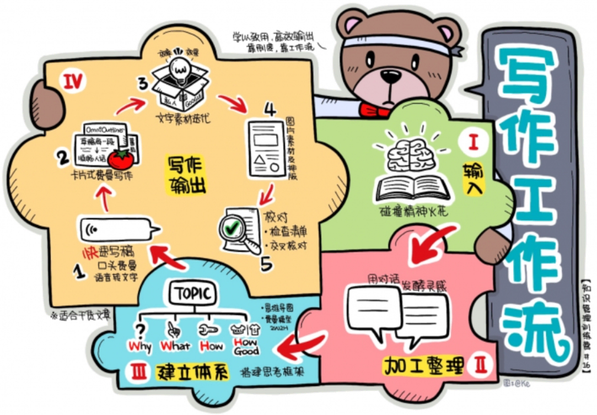

## 一、利用系统思维，打造你的输出工作流

什么是系统？遵循费曼的教导，这里不讲枯燥、没用的定义和道理，举个栗子。

### 《用系统来工作》

推荐看看这本书：《`用系统来工作`》(work the system)

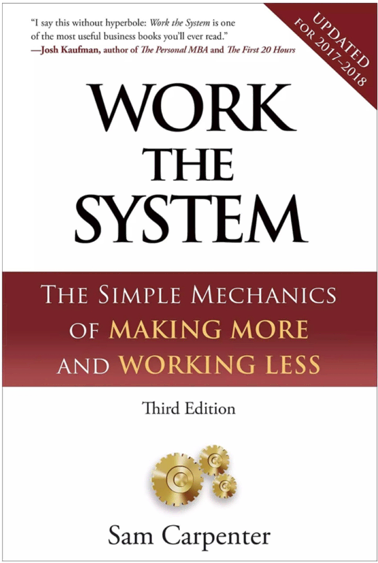

作者卡彭特本来大学辍学、混沌颓废、陷入艰难绝望当中无法自拔。
后来，他的自我救赎，只因为他做好了最重要的1件事：

### 设计自己的人生操作系统

他成功创业，办了个自己的电信公司，并且在众多同行的激烈竞争中脱颖而出。
在他看来：
- 宇宙、大自然、飞机、公司、人体、大脑，都是精妙的机器，是精确度高达99.9%的系统。
- 所有系统中，其实包含无数个子系统。
- 但要这所有的子系统有效运转，服务于主系统（也就是我们的人生目标），必不可少的就是自己的精心设计。

我们必须成为自己人生项目的总工程师，要设计自己工作和生活的战略目标、基本原则、工作流程。
既然工作、个人生活、健康、人际关系，这一切皆是系统，那么我们必须为之精心设计，
使其有效运转，从而有条不紊地驾驶这艘生命之船抵达我们的理想目的地。

### 系统与工作流

维基百科对系统和工作流的定义分别如下：

#### 系统

系统（System），泛指由一群有关联的个体组成，根据某种规则运作，能完成个别元件不能单独完成的工作的群体。

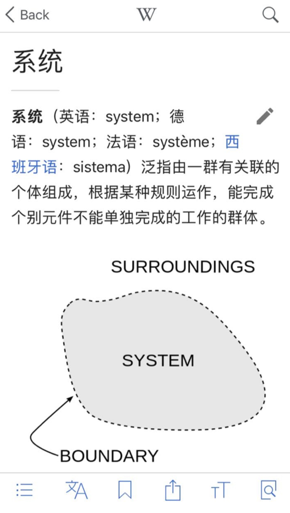

系统分为`自然系统`与`人为系统`两大类。 
常见的自然系统包括`人体系统、生态系统、大气系统和水循环系统`。 
人为系统包括电子系统、社会系统。社会系统，就是「为达成某共同目标，而依规律化的交互作用，或相互依赖的事物之结合，所构成之整体」，政府、商业机构，都是由人组成的系统。

当然，我们最常见的每天都在用的，就是我们手机里的iOS和安卓系统，电脑上的Mac和Windows操作系统。

#### 工作流

工作流（Workflow），是对工作流程及其各操作步骤之间业务规则的抽象、概括描述。

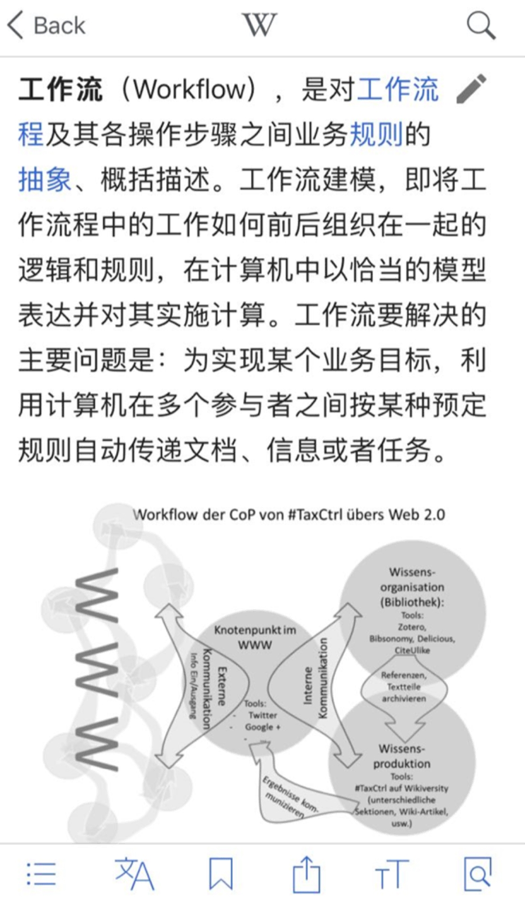

工作流要解决的主要问题是：
为实现某个业务目标，利用计算机在多个参与者之间按某种预订规则自动传递文档，信息或者任务。

工作流起源于计算机领域，但是在工作效率领域的应用对我们更重要。

例如，麦当劳这样的西式标准化厨房就遵循工作流原理，从制作汉堡到炸薯条，每个菜品的最终目标都是标准化的（每个汉堡配1片牛肉坯子，两片生菜，1片番茄），实现目标的过程被按照科学流程进行拆解，人员、设备等资源都进行了最优化配置，烤牛肉坯子的员工就在专门设备的固定位置专门负责牛肉坯子，放生菜片的员工就只放生菜。
前台从收银到送餐，都是专人负责。

这就是一个典型的工作流，其产品质量、生产效率和服务质量好比同档次的中式餐馆强不少。

#### 系统与工作流的关系

系统和工作流，其价值都是帮助我们实现目标，系统是底层基础，就像我们手机里面的iOS，
工作流是上层建筑，就像我们用手机里面的几个App做好一件事情，
相机App负责拍照，打开美图秀秀App把照片修得不像自己，然后再打开微信App发朋友圈嘚瑟一下。

工作流可以由几个App工具配合完成，也可以在一个App内完成；
可以靠App工具自动触发，也可以我们手动连续操作；

工作流所依托的底层系统，可以是别人给你做好的现成的系统，例如iOS，
也可以是自己大脑里的一套系统思维，例如大脑的学习OS、时间管理OS和知识管理OS。

## 二、系统的对立面：要你命3000

系统和工作流的唯一价值，都是解决现实的问题，前提是对目标的清晰界定，对流程的科学拆解，工作流的每个环节，都最高效、最有效地完成每个环节的任务。

对比之下，不能解决问题的功能堆砌，看起来很强大，但是却不是一个系统，而是「要你命三千」。

看起来，结合十种致命武器于一身，西瓜刀、毒药、硫酸、自行车车条、手枪手榴弹和杀虫剂，每一样都可以独当一面， 
但是，这样的工具癖，为了工具而工具，为了流程而流程，就是一个活生生的笑话。

- 为什么曾掌握这么多知识，却都成了洗澡水，刚考完试就倒得干干净净？
- 为什么学习的努力不可积累？知识商品越是买买买，心里越是焦虑？
- 不论是时间管理、知识管理、目标管理……十八种自我管理技术，都学过？都帮不了你？

都没用？！你需要的，不是技巧和工具的堆砌，而是一个系统，一个安装在你大脑里的操作系统，
在这个系统之上，建立一个高效输出、高效解决问题的流程，这才能真正帮助到你，真正带来自我升级！

## 三、我的写作输出工作流

有了这样一个系统，你就可以培养出专业、效率。
当你为自己建立一个系统，无时无刻不在运转，你的努力，更丰富成效。
甚至可以抓住`灵感火花`，纳入自己全面而扎实的个人知识体系和输出流程，形成实实在在的个人作品。

再举一个例子，我在平时，是怎么写文章的。

#### 3.1 输入环节：碰撞精神火花

比如，我今天工作累了，休息的时候翻翻书，这是信息输入。 
忽然，我看到书里面有一个观点特别有意思，我过去一直在思考这个问题，我们的观点，各有特色，这种观点的碰撞，往往是灵感迸发的时刻。

如何抓住灵感火花，变成具体的知识产出？

#### 3.2 加工整理：用对话发酵灵感

这个时候，我在「`跟作者对话`」。
于是，我打开自己的个人知识库、外脑、私人Google（管你怎么称呼，其实官方名字叫Evernote）。

我的Evernote里面有1w条笔记，都是我过去很多8年一篇篇积累下来的。

作为我唯一的知识管理系统，这些高质量信息完成了从收集、加工整理、梳理体系一直到知识内化、输出的「学习闭环」，
也留下了一个可检索、可迭代、可快速调用的私人Google。

我在Evernote中输入关键词，与此相关的我过去收集、整理、输出过的内容立刻展现在我的面前，
包括收集并费曼过的微信干货、读过的书籍全文、书摘和读后感、发过的朋友圈微博Twitter和Pinterest、
随手截屏收藏的内容、自己写的思考片段、写过的知乎回答和公众号文章、整理过的课程文字稿，等等等等。

总之，我的外脑是可搜索的。

我会快速回顾过去的内容，站在过去学习思考的基础上，和作者更深入对话。
读书就是思想的碰撞，是和作者对话。
打开印象笔记就是在自己过去的努力上迭代，更进一步。

#### 3.3 建立体系：搭建思考框架

然后，我想写一篇文章了。

我打开`XMind`这个思维导图软件，使用我自己设计的主题样式和思考框架（`费曼模型`），
5分钟时间搭建了一篇文章的骨架。 

2W2H故事模型：

- 有Why（场景引入，你为什么要听我说）， 
- 有What（我说的是什么，明确概念和主题，一句话总结自己的观点），
- 有How（我认为要怎么做），
- 有HowGood（做了之后效果有多好）。

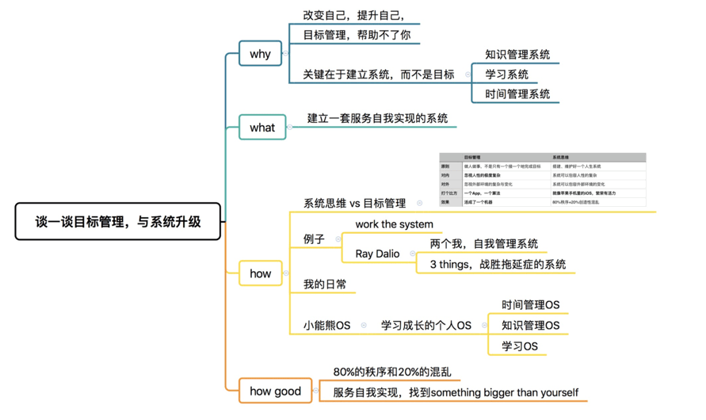

#### 4.写作输出环节

前面三步花了1个番茄。

写出来，才是真正花时间花精力的大头。

我从一个从来不写东西、不会说话、语言能力很差的人，到现在在自己的能力范围内持续产出，不断迭代，经历了很多实践，也整理出了一套我自己的工作流程。

#####第1轮，秘诀：在于快，质量根本不重要

输出草稿第一轮，输出草稿。
关键在于快，对着思维导图中的文章思考框架，用口头费曼的方式，把你的草稿快速说出来。

我的选择是科大讯飞出的「录音宝」App。我打开了「录音宝」，对着这个XMind文件，口述文章，讲了10分钟。

「录音宝」是科大讯飞出品的语音转文字工具，有大数据和人工智能加成，语音识别的效果很好，对我这种普通话很渣的人，竟然识别效果也不错。
PS：「`录音宝`」转文字好像要收费了。讯飞出了个新产品：「`讯飞语记`」可以作为替代品，有个缺点：普通用户不能连续录。

然后，我把录音和转好的文字稿发给小助手，进行下一轮校对。
小助手主要负责修改录音宝的机器转写错误。

第一轮的秘诀，在于快，质量根本不重要。

关于快，10分钟快速整出2000字的文字稿，要的是心理感觉，就像5点钟起床的人，他们知道早起不代表效率高， 
但是他们看重的是别人还在睡觉他们已经起床的那种在心理上战胜了敌人的心理感觉。

质量不重要，写的多了，就知道草稿不重要，就像海明威说的，第一稿都是狗屎，完美主义者干不了大事。
甚至你第二轮就会把第一稿的内容完全推翻。

##### 第2轮卡片式费曼写作

第2轮，结合思考框架和第1轮草稿，把每一段内容变成人话，我称之为「`卡片式费曼写作`」。

这个环节费时费力，我得来一罐精神红牛：`番茄工作法`。

我会打开 `Forest` App做番茄，这篇文章属于我今天「每日三件事」中的一项，计划投入4个番茄。
每完成一个番茄，我会叉掉一个框。

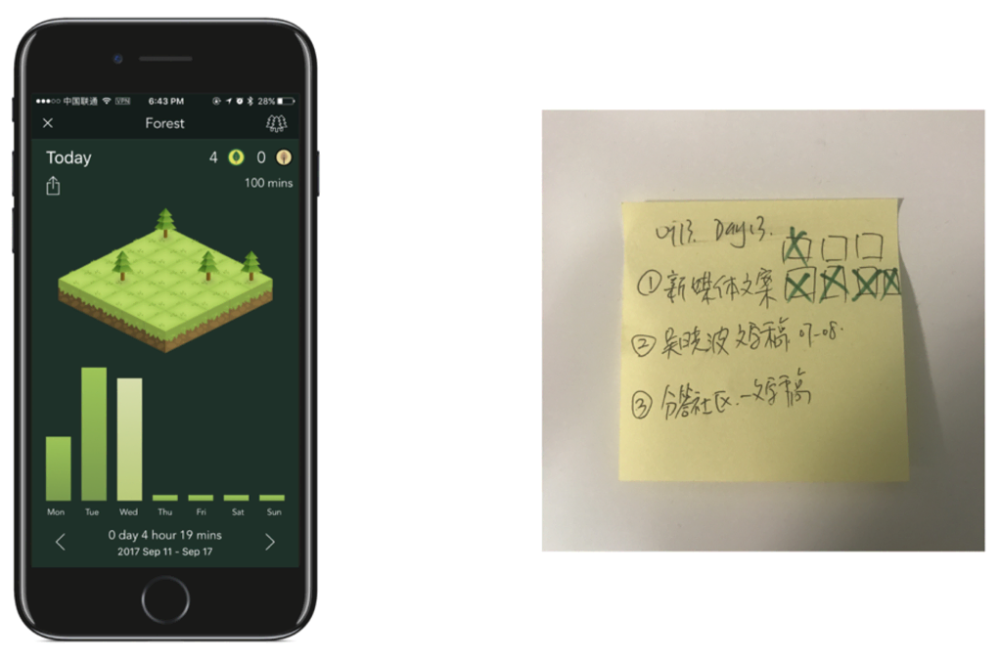

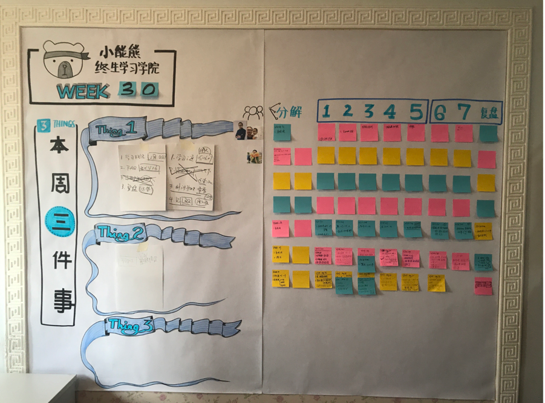

在写作时，凡是1000字以上的文章，我会用大纲软件 `OmniOutliner` (Win下推荐 `幕布` )搭建文章框架/大纲，
直接复制原来XMind里的文章思考框架就可以，每一段其实都是费曼技巧，把第1轮草稿改成顺畅的人话。

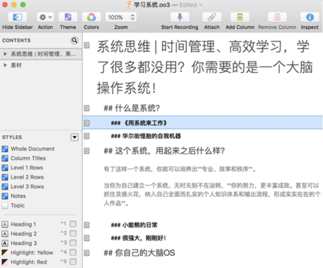

为了保证写作环境的纯净，在写作过程中没有任何干扰，我用简洁到一尘不染的 iA Writer 来写每一个段落。
(PS：Mac也推荐 `MWeb` )

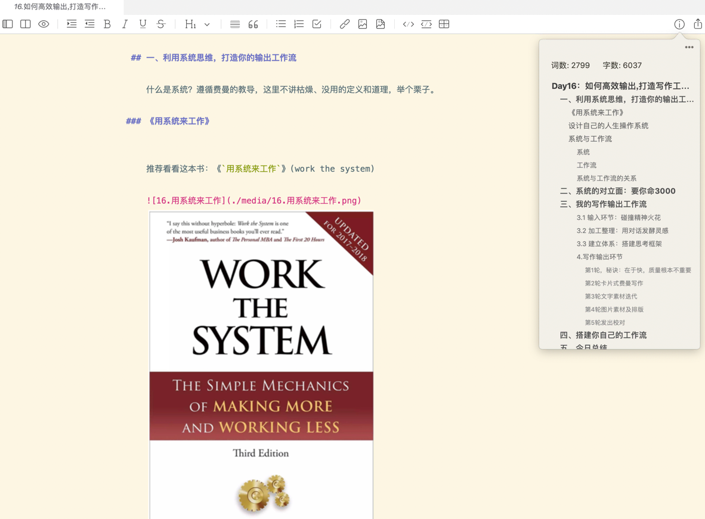

选择10分钟就可以学会的 `Markdown` 语法，这样我完全不用担心 Word 里面的排版问题。

##### 第3轮文字素材迭代

一篇过得去的文章，最起码不能通篇「我觉得」、「我以为」，而没有准确的数据、翔实的事例、有说服力的论述和观点。
驾驭高质量素材的效率和效果，是文章说服力的一个重要依据。

所以，我会利用我的私人Google，快速调用过去的学习努力，对文章内容的进一步修饰，进一步完善，同时精炼语言。
这个时候，我是不敢想象，如果我没有大象，会是多么痛苦。

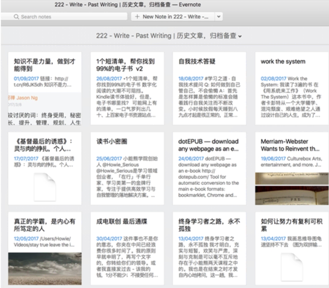

##### 第4轮图片素材及排版

写干货文章就像`炒菜`。
菜再好吃，端上桌的摆盘也很重要。
专业美观的图片素材、简洁而有个人风格的排版，就是文章的摆盘。

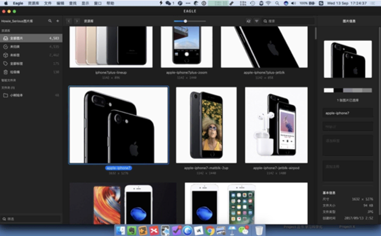

整个团队的图片素材都用Eagle管理（每个人都付费，每年近300块，不便宜），在GoogleDrive里面同步。
(PS：也可以单独使用GooglePhoto，保存高清像素是无限空间的；国内版推荐坚果云，普通用户有上传下载流量限制，但是够用了。)

5000张图片，只要是过去用过的，任何一个人放在Eagle里面，整个团队自动同步。
一句话，Eagle 就是图片素材版本的 Evernote。

所有图片素材，都用 `Keynote` 制作。

我制作了专门的Keynote模板，定义了字符样式、排版、图片大小和位置等一切细节，这是工作流里的工作流。
基本上，做一张配图，也就是几秒钟的时间。

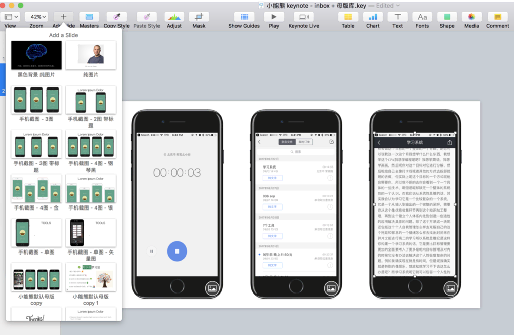

在各个平台发布文章时，插图片费时费力，让人想死。
但是，我用自动上传工具 iPic 和免费的七牛云图床，实现图片素材一键上传，
按一个快捷键，自动得到符合 Markdown 语法形式的图片链接，按下Ctrl+V，粘贴到文章里。
这样，包括微信公众号，任何地方发布我都不需要再手动插图片。

最后的排版，如果是用 Markdown 语法写的，直接复制, `粘贴`到公众号后台或知乎上就可以了。

(PS：想在MD的基础上`美化`下的话，复制全文，到，`壹伴，新媒体管家，135编辑器`等在线富文本编辑器优化，`创客贴`制作图片素材等)

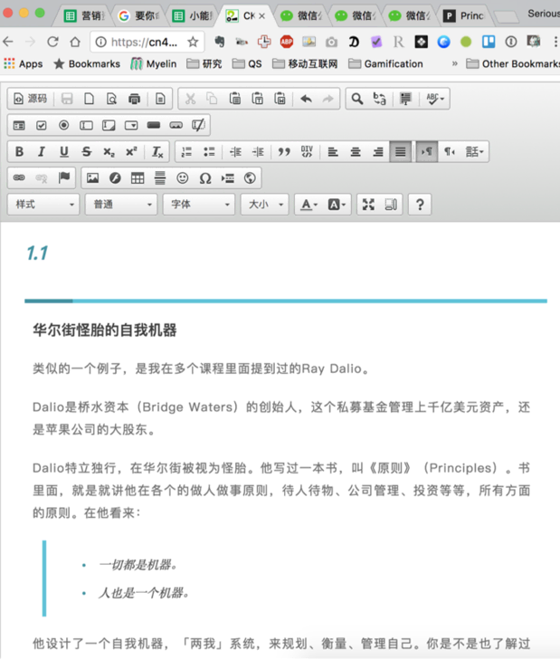

##### 第5轮发出校对

最后，发出前的校对检查。
现实生活中，我们总是重复犯错误。

所以，我做了两个预防措施：

- 1.Checklist(检查清单)

把常犯的错误做成检查清单，发出前一条条核对。
用原来10分之一的时间，让检查效果翻倍，检查有重点，节约时间。

- 2.proofreading(交叉核对)。

自己的错字自己是找不到的，发出前找一个细心的朋友帮忙看一遍。

有了这个工作流，基本上从一个精神火花到一篇3000字以上、图文并茂、排版精美的文章，一般耗时不到8个番茄。

最关键的是，整个过程不费力，沉浸在心流体验中。

这个工作流我只用于干货文写作，写诗歌的不要生搬硬套，最后还怪到我头上。

## 四、搭建你自己的工作流

这套工作流，`不是让你生搬硬套`，每个人的工作内容不一样，软硬件工作环境、工作习惯都不一样，
不是可以生搬硬套的，而是要掌握系统思维、工作流搭建这种解决问题、高效输出、学以致用的思维方式。

你需要举一反三，主动学习。

有了这种思维方式，给自己搭建了效率翻倍的工作流程，给自己安装了学习科学化的大脑操作系统，
你就不用为结果和成绩而焦虑，而是一步一个脚印，享受学习成长的过程。

所以，每一天，无时无刻，我大脑里的思考方式，对学习流程和本质的理解，
过去知识和经验的积累，管理自己、管理时间的方法，加上我的电脑里面的工具，合在一起，就是我自己的大脑操作系统。

我也不焦虑，担心今天写一篇文章没人看没人转发点赞，忧愁课程没人买，担心创业失败，
担心努力不可积累没有回报，我只知道要回归常识，相信人要靠作品说话， 
相信最基本的道理：

每天睡觉的时候，比早上起来聪明那么一丢丢。
`只要不是明天就死掉，总会走到终点。`

## 五、今日总结

好，再给大家总结一下今天的内容。

学以致用，高效输出，不是靠蛮力，而是要靠制度，靠一个输出工作流。 
你有类似的输出工作流吗？你想拥有这样的工作流吗？

今日最小行动：

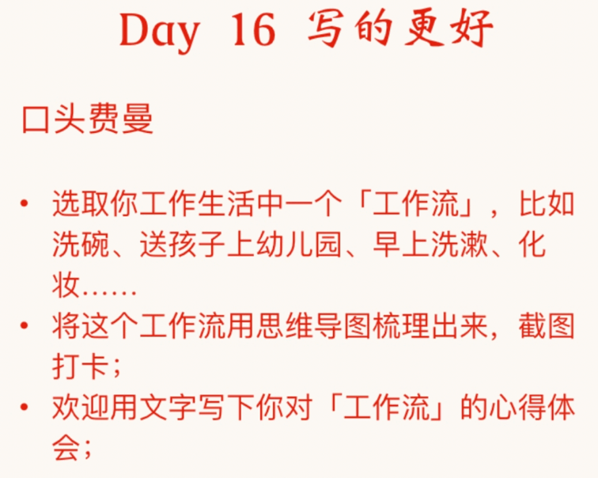

