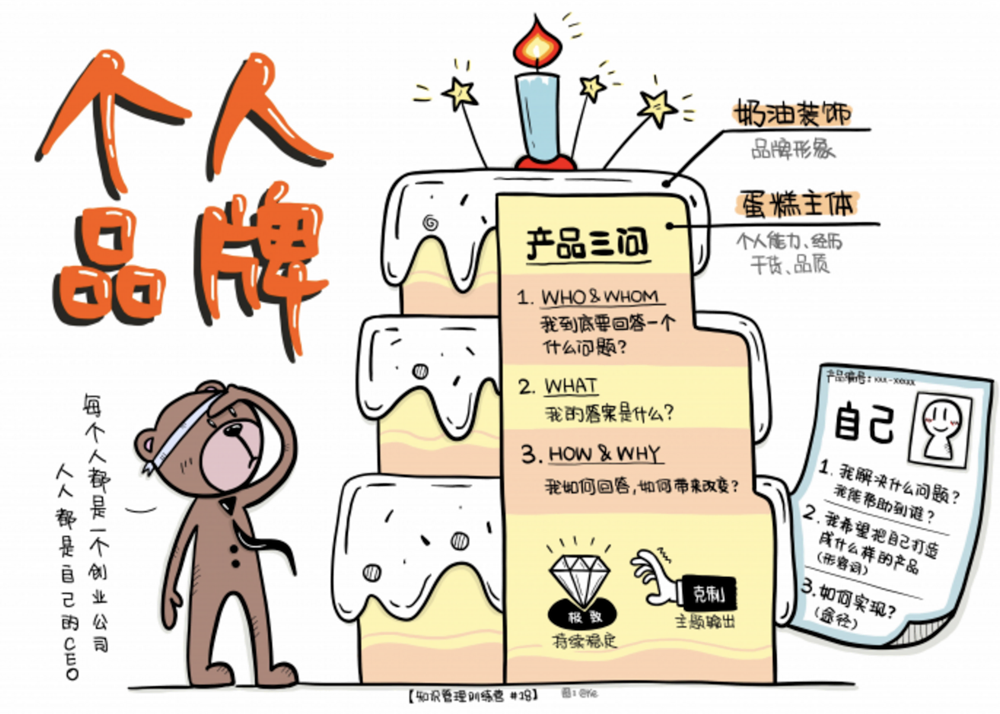
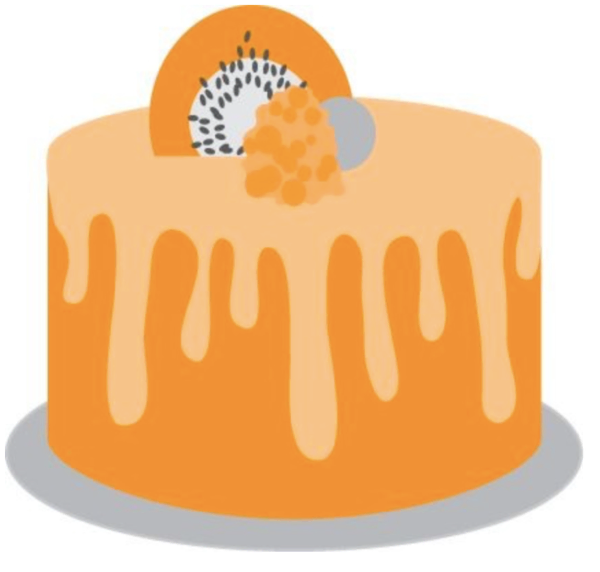
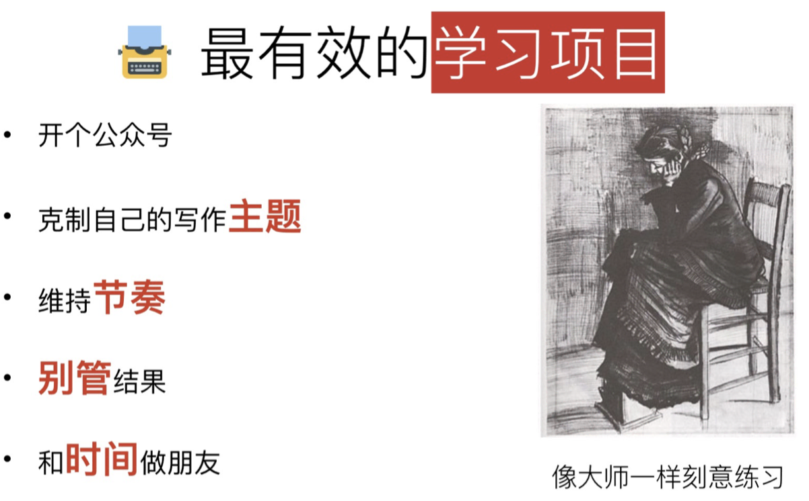
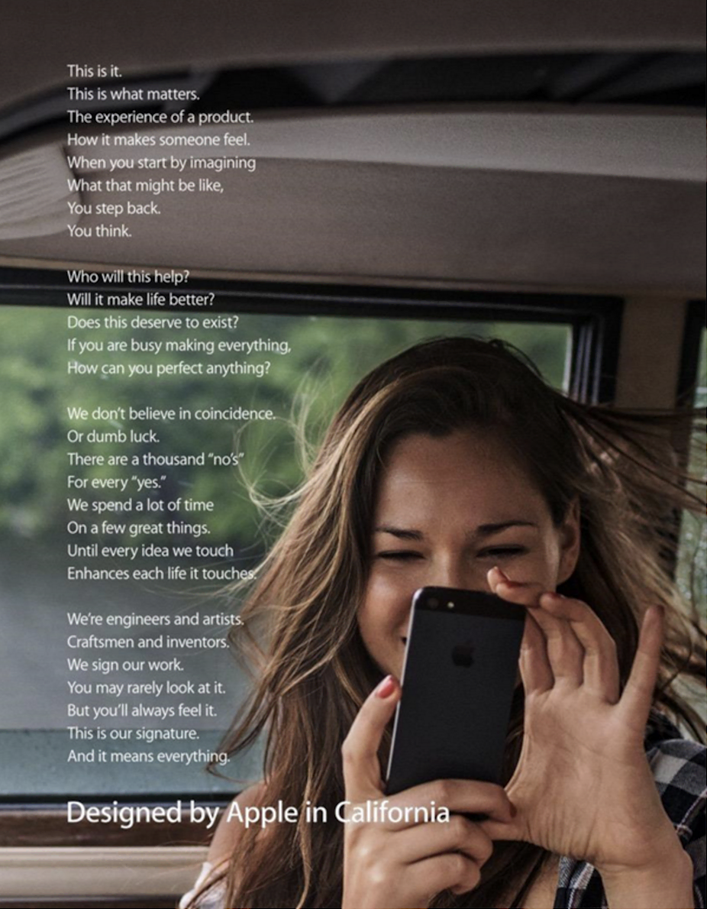
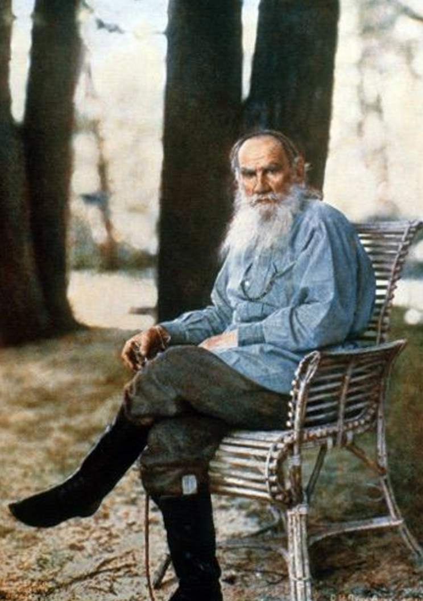
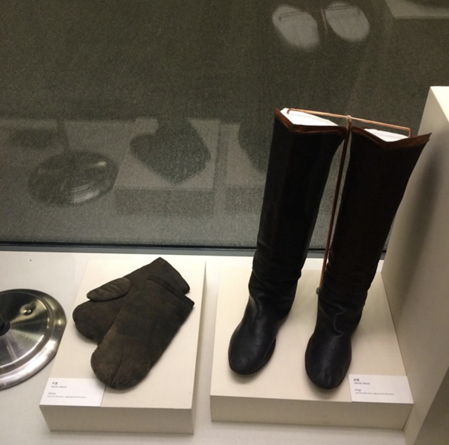
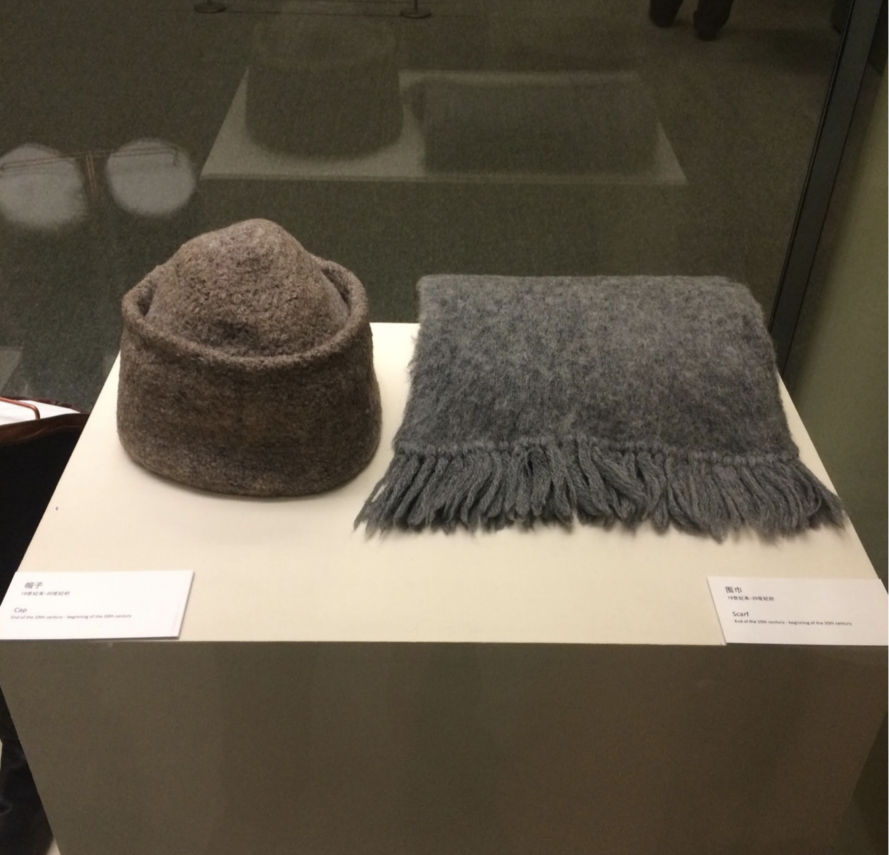
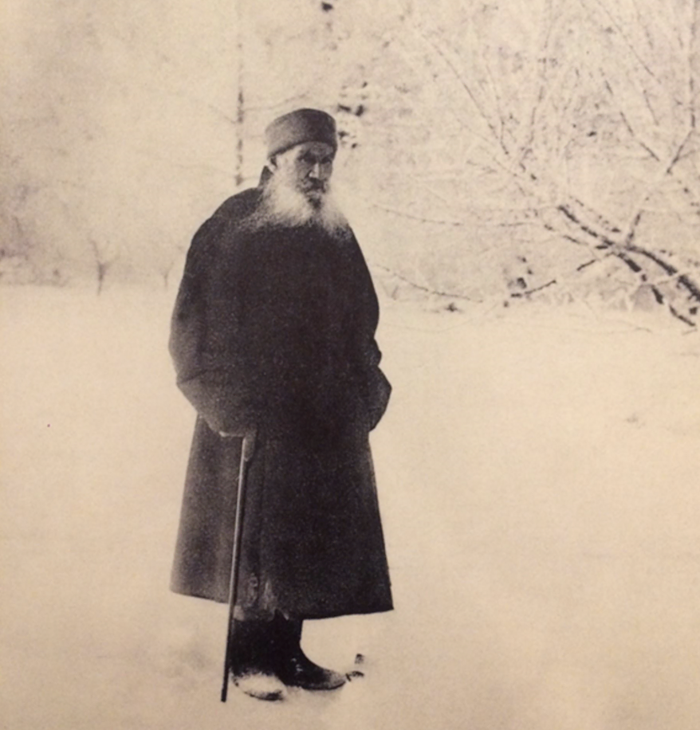
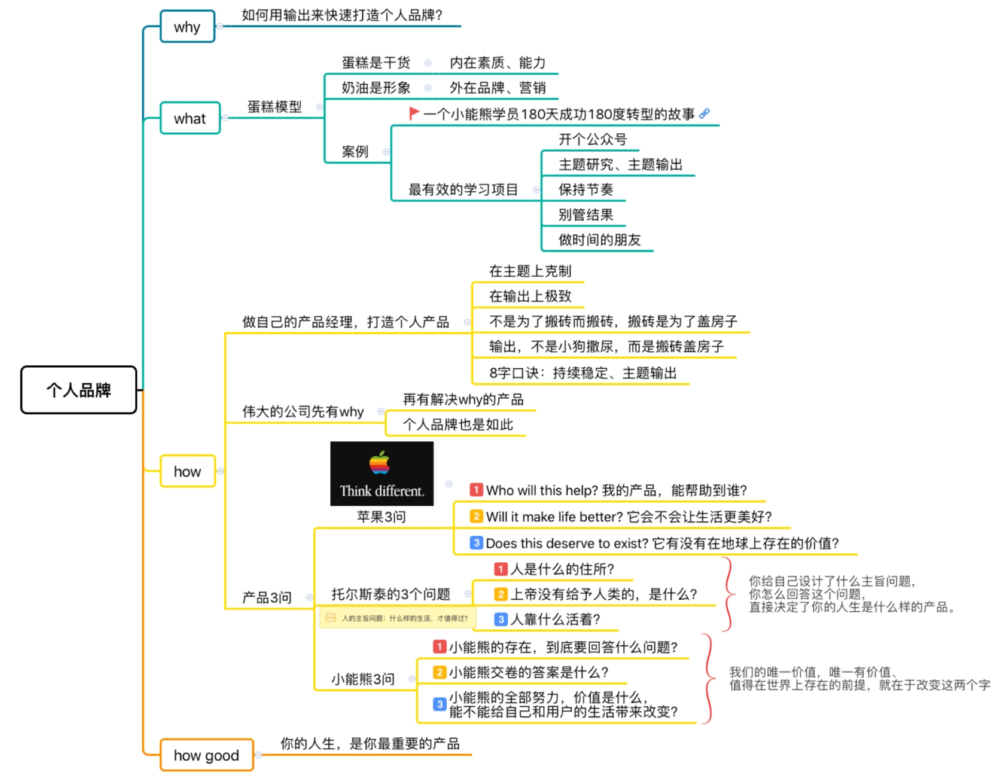

# Day18：如何打造个人品牌

如何打造个人品牌，实现个人职场升级？
今天的主题，是如何打造个人品牌。

每个人都是一个创业公司，人人都是自己的CEO。
当我们大学毕业，成为北漂，来到一个谁也不认识的公司、单位的时候，我们就像一个白手起家的创业公司；

当我们刚刚成家，两口子甜蜜地挤在合租的小蜗居的时候，同样也是创业公司，另一半就是我们的创业合伙人，一起经营家庭这个事业。

无论我们的起点如何，我们都不仅仅是打工的，我们都是创业公司。
我们都在我们所处的环境中打造自己公司的品牌——也就是我们的个人品牌。

今天我们就来谈谈如何用输出来快速建立个人品牌。

## 一、生日蛋糕模型

下面为大家介绍关于个人品牌的「生日蛋糕模型」。 

个人的知识能力经历等就像里面的蛋糕，而个人品牌就像生日蛋糕上的奶油。 

蛋糕是我们的干货，蛋糕外面的奶油就是我们在外面的形象；
蛋糕就是我们这个创业公司的产品，奶油装饰就是这个公司的品牌形象。
如果蛋糕可口，奶油装饰精致，那么就会是一个强的品牌。

奶油是依附在蛋糕上的，如果没有蛋糕的存在，光吃奶油，再可口的奶油也会甜的发腻；
同样如果没有个人过硬的产品，只是精于油头粉面的装饰，即使奶油的一时可口能迷惑人，但是不可长久。
所以，谈到建立个人品牌，绝对不仅仅是如何树立个人形象，如何在公司、互联网上多多曝光，人人皆知而已。

同样是手机，同样能完成电话、微信等功能，为什么iPhone手机卖8000，而有的手机只能卖2000呢？
为什么有人愿意多花6000块钱呢？很多人认为这叫做「品牌溢价」，也就是说这是品牌带来的额外价值。
但是真的是这样吗？

有人说过，品牌溢价其实是假象，看起来是同样的产品，因为品牌不同而卖了不同的价钱，其实更多是因为产品的不同带来的价格不同。
iPhone的做工，iPhone稳定性，让你买了以后不用折腾，上手就可以用，也不会越来越慢；
appstore里有各种应用，满足你各种需求；特别是在现在手机支付这么普遍情况下的安全性，也是其他手机所不可比拟的。

贵有贵的道理，卖的贵不仅仅是品牌价值让大家付的「智商税」，而是本质上卖的产品就是不同的。
生日蛋糕卖的贵，卖的绝对不仅仅是外面的装饰，而是里面的蛋糕和外面的奶油都要可口。

那么我们怎么打造自己个人的蛋糕+奶油呢？

## 二、一个学员的故事

首先，我们还是从一个小能熊的学员真实经历开始。

她是我们小能熊的一个学员。和小能熊一样，她是一个很普通的人，来自一个普通学校的普通专业，在建筑行业做了一个普通的工作。

但是慢慢的，她发现自己对互联网、对互联网运营非常感兴趣。 
现在互联网这么火，自己也特别喜欢跟人打交道，就想转行去做`互联网运营`的工作。

这样的情景相信很多人都遇到过。自己的专业不喜欢，喜欢的行业又没有人知道自己，跨界进入一个全新的行业就像一个白手起家的创业公司，我们应该如何开始呢？

如何快速学习，预备自己在新岗位中的知识技能？
又是如何树立自己的个人品牌，让别人相信自己呢？

我们来看看这位普通的学员是怎么做的。 

她没有后悔之前的选择，没有怨天尤人，也没有好高骛远，而是：

首先，她给自己`开了一个公众号`，并且`限制`了自己的`输出主题`。
只输出自己在互联网运营以及学习成长方面、每天学习思考的内容，学了什么、做了什么、有什么总结反馈。 

然后，她限定了自己的`输出节奏`，由于她的`目标`特别明确，特别希望快速成长，一般人可能一周输出两三篇，三四篇就可以了。
而她给自己限定的输出节奏是比较高的，每天都要输出一篇不少于500字的文章，并`维持`这个输出节奏。

而且，她也没有把这个公众号文章到处转发，到处发红包让别人看。
实际上这个公众号，是她自己的一块自留地，是她学习成果的一个记录，是她自己思考工作总结的一个复盘。

她通过公众号不断和她的读者们互动，获得了第一手的直接反馈，而且大家的激励也帮助她不断前行。

最后，仅仅用了180天的时间，她就实现了自己身份的转变。

一方面，她加入了一个互联网公司，成了一个项目的全职运营。

另一方面，她自己的公众号也积攒了很多粉丝，超过了1万，而且她公众号文章的互动和打开率都特别特别高。
普通的公众号可能就五个点的打开率，而她的公众号能有20个点打开率。

因为大家从头到尾都了解她怎么一步一步走过来，这些读者都是她的观众，都参与了她不断成长的过程。

而且，她还作为运营合伙人，参加了一个女性成长的社群组织。

每个人都读书学习，但是，每个人读书学习的效果都是不一样的。
整个过程，她和别人最大的不同，就是持续输出。

通过输出，通过实践，让自己的学习不再是为了学习而学习，而是通过`不断地实践`，去解决具体的问题，通过成长，让自己`跟时间做朋友`。
所以她也就真的在不断地成长，并且迅速实现了身份的转变。

## 三、做自己的产品经理，打造个人产品

每个人都是一个产品经理，每天都在殚精竭虑，穷其一生，就是要把自己打造成一个有价值的产品。
`产品，才是个人努力的从0到1`。
产品，就是那些能够凝固下来的、杠杆率高的、别人一看就能够了解你的东西。
包括标志性的重大项目、个人网站或知乎回答记录、个人作品集、优秀的书籍等等。

一句话，就是`持续输出`。

在之前的课程中我们谈到完整的学习应该是一个闭环，完成整个闭环才是完整的产品。
如果只是半成品，是无人问津或者售价很低的。
但是我们的学习是半成品还是一个完整的产品呢？`很多人的学习只是学习而已，并没有输出`。
如果这个学员也只是学习运营的知识，并没有系统地输出所学的话，她怎么知道自己所学所思输出，她怎么知道自己所学的价值呢？
别人又怎么能更多了解她呢？

并且她的输出也遵循了「克制、极致」的原则：

- `在主题上克制`。其实就是输出需要有目标、有方向。
   输出，不是像小狗撒尿，到处都留下「`到此一游`」的标记，不是知乎上哪个问题热，就去回答一下；
   
   哪个社会现象热，就去蹭一下，而是用主题输出的方式，输出你主题研究的成果；

- 在行动上极致。四个字：`持续稳定`。

就像那位学员，对特定主题维持稳定的输出节奏，每周3篇文章。

这样，输出自然就会拉动你持续的学习输入、思考、交流讨论以及实践。

这个学习闭环，自然而然就滚动起来了。

诺基亚手机一年能出40款手机，玲琅满目，好像能满足不同人的需求；
而iPhone一年只发布一款新手机，所有精力都投入到一款手机上，做到极致。结果呢？

所以我们在输出上，也要克制、极致，不是浅尝辄止，而是深入研究，在一个领域深耕，`打造自己的产品，做工扎实的蛋糕`。

一句话，我们都不是靠搬砖吃饭的，但我们每天都得搬砖。

但是，我们不是为了搬砖而搬砖，看了砖头就想搬，我们搬砖得心明眼亮：我搬砖是为了盖一栋房子。
这样，别人看到房子，就知道了：这小子不错。
很勤快，肯动脑子。

所以，输出，不是小狗撒尿，而是搬砖盖房子。
房子，就是你的产品。
行动上，只要做好8个字：`持续稳定、主题输出`。

## 四、产品3问

我们在个人品牌中要宣传什么？当然是我们的产品啦。

这个学员在每一天的输出中，让人看到她的成长，她具备的运营岗位的技能。

Linux操作系统的发明人林纳斯说过，「Talk is cheap. show me the code」。

我们不只是纸上谈兵」，要「行胜于言」。

这位学员，她用一篇篇文章为自己代言，`用作品说话，用产品说话，是最好的品牌宣传`。

我们要盖一栋什么样的房子呢？什么样的房子是好房子？这个问题，不要问大师，问你自己。

## 五、苹果3问

著名的Ted演讲(卓越领导者如何激发行动)中西蒙曾说到：
「People don't buy what you do; they buy why you do it. 」

在以往的产品生产中，往往只考虑市场的需求，然后我们生产相应的产品满足市场的需求。

这就像以前「生物」专业吃香的时候，很多家长老师都让考生报那个不知所云的「生物工程」；
觉得商科收入高，一股脑地都上MBA一样，都是从需求出发。
这本来无可厚非。

但是伟大的公司往往是先有了「why」，才去思考如何实现这个Why的产品；
这个产品的产生也吸引了那些有着同样「why」的顾客。
 这个「why」才是你和别人不同之处，才是最吸引人的个人品牌。

我们来看看伟大的公司的Why是如何的。
苹果算一个。
从濒临破产到全球市值最高的公司，它也就用了十几年时间。

在一个自我宣言式的广告视频「Designed by Apple in Carnifornia」里，苹果对自己的产品提出了三个问题，我称之为「苹果三问」。

- Who will this help? 我的产品， 能帮助到谁？
- Will it make life better? 它会不会让生活更美好？ 
- Does this deserve to exist? 它有没有在地球上存在的价值？

提出好问题，回答这个问题。
不论是公司和人，都得靠这个，才能活明白。

## 六、托尔斯泰的3个问题

伟大的公司如此，伟大的人也是如此。
人活着都得提出问题回答问题，人的存在是有一个主旨问题、或者说中心思想的。
就和猫狗一样，猫狗的生命意义、主旨问题就很简单很纯粹啊，狗讨好人类，让主人快乐，猫让人类讨好他，这样主人就快乐。

人的主旨问题是什么呢？问题提的好、问答的好，这个人就不一般。我们看看托尔斯泰的案例。

在《安娜·卡列尼娜》里面，主人公列文其实就是托尔斯泰自己，列文过的生活，就是他自己设计的理想人生，混合了他自己过去的真实经历、期望和失落。
他还从列文的角度，观察了安娜等一干人过的人生，审视别人混乱失控的、自我毁灭的生活，列文一直在思考一个问题：

什么样的生活，才值得过？

托尔斯泰的其他作品，包括《复活》等小说，也是如此。

小能熊理念「严肃、耐心、永不妥协」中的严肃，就来自《复活》，来自主人公聂赫留朵夫公爵所追求的「严肃的兴趣、痛苦和欢乐」。

托尔斯泰借着公爵的人生，又回答了一遍这个问题。

托尔斯泰还为儿童写了很多故事，很短的寓言和童话故事。
我喜欢他的一个短篇《人靠什么活着？》(What Men LiveBy）。

故事里，上帝对天使提出的三个问题：
- 人是什么的住所？
- 上帝没有给予人类的，是什么？
- 人靠什么活着？

What dwells in man, What is not given to man, and What men live by.
答案我不直接揭晓，作为课后的阅读材料大家自己去读。

托尔斯泰一生的全部作品、他的全部行动，包括老年的时候放弃所有财产、为穷苦人民的权利奔走、死前还和老婆闹脾气离家出走。

他的一生，都是在回答自己的主旨问题：`什么样的生活，才值得过`？

我在国家博物馆看过托尔斯泰的展览，他的大衣很破，棉裤很旧，书桌上的文具很可爱。

视频里面，他到俄罗斯的广场上散步，老百姓闻风而动，10w上涌上广场，就为看他一眼。

简单说，托尔斯泰，堪称我们这个时代的鹿晗。

所以，你给自己设计了什么主旨问题，你怎么回答这个问题，直接决定了你的人生是什么样的产品。

## 七、你的产品是什么？

对照着苹果和托尔斯泰的产品思路，我们自己的产品应该是什么？
你作为自己的产品经理，你的产品思维，你对产品的定位和认识是什么呢？

效法伟大的公司和人物，我列了三个问题：

- 我到底要回答一个什么问题？ 
- 我的答案是什么？ 
- 我能不能实现自己的回答，能不能真正带来改变？ 

关键词就是`问题、答案和行动`。
回到学员的例子，我们用逆向工程的方式，来想想开头的那个学员是怎么回答的。

她的问题，是自己到底想做什么样的工作，成为什么样的自己？

她的答案，就是自己确实不喜欢当下的建筑行业工作，自己想做互联网运营，想过有趣的、有成果的、丰富的生活，但是抱怨和等待都没有用，只有主动改变。

她的行动，很简单了，就是持续稳定的主题输出，密切围绕自己的目标高强度的学习、思考、实践和分享。

## 总结 & 最小行动

好，我们总结一下。

- 要想有个人品牌，不是靠技巧去吸引别人眼光，而是靠输出打造产品。
- 输出不是小狗撒尿，而是搬砖。搬砖不是为了搬砖本身，而是为了盖房子。
- 持续稳定的主题输出，把自己的人生变成产品。
- 你没有选择，你就是自己的产品经理。怎么做产品？问自己问题。
  - 苹果有3问，托尔斯泰有3个问题。你怎么回答？

今日行动

知道很多道理，却仍然过不好这一生，因为，道理光知道没有用，关键要`做到`。

今天的下一步行动是：

- 如果你在搬砖盖房子，你的房子是什么？或者说，你的产品是什么？
- 你想打造什么样的个人品牌？你想为自己贴上什么样的标签呢？
- 如果费曼让我们形成个人品牌，有什么渠道或平台让你现在就能利用并开始实践费曼呢？

