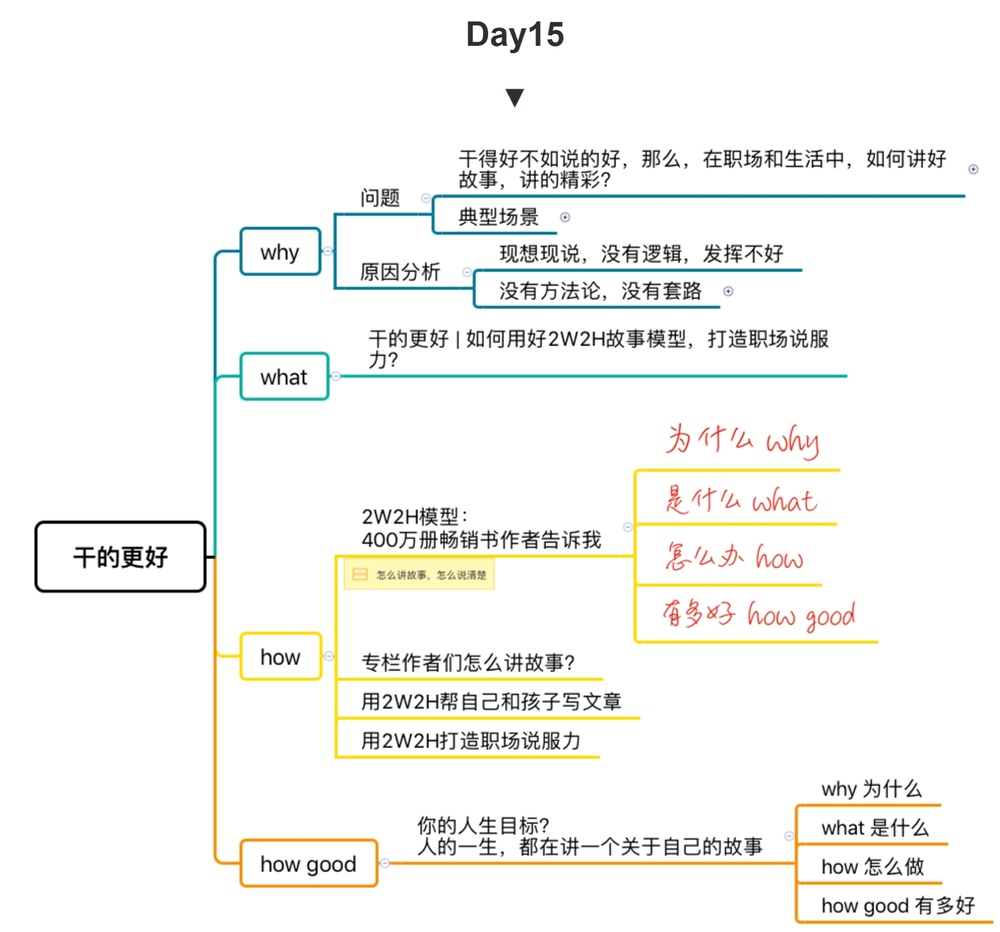
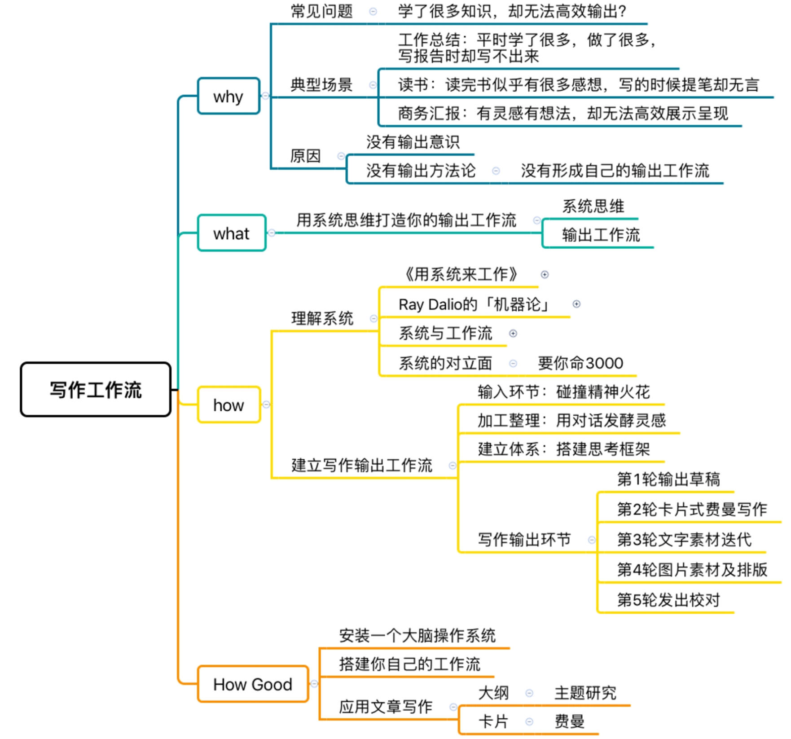
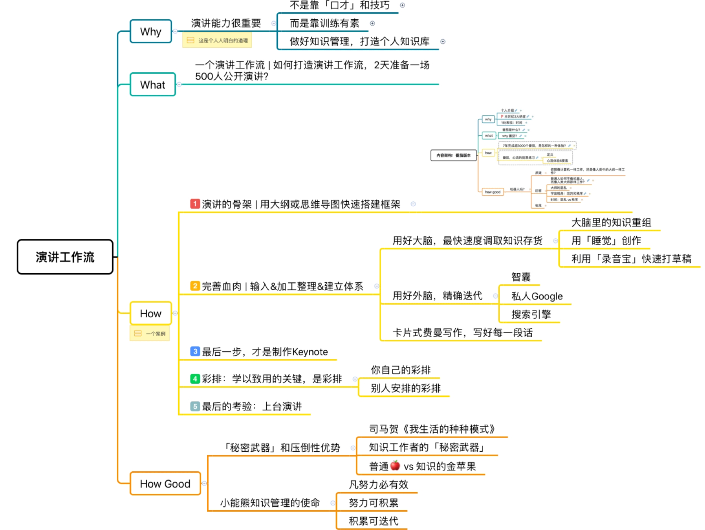
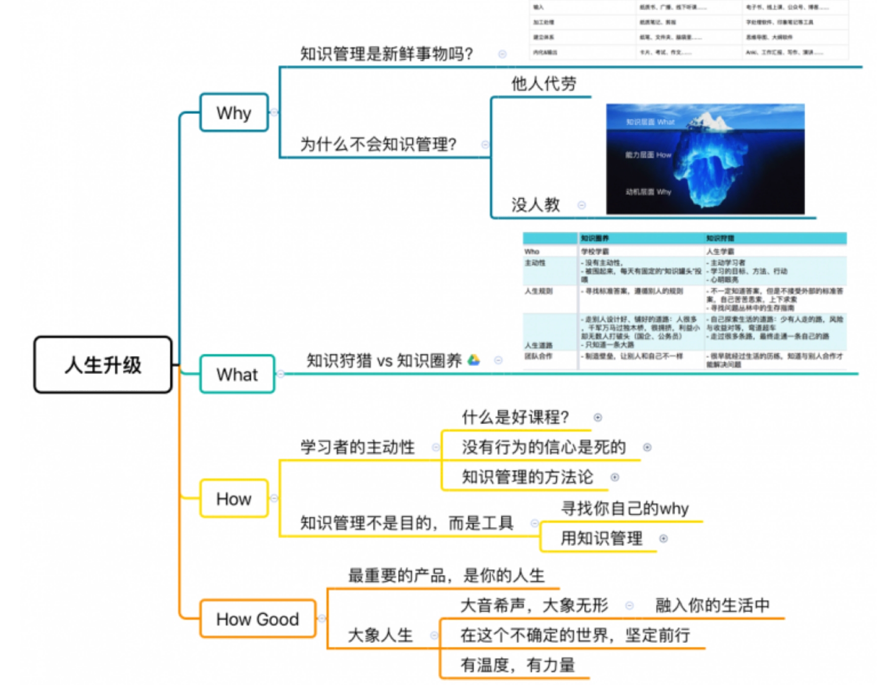

# Day20：第3阶段复盘

## 15.2W2H故事模型

[15.如何用好2W2H故事模型,打造职场说服力](15.如何用好2W2H故事模型%2C打造职场说服力.md)

## 16.写作工作流

[16.如何高效输出,打造写作工作流](16.如何高效输出%2C打造写作工作流.md)

## 17.演讲工作流

[17.如何打造演讲工作流](17.如何打造演讲工作流.md)

## 18.个人品牌

[18.如何打造个人品牌](18.如何打造个人品牌.md)

## 19.将人生当产品打磨

[19.最伟大的产品莫过于自己的人生](19.最伟大的产品莫过于自己的人生.md)

