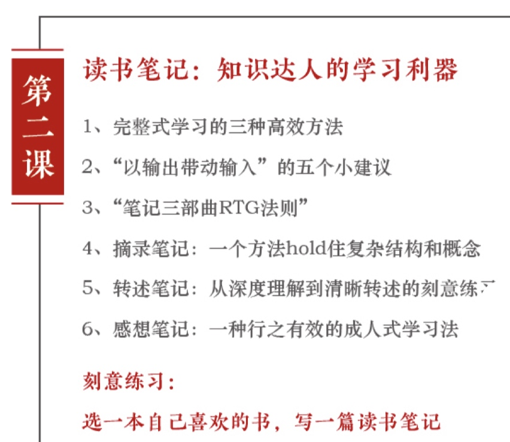

# 第二课：读书笔记——知识达人的学习利器

首先，今天请你先思考两个问题。

第一个问题，为什么在一个新书层出不穷，好书汹涌而来的时代，我们依旧有`知识的贫穷感`？

其次，我们常说要多读书，读好书，究竟`能把书读好的人有多少`，你是其中之一吗？

今日要点：

----

## 1. 完整式学习

我们常说书是人类通往文明的阶梯，记忆一旦消亡文明就会消失。
所以人类文明发展到今天最好的记录和记忆产品就是`书`，我们要学会读书。

关于如何读书，我先谈一个个人的浅见：
结构性的知识，其实是最有力量的，完整式的学习才最有效。

因为一旦知识结构片面或者学习片面，就会有漏洞，所以呢？
你要学会结构式看书学习，而不是泛泛地浏览。

曾国藩先生在给他儿子的信中说到，`避重就轻，是读书之大忌`。
他恪守`独一不二`的古训，也就是一本书不读完，不读的第二本，拒绝`游手好闲似的读书`。

在他看来，`读书就好比是打仗，必须攻下一个个大的据点，方能最终取胜`。
如果只是散意地随意地`攻下一个小村小寨，并因为这些微小的成就而自得自喜`。

最终其实空空如也，这里先给你推荐`三种高效阅读的方法`。

### 同一个大主题下的多种子主题阅读

第一种，那就是在`同一个大主题下的多种子主题阅读`。

怎么理解呢？比如你要研究`品牌`方面的知识，可以同时研究：

- `艾.里斯(AI Ries)，杰克.特劳特(Jack Trout)`的定位理论
- `罗瑟.里夫斯(Rosser Reeves) `的独特销售主张
- `大卫.奥格威(David Ogilvy) `的品牌形象理论
- `Grey(美国广告公司)`的品牌个性理论
- `李奥贝纳`的人本主义和创意文化`
- `舒尔茨`的整合营销传播

包括后来出现的品牌资产理论，品牌社群理论等等。

这都属一个大主题下的多种子主题，如果你要学习这样一个领域的知识，你可以请`专家推荐或者自己查阅`相关资料，选择基本相互匹配的书，然后呢, 至少去读上两遍左右，包括快速通读和重点精读，
然后在这一定的时间内完成这个阅读，获得对书籍，对这个领域支持的整体理解。

### 同一个子主题下多视角学习

第二种就是同一个子主题下多视角学习。

刚才提到了定位理论，你可以看 特劳特和里斯 写的也可以看 邓得龙和冯卫东 的演讲，
也可以选择其他不同的版本，不同作者的书，
然后从中对比参照，反复阅读，
这样可以帮助你更好的开拓这个主题里面的思路。

### 拟大纲，查漏补缺
第三种，就是对自己关注的领域，在有了一定的了解之后，可以尝试拟个大纲出来。

看看自己已经掌握了什么，还需要补充什么，哪里还需要深入？
然后在之后一段时间，可有针对性地阅读思考和时间，最终可能形成个人在这个领域的体系，

----

## 2.输出带动输入的五个小建议

在以上了这个基础之上，再给一些其他的`小建议`：

1. 一定要`追问`一次
    用自己的思想去拷问，去反思自己。
2. `要学会提问`，问出好的问题胜过得到最好的答案
3. 第三：一定要建立一套完善的训练。来强化书中的经验，能够不断反复反复再反复。
4. 第四，就是很多人去关心怎么构建自己的知识体系？
    其实，知识体系的本人应该是你想成为怎样的人，适合我的，不见得也适合你。
5. 最后那读书和学习的方法中`最重要`的一个经验就是`用输出带动输入`。
    比如读书就一定要做摘录笔记啊，转述笔记啊，或者说做些书评，比如经常优秀的人在一起分享你所看到的东西啊，然后在交流碰撞中，你会得到更多的。

## 3. 笔记三部曲RTG法则

刚才那我们讲到读书最重要经验就是要输出，因此那接下来我讲讲如何做读书笔记，`读书笔记有三种方法`，这三种方法对应笔记侠提倡的了一个概念，叫做`笔记三部曲`，RTG法。

- R Record 记录
- T Tidy 整理
- G Go 行动

RTG就可以对应三种笔记出来。

### 摘录笔记

第一种：叫做`原文摘录`。Record：记录，我们可以称之为`摘录笔记`，通过记录来帮助记忆。

因为真正好的书是非常复杂的，它有多种的层面经得起细细的品读。
这里建议你可以先把书里面的`核心观点，方法论的案例摘录出来`，句子很重要的课`标红，或加粗`。

关于这种摘录的方法，现在有个很流行的快速读书方法就是`拆书`。
所谓的拆书就是`拆解一本复杂的书`，把其中的`骨架和知识点`找出来，用笔记的方式将它记录。

拆书有什么价值呢？有两个。

第一呢，就是`拆的过程`，他是一个快速又全面通读的过程，不会因为跳读而漏掉核心的信息。

第二个好处呢，就是这个`拆的结果`，要形成书的一个要点的笔记的记录，让人对书的整理，知识体系有全面的认识，拆书呢，很多人会做成一个思维导图。

我们这里呢，建议你用思维导图工具是**XMind**的，非常实用。

然而使用思维导图也要注意：
做思维导图的人呢？基本只有自己看得懂。

所以如果要给别人看的话就会比较麻烦一些，笔记侠和一些出版社，像中信,机械工业出版社，长期合作读书笔记。

每个月我们都会选出优秀的新商业类的书籍，然后发给全国感兴趣的笔记达人来完成读书笔记，在他们做笔记的时候，我们会非常强调她们有没有把这本书最基本的结构概念理解透彻？

一个人在学习的时候，比如对最基本的营销概念呢，市场概念的理解透彻后，就能够建立在这些观念之上的认识，形成市场判断的基础能力，人的学习水平在某种程度上，它就是拥有正确的底层关键知识的数量，以及调动这些关键知识解决问题的能力的综合体现。

所以。我们判断一个笔记达人摘录笔记做得好不好？
就判断他有没有`把知识结构和概念说清楚，说明白`，案例是否`详实`。

### 转述笔记

不过那做好摘录笔记只是一个初级的读书学习者必须掌握的技能，我们刚才说到我们的三部曲，还有第二部`整理`(Tidy)，其实就是可以做成`转述笔记`。

你可以通过整理来帮助你思考，那就是用我们自己的语言还没掌握的整个框架，我们认为`非常重要的一部分`的知识，很好的转述出来，比如让我们华东大区的笔记达人`铜陵行走`，他在这个方面的能力就特别强，她今年也刚考到了麻省理工MBA，他就是经过长期的训练，形成了极强的归纳和演绎能力，然后呢，用自己的语言转述出来，通过再次的全是准确的解读，清晰的描述，证明他完成了对这本书的吸收。

那人在转述的时候，有时候描述感受也是非常重要的。
唉，我觉得这个模块特别好，特别能给我带来什么样的启发，他有评论点看法，根本其他有效的沟通作用，
然而大多数人并不清楚，关注自己的感受。

摘录笔记和转述笔记。
这些呢，其实都属于`学院式的学习`，就通过记录和整理，他是以知识为中心的学习，实现了对知识的记忆，理解和归纳，希望把书读完，把干货压缩。
自己的能够去记忆与分享。

### 感想笔记

第三种：`记录整理后的行动`。

就是我们可以做一些感想笔记，什么意思呢？
感想笔记，还有另外一种说法，就是`读后感`，或者说，他也是富含笔记的一种。
做法是从书里找到一个`有感触的点`了，用自己的知识和经验，进行引申放大，试图对自己的行动有启发，这是一种`成人式的学习`。

因为成人的记忆能力是衰退的。

那这种启发性行动的感想笔记，就是以`自我为中心`的学习，强调学习的过程中关联的经验，强调运用和实践。
强调聚焦于解决实际问题，这点非常重要。
很多优秀的人，成功人，他在实践的时候，像专家一样严密细致，就是因为它能够很好的、完整的去理解这个`知识跟现实的关系`，所以在使用的时候可以随时调取出来。

这是可以通过训练的，通过这种持续的训练，我们就能够在学习当中，获取很多可以应用于生活和工作的好的创意和结构。
如果我们平常就刻意去努力，通过学习长期思考，给我们带来很多好的创意和结构，那是可以极好的帮助我们的，这样能够有清晰的框架和成长性思维。

最后，做完读书笔记，还可以参加或者建立读书社群。

可能过去在没互联网的时候，在没有电脑的时候，有很多纸质的笔记本。
今天我们非常发达，有手机有笔记本，手机里面还有各种应用。
我们在记录的时候，可能就开始东记录一点，西纪录一点，散落在各个地方。

我们要好好的使用这些新的工具，让他们从我们大脑的延伸，从我们个人知识和认知的延伸。
这个在后面，我们也会提到怎么使用这些工具？

避免说我们最终因为更多的工具让我们自己更加的混乱，那其实还有种工具，就是`社群`。
建议可以加入一些社群，比如那我们比一下其实也有读书社群。

像笔记达人的社区思维导图的社群，那还有像外面一些读书社群。
比如说`许晖`创办的`西山读书会`(后改名：溪山读书会)，这是一个很优秀的组织，这个组织目前的他们分别在专业领域，兴趣小组，两大类有近百个活跃的这种读书小组。

各个小组，都经常组织线上线下的分享讨论，以及各类主题的活动。

你也可以自己建立一些`单点突破`的群，现在那就很多人喜欢  `德鲁克` 的书，然后会根据他的书，做一些读书笔记，思维导图。

那是不是可以建立一个群来讨论学习呢？
根据这种方式就可以`链接`到其他很多的点，认识了很多志同道合者。

当你们学习了一定程度，是不是还可以邀请这个领域优秀的老师入群，一起解读，来帮大家固化这些知识。

## 小结

讲到这里，我们做一下小结。

今天的主要讲了如何更好的读书学习以及做读书笔记了一些方法论，
简单来讲的读书笔记的道理在于通过完整式的学习，搭建结构性的知识系统，
帮助自己即使足不出户，就可以实现慢慢的内化，快快的成长，从记住到会用实现从知识到操作的关联，
通过一层的读书笔记法实现，刚才我们想要达到的完整是学习结构化的知识系统，

那么第二就是这个读书笔记怎么做？
有什么方法？有三种。

我们刚刚说到的：一种是原文摘录，记录精华的知识结构，概念案例。

第二种就转述，准确的解读，清晰的表达。
第三次是感想笔记，强调怎么用，怎么用于以解决实际问题。

通过以上这样的反复练习，又再次帮助我们建立这套知识系统。

第三个点就是我们知道了这个道理，方法之后，还可以加入或者自己建立读书社群。
相互促进，相互交流，加快让自己摆脱知识或者智慧的贫穷感。

---

最后发布个小任务，选一本自己喜欢的书，写上一篇读书笔记。
我们会给出点评，优秀的笔记，我们将会在笔记侠公众号刊登。

欢迎你在留言区分享你掌握的信息
或者留下你今天的心得和困惑，我会和你一起参与这场读书笔记的讨论，这就是第二讲的内容。

第三节课，我会教你怎么做`课程笔记`。

