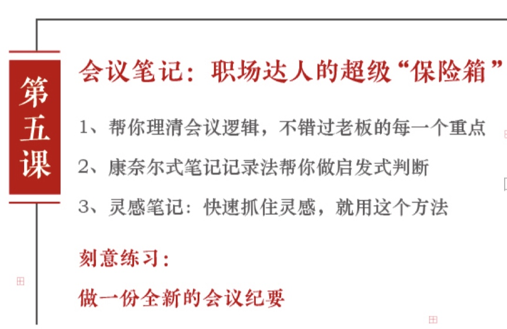

# 第五课：会议笔记——职场达人的超级“保险箱”

上一讲我们讲到`职场达人`和`普通达人`最大的差别就在做工作笔记的方法。
讲完如何做计划笔记呢，接下来我主要讲`如何做会议笔记和灵感笔记`。

今日要点：

----

## 1. 理清会议逻辑

我们在说到开会，如果你想要有效率的话，你做到以下`四点`。

`第一`，开会前要在笔记本上面写好今天的`日期，具体时间`，比如上午九点到，`参会人员`都有谁？
还有什么是`会议的主题`？

以便你日后检索翻阅，看看上一次会议什么时候举行，落实了多少。

`第二`，在开会的过程中，你可以记录，把你想到`点子`，写在上面。
千万记得，别人讲的时候不要打断。
你先记好，然后等别人讲好，等到你发言的时候，再把你想法说出来。

`第三`，开会结束之前把结论梳理好，跟大家`再三确认`。
这个确认的部分就可以变成会后的待办事项，照做就行了。

----

有的人认为做笔记等于工作认真，每次开会的时候，无论谁的发言或者PPT上的文字都写到笔记本上。
其实这样记录的信息对工作的推进没有任何实质性的作用，怎么办呢？

这里有方法，首先开会前想清楚`会议目的`，每次开会基本会有个主题。
在开会前最好花2到5分钟，想清楚，通过这个会议，你要解决哪些问题？达到什么目的？

比如呢？下午有个参加一个有关活动方案的讨论。
那你可以提前在本子上列出你想要解决问题，活动主题是否认可？
方案中哪些细节要调整，如何调整？活动时间，排期，配合人员是否有疑虑？
活动的执行，是外包还是自己做？等等。

这样就不会让你像搬运工一样，在会上什么都记，你会清楚地知道，什么信息与你解决问题相关。
千万别让**`战术的勤奋，掩盖战略上的懒惰`**。

会前的2到5分钟就是整理整个思路的过程，如果你以后有机会主持会议的话，这个简直太有用了。

然后在会的时候，同时要做到第二点就是：一定要**`区分事实和意见`**。

很多人对开会延长时间的行为很郁闷，为什么原计划40分钟的会议老是拖到两个小时才结束？
后来会开多了，慢慢明白，就是因为会议本来是用来陈述基于事实总结得出的想法的场所。

但是会总有不少人，不是我觉得，就是我猜，没有任何事实依据，凭空发言。

----

回到我们会议笔记上，就是因为会上有太多的凭空发言，把整个思路打乱了，最后事实和意见傻傻分不清楚。

比如说运营总监说：我们要重点提高活动频率。
市场总监觉得：我们要聚焦在一件大的事件活动上。
或者市场总监觉得方案有问题，需要调整，那怎么调整？

这个时候如果你仅仅是记录下来，他对工作推进基本上没有意义，那怎么做呢？
首先呢，在听每个人发言的时候，我们要能够区分出事实和意见。
比如说后台数据，这就是亲眼所见的，是`事实`。
像比如说我建议啊，我觉得可以这样做，基本才归为`意见`。

如果只是单纯的提出意见，可以在后面补充问一句，**方便说一下，你这个意见理由吗？**
或者请问你是基于什么事实提出来的？

很多人在解释原因的时候，可能就会发觉自己的意见，毫无事实依据，个人喜好而已。

那么到了这个时候，就可以很努力的将很虚的方向性意见，拆分成可执行的`落地性意见`。
比如某个总监的这个方案有问题，这个时候你把种信息记录下来是没有意义的，然而你可以在后续的对话中，逐步缩小对话范围。

比如接着问你说的问题，具体是指活动内容，活动主题还是方向错了？
如果对方说是活动内容，那你就不用管其他的了，集中在活动内容这部分`继续往下问`，慢慢你会发现，会议一结束你就知道该怎么行动了。

很多人做会议笔记，一开始想规规矩矩的写，写着写着就变成纸上哪里有空白，就算哪里的记下笔记，这其实是不利于会议后梳理信息，还会造成`思维混乱`。

----

## 2. 康奈尔式笔记记录法

`麦肯锡`对于记录工作笔记的解释很赞：
> **记工作笔记绝对不是一件机械的、麻木的重复劳动，而是一个思考的过程，不是为了记而记。**

特别在会议和工作中记笔记的目的是**帮助判断，最终得出结论**。

那OK，一个会议基本上要结束了，这个时候请你再一次确认结论，因为很多人特别是负责人，经常会忘记开会中说过的话，在会议结束前要习惯快速的回顾本次会议笔记，查看需要确认的事项是否都有了明确的答案。
注意是`明确的，可执行的答案`。

都确认后有可能要说下面这些话：
我想耽误各位一分钟，刚刚讨论的结果大伙都再确认一下：

第一点是什么？
第二点是什么？
第三点是什么？
如果没问题，我们就照这样执行。

大家没看到，这不仅是帮自己再次理清思路，更重要的是向大家再次强调已确认的事项，以及将如何执行。

----

## 3. 灵感笔记

说完，我们在会议当中如何做笔记，那么最后分享一个工作笔记的需求，就是**`记录灵感`**。

你的的思考逻辑，最好能够当下就能够写下来，你想到了什么，你听到了什么，也可以马上把它写下来。

有时候会放在一些`很微妙的场合`。

比如说洗澡的时候，比如说上卫生间的时候，这个时候是人特别放松的时候，很容易出灵感，这说如果灵感来了怎么办呢？
可以记下来的，你可以在你的卫生间放一些便利贴，想到就马上记下来，因为很容易有时候洗完澡就忘了，就再也找不到了。
那个灵感仿佛掉到了失去了大海里面，你再找不出来。

今天我们介绍了在工作中做好计划会议和灵感的笔记，希望说大家的工作当中不要**穷忙瞎忙**。

在这里呢，请你理解一下三点：

1.做工作笔记的道理是为了记录，整理和行动。
2.工作笔记，具体怎么做呢？
3.有什么方法呢？

我们在上面都已经详细的阐述了，在这里就不在一复述，但总之要学会`高清具体`的做工作笔记。

----

也发布一个小任务，按照我们今天讲的做会议笔记的方法，请你做一份会议纪要，同时体会这样的开会是不是更目标感是不是更清晰了？

欢迎你在留言区分享你掌握的信息，或者留下你今天的心得和困惑，我会和你一起参与这场工作笔记的讨论。

好了，感谢你跟着我一起学习如何做读书笔记，课程笔记，工作笔记。
实现知行合一，用知识整理术，提高工作和生活的效率，让自己成为更优秀的人。

