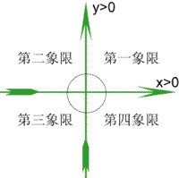

# 程浩: 投资人如何评判创业公司

内容来源：**`2019年6月25日`**，在创业黑马主办的 **`吴世春创业心学实验室`** 第5期结业课上，远望资本创始合伙人、迅雷创始人 **程浩** 进行了以“`投资人如何评判创业公司`”为主题的精彩分享。笔记侠作为合作方，经主办方和讲者审阅授权发布。

讲者 | 程浩 今日笔记达人 | Mr.Dragon

程浩百科：
- https://baike.baidu.com/item/程浩/5120541
- https://baike.sogou.com/v106219367.htm
- http://www.baike.com/wiki/程浩[迅雷网创始人]
- http://www.cndss.net/companyTypeDetail/62117/


```
程浩，毕业于美国杜克大学（Duke University），获计算机科学硕士。
之后在硅谷工作，并于2001年回国加入百度；
2003年初和杜克大学同学邹胜龙联合创办迅雷；
迅雷于2014年在美国NASDAQ上市。
2016年1月28日，程浩正式宣布离职迅雷，并与松禾资本的厉伟、汪洋成立松禾远望基金。
2018年5月2日，程浩宣布与田鸿飞、江平共同成立远望资本。 聚焦人工智能领域投资。

梅花创投创始合伙人、黑马实验室导师：吴世春
远望资本创始合伙人、迅雷创始人：程浩
珞石机器人创始人：庹（tuǒ）华
```


## 怎么评判一个CEO

我`从投资人的角度`来讲一讲，就是我们怎么评判一个创业公司，怎么评判一个CEO。

经常有一些朋友问我，说浩哥你们在**投项目的时候，你们主要关注哪些，或者你们主要关注哪些问题？**

## 五个问题

其实就是五个问题，而且这五个问题对于领域来讲其实没什么区别，就是你`不管做什么，核心都是回答这五个问题`。

### 第一个问题：你做这个事是不是刚需

第一个问题，**你做这个事是不是刚需，是否真正解决了痛点**。

通常我们做一个事，创业公司嘛，选择一个方向，一定是解决了一个需求。
你说这个事完全没有需求，通常你也不会做。
但是这个**`需求是不是刚需`**，我觉得这一点其实就有很大的可能性了，以及很大的不确定性。

什么叫**`刚需`**？
我简单总结，就是三点：
第一个，**`极大提升效率`**。

#### 极大提升效率

什么叫极大提升效率？

举个简单的**例子**，大家都用搜索引擎，大家想想没有搜索引擎的时候你怎么搜东西？
你想有个问题，没有搜索引擎怎么解决？
遗憾可能是图书馆，后来或者就是问朋友，咱们想想20多年前没有搜索引擎的时候，问朋友。
或者有互联网的话，有些分类目录你可以去找一找。
我们现在已经很难想象没有搜索引擎的时候，你获取信息是多么地繁琐。
所以搜索引擎极大提高了获取信息的效率，提升效率，极大。

举个**`例子`**，即时通讯，QQ出来之前，大家互相怎么沟通的？
有时候写信，写信太早了，可能发邮件是相对比较接近的。
那发邮件发一个5分钟，收一个再5分钟，这个小其实很低。
但是打电话也可以，但是打电话有时候就非常让你`juicy`，而且打电话还得花钱。
所以即时通讯的出现，QQ的出现极大地提升了大家沟通的效率。

也包括像迅雷，没有迅雷之前你下一个东西，可能1个小时，有迅雷下一个东西可能是10分钟，迅雷也是极大地提升了效率。

那么这是第一点刚需，你只要**`能够做到极大地提升效率，那你肯定是刚需`**。

#### 极大降低成本
第二个，**`极大降低成本`**。

就像`庹总`从事的机器人行业，现在中国在普遍做什么？
就是中国的制造业普遍在进行**机器换人**。

机器换人有很多原因，其中成本原因是一个**最直接的原因**。

因为举个**`例子`**，一台机器人能够代替四个人，那四个人的成本一年20万，我机器人可能一年也是20万成本，但是我机器人能跑五年，还不说做的东西有更好的一致性，机器人肯定做的更好的一致性。
所以从成本的角度来讲的话，一定是**`极大地降低了成本`**。

那么也包括像`Elon Musk`，大家知道Elon Musk有个公司叫`特斯拉`，他其实还有家公司，大家知道叫什么名字吗？`SpaceX`。它是干什么的？它的专门`发火箭`的。

火箭把卫星送到轨道上，它主要就是干这个事的。
它的价值在哪呢？
最大的价值就是发明了一个`火箭回收`技术，我这火箭把这个卫星送上去它还能按照我指定的地方给我落下来，我下次接着用。

所以，它通过这种火箭回收技术很好的**解决了一个成本问题**，以前大家发一个卫星都是找**波音**，多少钱啊？
2亿美金起，它一下子降到了几千万，几乎只是以前的零头，极大降低成本。

还包括什么呢？

#### 极大提升用户体验

**`极大提升用户体验`**。
咱举个最简单的**例子**，在ipad之前很少有一个电子产品，就是这么复杂的电子产品但是用起来如此简单，所以现在大家如果有小孩，现在其实玩pad的人很多都是小朋友，因为操作起来太简单的，而且手机有时候家长不愿意给小孩配手机，那就一个pad非常方便。

这么复杂的一个东西，但是能做的如此简单，也包括像iPhone智能手机也是，智能手机出来之前都是featurephone。

featurephone唯一的作用两个：
1、发短信。
2、打电话。

别的什么都干不了，现在的什么都能干，你可以微信，你还可以王者荣耀，所以极大的提升了用户体验。

大家要注意到，三点里头**`极大提升效率，极大降低成本，极大提升用户体验`**，这三点你只要能够爱上一个，你就已经很牛了，**不要求三点全都中**，但是如果你三点一个都没中。

#### 三点都没中

举个**例子**，就是说我这个效率提升的15%，这个就有点尴尬，为什么呢？
你这效率提升了15%，我们叫**渐进式创新**，基本上就是为你的竞争对手打工。
包括降低成本，你说我这个东西比竞争对手便宜15%，便宜15%这个量它没有引起质变，没有引起质变的原因是什么呢？

举个**例子**，我以前买了庹总的机器人，这时候**世春**也做个机器人，说我比他便宜15%，就是这**15%远远不足于打断我跟庹总的关系**。

为什么？我是采购方，我如果有个老板问我说世春那便宜15%，你为什么不用他的？

我有100个理由可以说，我不应该用便宜15%的，因为庹总这块合作关系更长久，庹总这边质量更稳定，庹总的服务更及时，我有100个理由可以说服老板接受这个相对老的合作伙伴。

但是，如果世春报价只有庹总报价的1/3，我的任何解释都没用，除非完全这个东西不可用，就是说这种量变引发质变，这点在这方面仅仅是小幅的降低成本，我觉得这个价值是很小的。

包括提升用户体验，我以前有一次跟傅盛吃饭，傅盛说我们这个产品其实创新挺多的，很多杀毒软件的创新都是我们这边首创的，我说你挺厉害的啊，他说没用，为什么呢？

其实确确实实给用户带来了很好的体验，他说没用，他说我每次上线了一个礼拜之内，360一定会上线同一个功能，就这种微小的创新，微小的改善用户体验，不论是微小的提升效率，还是微小的改变成本，还是微小的提升用户体验，这个都是不足够的。


就是这种**渐进式的创新**，我的一个总结都是给大公司打工或者是给行业龙头打工，所以要做一定得是**颠覆式创新**，在这里**为什么一定要用极大**？极大提升效率，极大降低成本和极大提升用户体验。

#### 为什么一定要用极大

我这里头举几个简单的例子，智能手表和智能手机，大家**现在戴智能手表**的人举一下手，任何品牌的，大概有2、3个人，大家**曾经体验过智能手表的人**举一下手，我粗数了一下大概得有20多个。

我其实就想说的是这个事，大家知道我想说什么了吗？

我讲讲我第一次体验智能手表，我真的是中国最早一批体验智能手表的，当时买的是LG的一个品牌，我忘了叫什么名字了，我专门请一个朋友从美国回来给我捎回来的，第一次用起来极其痛苦，为什么啊？

因为它用的是Google组件，中国用不了Google，所以翻墙费了我一上午时间。

但是因为这个东西很新鲜，所以一上午搞定之后我还挺兴奋的，天天用天天用，但是后来发现这个东西最核心的两个价值。


1、帮你把这个push。
举个例子以前微信来一条消息你不得掏出口袋来看，现在不用掏口袋了，直接在手上看了，这个需求按理说有一定的需求，但是我的感觉是这个需求不是很刚，首先我把这个手机从口袋掏出来好像也不麻烦，你这看的有时候字多的话你还得翻一翻，我从手机掏出来不麻烦。

还有一个原因是什么？
就是有些比较紧急的微信我可能要立刻回一下，我手表上没法回，当然我手表上可以通过语音回，如果旁边有一个朋友在我旁边的话，我用语音回不方便，所以这就第一个功能弹push的功能，对我来讲我觉得没什么用。

2、鼓吹的是第二大功能，能测量你的一些健康指标（呼吸、心跳、睡觉睡的好不好），睡觉好不好这个东西对我来讲更没有价值。

第一我不会戴着手表睡觉，我都已经10几年不戴手表的，现在还戴着手表睡觉这个对我来讲很难。

第二，我昨晚上睡没睡好我自己其实很清楚，你说你睡觉你昨晚上几点睡几点起的，中间做了几个梦，上了几次厕所你都很清楚。
所以它实际上是**`告诉了你一件你已经知道的事，而且还不告诉你解决方案`**，就是只指出问题不给解决方案的都叫耍流氓，所以这个对我来讲也没价值，我昨晚上没睡好，那so  what，你能告诉我怎么睡好吗？

因为这是它最主打的两个功能，我用了一下我发现好像对我没什么用处，所以我大概坚持了1-2个礼拜，我实在不了了 ，为什么呢？
因为每天需要充电，这大家都有体验，所以我就直接扔在我车后备厢里了，再也没用过智能手表了。


同样都要充电，智能手机可能每天有的时候还不只充一次电，你为什么能坚持下来，核心就是因为这东西太刚需了，所以简单讲就是说如果这个东西不刚需，它所有的毛病都是大毛病，如果这些东西是刚需，所有的小毛病你都能容忍。

大家知道iPhone1出来的时候我也体验过，当时我都已经惊呆了，就是最基本的一个功能没有，大家知道什么功能吗？

2007年用iPhone1，你们会发现它没有**短信的转发功能**，我都已经完全惊呆的，因为那会儿飞这风已经很多年了，这都已经很成熟了，居然没有，但是Nobody cares (没人在乎)，那时候出来的iPhone1真的是需要每天充电，但是也都坚持下来了，因为它大屏幕，它肯定是耗能量大，每天需要充电。


但是，这个东西因为它太革新了，这么大的屏幕，诱惑力太大了，而且它的智能操作系统诱惑力太大了，它是Smartphone(手机)的鼻祖，所以尽管它有很多不如意，转发微信、输入法也不好用，每天都要充电，但因为它是刚需，所以大家都坚持下来了。


当时在2007年、2008年有一个最著名的笑话，就说**`所有的女士都应该给她老公买一个iPhone手机，保证他晚上要回来充电`**，这就是当时的一个笑话。


所以，就是说这东西一个刚需一个不刚需，相对刚需，那就带来今天最大的差异，刚才我大概数了一下大概有20多个人曾经用过体验过智能手表，但是今天还在用的大概2、3个人，这就体现了一个巨大的差异。


往上面延展一下，就是说我们把刚需跟高频分为**4个象限**，最右上角的象限我们叫**`刚需且高频`**。


第一象限：（正+,+正），横纵坐标同号，记作xy>0
第二象限：（负-,+正），横纵坐标异号，记作xy<0
第三象限：（负-,-负），横纵坐标同号，记作xy>0
第四象限：（正+,-负），横纵坐标异号，记作xy<0




| 刚需不高频 | 刚需且高频 |
| --- | --- |
| 非刚需不高频  | 刚需不高频  |


大家创业的时候，你们先询问一下你们做的创业想法，看看它是不是在第一个象限，如果是在第一个象限，那么首先恭喜你，因为这样的事不多，刚需高频的东西其实并不多。

同时我也要提醒你，刚需和高频一定是兵家必争之地，一定是竞争最激烈的领域。


而且在第一象限的公司，因为它又是刚需又是高频，所以它一定有入口的价值。

所以大家为了争夺入口，通常会打的头破血流，会有很多种手段去争到入口，最简单的手段就是免费。


大家发现BAT都是入口，但BAT全是免费的。

百度搜索也不会管你用户要钱，腾讯即时通讯也不会管你发这个要钱，阿里淘宝你是买的商品的钱，你其实也没有直接给阿里贡献收入，其实是广告的钱。


所以如果是第一象限，你的最正确的策略，换句话说你不这么做也不行，因为第一象限大家一定会拼了命的抢占这个入口。

因为它是高频，所以你一占抢占这个入口，那一定会有衍生的收入在里面。像腾讯你可以有游戏的收入，百度可以有竞价排名的收入。


所以在第一象限大家一定要注意，最正确的打法，或者**`最有效的打法，就是要拼命抢占入口`**。

而抢占入口最常见的手段就是免费，甚至补贴。

大家知道像滴滴打车的时候，最开始疯狂那叫双向补贴，不光给你补，还给你推荐的朋友补，那这个第一象限的竞争是最残酷的。

那么通常第一象限对于资本的要求也是最高的，说白了这个事要做好、做成，可能需要不少钱，特别在今天这个竞争的环境下。

所以其实对你这个创业团队本身的要求也会高一些，因为说白了大家都没钱的时候，为什么你融的钱能比我多一倍呢？是因为你的背景好。

---

左边我们叫第二象限，**`第二象限叫刚需不高频`**。

其实大部分的生意都是刚需不高频的，就是刚需高频的生意反而没有那么多，刚需不高频的太多了。


你举个例子买房子，这绝对是刚需不高频，你结婚那这高频就坏了，或者拍婚纱照，这都是刚需不高频。


那么做这类生意它比较关键的是什么？就是每一单都得有比较好的毛利出来。


因为很简单，你不是高频的东西你就没法成为入口，你不能成为入口的话，你未来衍生的这个生意就会比较有限，所以**`每一单都要有比较好的毛利`**，同时每一单都要有口碑出去。


**`每一单都有好的口碑`**，这样的话便于你未来的获客和持续传播，这是第二象限。

---

那么第三象限、第四象限我的就不用讨论了，因为首先它非刚需的东西，它一定很难持久，很难接受这种持久的考验，所以第三象限、第四象限我们就先不讨论了。

所以在座的每一位同学，你们在创业的时候，你们一定要看一下你到底是落在这四个象限中的哪一个，而在每一个里头的打法是不一样的，这个是刚需高频。

### 第二个问题:市场有多大

那么刚才讲了刚需，我们通常问的第二个问题是什么？

就是市场有多大，说白了这个很简单，这事天花板在哪儿，如果整个这个行业总共就10亿的市场，我都给了你能怎么样？也就10亿的年收入，所以这就没有想象空间了。

通常对于我们装也投资人来讲，我们需要一个至少要是几百亿人民币的市场，至少是这么大的一个市场，当然你如果几千亿甚至更高当然更好。


但如果你这事只有20亿或者30亿的市场，通常对于我们来讲就不够juicy，因为说白了这30亿不可能全是你的。

即使你做的最牛逼，你占40%，你也就是12亿，这12亿我觉得还撑不起一个上市公司，或者勉强撑起一个上市公司，但是你没有upside。

所以**第一点**很重要，就是**`市场容量到底有多大`**，这个事是非常重要的。
有的时候如果你讲的市场容量太小，可能投资人都没有兴趣听你往下讲了。


**第二点**我觉得也非常重要，就是**`未来的市场趋势是什么`**。换句话说，你这是一个朝阳产业还是一个夕阳产业，我举几个简单的例子。

我有一个朋友，也是我们以前迅雷的同事，他做什么呢？
他做工厂的蓝领招聘。
其实这个需求是有的，特别是每年春节之后，因为返乡的有早有晚，所以其实招人挺难的。

但是我跟他聊完之后，我一个感触是什么呢？
我觉得这个事可能长期来讲不是大趋势。

因为最核心的是什么？我刚才提到了，机器换人这个趋势是很明显的，我觉得未来中国对于工厂里的蓝领的需求可能会逐渐减少，你今天虽然是一个问题，也许过了5年，它就不是问题了。


但是你今天只是一个创业公司，也许你得花3到5年，你才能做到这个阵营的top  tier。

也许你做到那时候，你发现必须得换方向了，这个有点尴尬。
所以我们觉得这个事跟大势不太相符，当然后来他确实证明很多投资人都有这种疑虑。

还包括什么呢？
我一个朋友他做什么呢？也是深圳的一个朋友，他做立体停车场，大家知道立体停车场干什么的吗？

以前的停车场都是平面的，说白了你可能只能放100台车，他用立体的他可能能放150台或者200台车，他想做这个。

跟我聊，他做的还挺炫酷、挺智能、挺自动化的。

我觉得这事确实现在有需求，很多小区停车位不够，都停到大马路上，可能有些还带来一些交通方面的问题。

但是从另一个角度来讲的话，我还是觉得这事长期趋势不对，首先有几点：
第一点，现在各个交通比较紧张的城市都在限购。
大家鼓励你去坐公交、地铁，各大城市都在坐地铁，大家鼓励这种public  transportation。

同时其实就是中国对于这种共享用车，类似于滴滴是非常包容的。

中国对于滴滴这种公司是非常包容的，虽然也经常说扣了滴滴几辆车，但是overall来讲，我猜它其中一个原因也是希望能够减低、缓解一下交通。

再长一点的趋势是什么呢？是**自动驾驶**。
自动驾驶出来，我觉得大多数的人可能会选择不再自己买车了，而是直接使用on  demand，按需用车。

那么按需用车大家都不买车了，你要那么多停车场干嘛呢？

所以这个事我觉得长期趋势有问题。

而且你建这个立体停车场，他其实一次性投入还挺大的，你可能花三年才能把成本收回来，结果发现过了五年这个事没需求了，你这不是折腾吗？这都属于我们讲有需求，但是长期趋势不对。

我还有一个朋友做一个什么呢？他是软件出海。
他做了一套软件，专门卖给印度。

不是卖给印度，就是免费提供给印度人。
他当时非常敏锐地发现一个什么机会呢？
就是印度人很多人，一个家庭只有一部手机。

按但是大家知道两个人用一部手机有很多不方便的地方，例如你的微信也好，你的短信也好，全都mix在一起了。
举个例子，他做了一套系统，使得两个人甚至多个人可以用同一个手机，确实解决了部分家庭的问题。但是你会发现，这事不符合大趋势。

慢慢地趋势肯定是一个人一台手机，你发现你这两年好像用户涨的还挺快，明年发现用户就平了，后年就往下降，因为印度人也都一个人一个手机了。

所以要做一定要做符合……不光这个市场容量要大，而且一定要符合大趋势。

否则从你今天作为一个创业者，你做到市场的No.1，你可能刚做到No.1，你可能马上就面临着转型，所这实际上给投资人带来很大的不确定性。

所以我们这两点，不光是市场容量得大，同时我们认为市场趋势必须得对。

刚才提到机器人为什么市场趋势对呢？

首先中国人劳动力成本越来越高了，这个不用讲了，当然前提是中国国运还在，一切的前提都得在中国国运在，否则世春你投资很难赚钱，我投资也很难赚钱，大家都得depends  on一点，就是中国这40年的国运还得继续往下走。

所以其实从我们的角度来讲，我是最希望28号还是多少号，就是特朗普跟习近平见面，我是最希望他们赶紧签个东西。
Whatever  it  is，赶紧签个东西就别再打了。

我相信世春也是，是不是？
就是国运一旦没了，我跟你讲做什么都不赚钱。

我们过去的生活，我猜咱们大家都是80后、90后居多，包括我们的70后。

其实我们懂一点事的时候，其实中国已经改革开放了，我们40年都是在这么一个趋势上的。
所以我们已经想当然了，中国就应该是这么一个趋势，其实不一定。

这种趋势连续40年，中国GDP从全世界几十到全世界第二，这个在人类历史上都是非常罕见的。

但是这个对于我们来讲，对于你们创业者来讲，和对于我们投资人来讲，这种我们又叫做不可抗力，你只能指望这个国运还在。

这是out  of  control，我们也没有办法左右这个事情，但是我们这个事，你们创业要想成功，我们投资要想赚钱，很大程度上要依赖这个国运，这是另外一个话题。

这是第二个topic，就是说市场容量有多大，未来市场趋势是怎么样，这个是创业者要非常关注的。

### 第三个:你的商业模式怎么赚钱？

第三个就比较简单了，就是说你这个商业模式，你到底怎么赚钱。刚才我举个离个例子，通常有几种：

| 足够的毛利 | 增值服务 |
| --- | --- |
|  |  |


第一象限你可能得增值服务。
第二象限你得有足够的毛利。

所以大家要回答一下这几个简单的问题，就是说假设你这个创业，你有几类收入，你必须要明确地说明哪类是你的主营收入。

如果你是做硬件的，你必须得说清楚，或者包括你是做服务的，你要说清楚你的毛利是多少，哪里是你的收支平衡线。

如果你是抢占入口型的，或者说是第一象限的，你就得说清楚，羊毛出在猪身体上面，那么到底谁是猪。

这个我们觉得是非常重要的，就是说特别是对于到了A轮的企业。
其实有些天使轮的企业，这个问题回答不清楚。

但是到了A轮，这些问题必须要非常明确地说清楚。

---

### 第四点，为什么是你做这个事？

第四点，为什么是你做这个事？
刚才前几个发言大家都是跟事有关系，那么这个第四个就是非常核心的一点，就是跟人有关系，就是为什么是你做这个事，不是我做这个事。

最常用的一种可能性是什么？
就是我们看了这么多项目、看了这么多创业者，创业者最常见的一种可能性就是我在这个行业已经耕耘了很多年了，我突然发现一个细分机会。

也许是我在现在这个公司没有创新精神，或者老板不同意，或者说我觉得这个Marketing特别juicy，我应该自己试一试，这是最常见的一种情况。

就是在我行业耕耘了很多年，我这个knowhow很懂，但是我发现了一个细分机会。

大家只有2个月之前上市了一个叫ZONE的公司，现在是多少？
200多亿市值，号称它的天使轮投资都赚了几千倍。
ZONE这家公司就是很典型的，ZONE这家公司的CEO是以前white  box的高管。

但是他自己觉得white  box做的不够好，或者叫我还觉得有别的市场机会，所以这个哥们儿自己出来做ZONE，那做的很大，这个是最典型的一类创业的可能性。

还包括哪些呢？
就是说我以前一直是甲方，我一直有这个需求，那我对这个市场需求非常了解。

但是我找遍了整个市场，发现没有一个好用的解决方案，或者没人做，或者没有好用的，而我认为我这个需求是挺普遍的，所以我自己做，这是从甲方视角，这是一种可能性。

还有一种大家创业之前一定要问自己一个问题，就是你为什么要创这个业？
如果你只是一个机会主义者，或者是风口论者，就是因为这事热闹才创业，那这个事是很危险的，因为这个风口早晚得过。


举个例子像几年前，2016年我觉得VR特别火，我们当时也看了很多VR项目，还好我们当时没投。

只是因为火去创业，那到2018年的时候这已经完全不行了，那这种公司一定会散。

但如果你做VR创业是因为你非常热爱这个行业，你深深地believe  in这个行业eventually而一定会take  off，那这个就可以让你去持续坚持下去。大家了解这个意思吗？

就是一定得问一问自己做这个事的初心是什么，我为什么做这个事情，这决定了你未来能不能坚持下去，这是最核心的原因。


所以通常为什么是我做，而不是你做，有这么几种可能性。当然有的人如果你问一个创业者的时候，他说我就是对这个事感兴趣，但这个就比较flat。


感兴趣的人多了，为什么是你能做出来？这就不足够。

所以通常来讲，一定得fall  into这些，得有几个真的是给投资人的感觉，这事真的是属于你的，这就是我的菜，这才行，而不是说我只是感兴趣。


我以前跟一个投资人聊，很有意思，那个投资人也是个个人投资人，个人天使。

他有一次跟我聊天，说他最近看中一个项目特好，他想投，但CEO不想让他投，因为CEO可能不缺钱或者已经拿了别人的钱不想让他投，所以他说他很郁闷。

我说那算了，无所谓吧，您再找别的机会呗？
他说不行，我特别看好这个机会，我说那怎么办？他说打算自己做。

我后来一想，好家伙，这项目你自己都能做了，可见不是什么好投资机会。必须得要能解释为什么是你不是我，这是第四个。

### 第五个：项目的护城河在哪里

第五个特别重要我觉得，而且往往是创业者比较容易忽略的，就是这个**`项目的护城河在哪里`**。

因为在中国大家知道，特别是前两年所谓万众创业大众创新，就是创业公司太多了。


我记得刚好来到这个地方了，许单单那个叫什么来着？
3W咖啡，我记得李克强2年前来参观中关村创业大街，然后专门到3W的咖啡喝了杯咖啡，然后大家就给拍张照片放到网上了。
然后很多不怀好意的人给他点评一个什么句呢？说创业就像这杯咖啡，真的好多的泡沫啊。

事实上就是，就是中国绝对不乏创业者，你想到的一个idea，不可能全中国就你一个人想到，你最快比别人跑3个月。

那你怎么be  make  sure，说你做这个事，未来3个月人家catch  up不了你，换句话说就是这个事的壁垒在哪儿？

比如你说你现在60%毛利，3个月之后竞品推出来东西了，你60%的毛利变成20%了，甚至变成10%，也许以后就亏损了，这对投资人来讲，其实对你自己来讲也不是什么好事。

所以一定要想清楚，就是你这个项目的护城河在哪里。

护城河通常有几类，我们一个个讲。

#### 网络效应

就是在互联网这个行业，**`最有效的护城河是网络效应`**。

网络效应拿微信举个例子，就是微信一旦起来了，所有的社区社交都做不起来。

大家知道以前网易也推过，阿里也推过来往，都做不起来，因为这是强网络效应。

我所有的好友都在微信上，我一个人选了阿里的来往，这事不make  sense，我找不到我的朋友，我还必须动员我的朋友全过来，这个事可能性极小，这是第一个网络效应。


也包括像滴滴打车，滴滴打车其实有比较明显的网络效应，但是滴滴打车的缺点是什么呢？
它的区域化程度太高了。

滴滴打车的网络效应在哪儿呢？
就是说越多的司机会带来越多的乘客，因为这样的话乘客的体验好，他等的时间短。

同样，更多的乘客会带来更多的司机，因为司机在这里面能赚到钱，我们管这个叫**`双边网络效应`**。


事实上所有的marketplace，就是所有的交易平台都是有比较明显的网络效应的，这是第一点护城河。

#### 钢柱效应

第二点叫什么呢？第二点叫**`钢柱效应`**，特别在2B的领域，特别在SaaS领域里头。


还举这个例子，就是说假设我买了一套CRM系统，或者人力资源，或者HRM系统，我从庹总这买了一套系统，然后我用了一年世春找我了，说浩哥我这比庹总那便宜20%，你愿不愿意体验一下？


我十有八九会直接把他拒掉，大家知道为什么吗？

因为我好不容易实施了这套系统，我好不容易把这套系统用熟了，好不容易我的数据全在这上面的，你现在让我迁移到另外一套系统上，我觉得太麻烦了。


而且你说你比我便宜20%，会不会你哪天有别的增值服务来charge我，或者说我觉得庹总这产品虽然不完美，但是他们可用性比较高，或者说庹总的服务非常好，我再换成世春的，他未来服务要不行怎么办，或者说庹总已经规模比较大了，世春还是一个创业公司，哪天世春的公司挂了，我这个可麻烦了，一堆考虑。


所以，这就是典型的2B领域叫钢柱效应，就是说它这个迁徙的难度是比较大的，我不会因为另外一个公司比你有一些好的改善，我就直接迁到另外一个公司了，这个可能是比较低的，我们管这个叫钢柱效应。

#### 技术始终领先

第三，**`技术始终领先`**，这个其实是最难的，但是也是非常有效的。


举个最简单的例子，大疆，大家知道做无人消费机，无人机的很多，我2017年去CES，整个一个hall全是消费类无人机，因为CES它叫Consumer Electronics今天都没了，只有大疆，核心原因是大疆的产品做的好，大疆的稳定性做的是最好的，而且大疆对于竞争对手，就是它技术始终跑在你前面。


庹总你出了个无人机，我大疆卖9000，你推出了一个无人机号称跟我这个最高型号的无人机可以compete，但是你的价格可能只卖6000，你知道大疆怎么做的吗？

我会立刻推出一个更高型号的，就是全面超越我的性能，同时你跟我对标那个我只卖5000，大疆这个做的特别狠。

所以，所有的Consumer Electronics这种Consumer  zhens全部挂掉，这是因为大疆真的是在技术方面和创新方面始终走在最前面。

#### 规模效应

第四，规模效应，规模效应最最典型的是什么呢？

半导体，大家知道半导体的投入也非常大，半导体它的初始投资特别大，流片这个成本很高，但是一旦流片成功的，你在每次做一个边际成本几乎为零，因为半导体就是硅，硅是全球最不缺的东西，它的边际成本是非常低的。

但唯一的前提是你必须能保证你的销售规模，我只要能上量，我的边际成本就几乎忽略不计了，所以我想卖多少钱都合适，你只要不上量你的研发费用，你的开模费用都刷不起。


所以，半导体是一个最明显的具有规模效应的行业。中国现在真的是兴起个股半导体热，但是坦率讲因为市场的总盘子没有大家想象的那么大，特别是AI半导体这起或者AI芯片，我相信中间很多最后都成为先烈，因为这个市场规模养不起这么多半导体公司，而半导体公司又是一个极其追求规模效益的。


换句话说，如果这一个市场只有一家做，这一家非常赚钱，只有两家做，第一家很赚钱，第二家也比较赚钱，如果10家做都是同样的market所有人都不赚钱，这就是它的规模效益导致的。

所以，就是说创业者必须要建护城河，护城河可能是中间的某一个，如果你创业发现你这是没护城河，但也许有第五种、第六种，留给大家自己去开发。
如果你发现你做的事没有护城河，这个事是非常值得你思考的事情，意味着你这个钱赚不长久。


最后，再送给大家一句话。

#### 凡是一句话讲不清楚的创业者都是没讲清楚

第一个topic，**`凡是一句话讲不清楚的创业者都是没讲清楚`**。
我认为所有的生意都必须要一句话讲清楚，所以经常创业者找我聊天，我说进来你先别急着讲你的PPT，你也别急着介绍你自己是谁，你先一句话把你做什么讲清楚，但坦率讲，其实大多数人都讲不清楚，我为什么说这句话特别重要呢？

大家听说过有个 elevator pitch，就是叫电梯whatever，它大概意思是什么呢？

举个例子，世春是个大老板，我想卖东西给世春，做世春的生意，我好不容易约的世春，约了2个月终于约到他了，我走到世春办公室要跟他聊，世春说浩哥，实在不好意思，我有一个急事我现在必须得出去，我是10楼，你跟我一起下去，咱们在电梯上你简单把你这个事给我讲清楚，这就叫elevator pitch，就是你要把你想讲的东西，你不管是做生意也好，你要卖给他什么东西也好，你必须得把你这个事在一个电梯的时间内讲清楚，所以这叫elevator pitch。

我们认为你如果讲不清楚，通常都是你自己没有想清楚，其实对于大公司来讲也是一样的，大家知道**`微软新的CEO纳德拉`**，这个哥们儿刚上任微软的CEO，把微软的商业核心精确成中文是7个字，大家知道微软是10几万的企业，他把它的商业模式，或者把他们的生意凝结成7个字，大家知道是哪7个字吗？
**`移动为先、云为先`**。

移动为先，10几万的企业这么多的 bussiness，有office、windows，这都是tactical bussiness，但你让他精炼微软的strategy，就是7个字，移动为先、云为先。
这还是翻译成汉语的，其实英语就4个字，moblie  first，cloud  first。

微软10几万人，这么多业务人都7个字能总结出来，你说你一个创业公司还总结不出来，这就不对了。

所以，大家一定要把自己的事精炼成一句话，其实很现实大家有时候在一个pannel上，让你介绍介绍你自己，你发现你两句话说不清楚，完了，这机会你就丧失了，所以这点很重要，这就是我刚才讲的第一部分。


在讲第二部分之前，我想跟大家讲5个问题再review一下。

- 是不是刚需
- 市场空间有多大
- 怎么赚钱
- 为什么是你
- 竞争壁垒是什么

这5个问题不仅仅是投资人要问你的，更是你们在创业之前你们要自己问自己的，这个不是说是大家VC们专门挑战大家的，这是你真的是要自己想清楚的事情。


但坦率的讲，就是我们看这么多的项目，特别是早期项目能把5个项目全部回答的利索的，基本上没有，所以大家可以relax一下。


但是不代表你不应该想，你肯定还是得应该想，通常来讲，我们对于这种二次创业，不管你过去第一次创业是成功还是失败，对这个问题会有更深的思考，但是第一次创业的人，往往很多问题我一问他，他基本上就有点蒙，但是二次创业的人要好很多，所以二次创业或者连续创业者是我们评判CEO一个非常重要的尺度，5个问题大家回去都可以问一下自己。

#### 怎样的CEO最受投资人欢迎
第二个topic,就是说**`怎样的CEO最受投资人欢迎`**，因为我们投很多早期项目，说白了可能团队也不多，人也不多，财务也没什么数据，客户可能很少或者说也没有，我们非常重要的就是看团队本身了，团队占我们的比例就比较高了，其实这很容易理解，就是越早期的项目人的比例越高，因为你也没别的，你也没财务、利润、客户，肯定是人的比例越高，越后期通常就是事的比例越高。


举个例子，腾讯投资京东，人京东都做这么大了，你就别怀疑人家刘强东到底行不行了，除了某些方面可能不大好，但是做生意来讲没问题。
所以越到后面事的比例越高，越到前面肯定是人的比例越高，我们通常就是说在早期我们判断CEO，我们有几个比较重要的标准，我这个完全把甲方的套路告诉你们了。


当然这**`4点我觉得不分顺序`**，不分哪个更重要，哪个不重要，都很重要，我只是按照顺序讲。

##### 领导力

第一点我们比较看重的是**`领导力`**，我觉得刚才庹总跟我讲的，其实跟世春的对话,我觉得有一点让我看到他的领导力，就是刚才主持人问世春庹总当年融资的时候，跟现在的BP有什么不一样的地方？
然后庹总回答除了3个人还一样，其它都不一样了。

在这句话里面其实就看出了一个问题，庹总的领导力很强，人都没走，这就说明一个人的领导力，领导力为什么特别重要？


领导力最核心的就是一个巨人的能力，领导力怎么看呢？
其实也相对比较容易，咱俩聊聊2个小时，你能够打动我，意味着你能够打动别的投资人，意味着你能够打动你的客户，打动你的合伙人，打动你的员工，就叫领导力。
创业肯定各种槛，如果你有领导力，这些员工也好，合伙人也好，他不会散。


甚至很多二次创业的人，我这个第一次虽然这事不成功，但是我的人马全留下来了，那这就就牛逼。
我有一次跟王兴聊，他之前失败了，后来他再创业的时候，做美团的时候，他以前的人马几乎全留下来了。
我印象里他好像说就走了一个，谁呢？张一鸣。
我说那人走也是对的，这就是领导力的体现。


所以，领导力在沟通的时候，跟一个人聊的时候，根据这个人聊天的气场，其实能够比较明显的感受出来这人的领导力，也包括假设你是连续创业，你以前那些伙计愿不愿意跟你在一起，这也是一个判断标准，或者就是说你以前是在BAT做高管，或者说在BAT已经做了很多年了，你出来之后能不能带几个人马，你要是一个都带不出来，不管说什么理由，我们都会觉得有一点点问题，至少有一点点怀疑，可能不是那么充分，但是都会有一点怀疑。


你如果能举一个例子，把你以前合作的下手拉过来一起做这个事，这种领导力就OK了，这是几个比较简单的判断标准，第一个是领导力很重要。

##### 创业精神

第二，我觉得同等重要的就是**`创业精神`**，我刚才提到就是说所有的连续创业者，我们认为在创业精神这方面都是没问题的，为什么创业精神这么重要？


大家知道创业就是过九九八十一难，你如果没有创业精神，其中任何一难把你挡住了，你可能就算了，所以你必须得有足够的动力，足够的抗造的决心，你才能真正最后走到成功。


所以，就是说这个创业精神是极其极其重要的，我刚才提到连续创业者通常这方面都没有问题，因为他以前被蹂躏过，你都被蹂躏过了，你也知道这里面创业的痛苦了，你还选择创业，这说明你mentally一定是rally了，但是很多人如果创业精神不足就会有问题。


特别是我跟你讲一些所谓大平台出来，因为他以前在他所在的部门里头做出了非常好的成绩，但其实到底有多少是你的因素，有多少是平台的因素，他自己其实不知道。


但是你一旦出来之后，怎么失去了平台的支持这么难呢，可能会跟你形成非常大的落差，也许有的人可能就不坚持了，因为他当时想象创业应该就跟我在大公司里做一样一帆风顺。


但是，他突然发现失去了平台支持，他可能就是个一般人，这种风险就会比较大，所以特别是从一些大平台公司出来的人，我觉得往往可能会高估他个人的能力，而忽视平台的力量，这点我觉得大家如果有大平台出来的人，你们一定要考虑一下这点，虽然你过去的业绩很不错。


举个例子，你做个游戏做到多少多少DAU，赚到多少多少钱，但你要考虑一下，如果你是腾讯出来的，你离开腾讯这个平台，你如果没有微信、QQ能不能还做这么好，这是个巨大的问题，如果你没有这样的心理准备，你就不用说八十一难了，可能前五难你都过不去，这是第二点创业精神。

##### 执行力

第三，**`执行力`**。

执行力这个毋庸置疑了，大家知道CEO是什么简称吗？Chief Executive Officer，首席执行官，执行力是极其极其重要的，这个我觉得道理很简单，不说为什么的道理，我只是说我们怎么看一下CEO的执行力，我们有一些技巧，这些都是甲方的思考，今天传授给你们，不让你们白来，有很多小技巧。


举个例子，在聊的过程中，我问你是做什么行业的，你说做金融行业的，是不是很多银行都是你的客户，他说对对对，我说哪些银行？


这里我会一句，我说招商银行的CIO是我的好朋友，然后我就只说一句，我就接着聊别的事了，你看他事后会不会找你，如果他聊完之后立刻就说浩哥，今天你提到招商银行那事，能不能麻烦帮我对接一下，你必须得脸皮厚，我还没决定投资你呢，但你觉得我能帮忙，你也得问我，这必须得脸皮厚，这个我不觉得感觉有什么问题，这是个非常好的品质。


然后，我有可能说好，我拉你，也有可能我当时确实比较忙，我忘回他了，你看他继续跟不跟你，当然他可能不好意思10分钟再催我一下，他也许晚上再跟我发个微信，浩哥那个什么事，看你麻烦不，我可能就立刻帮他拉了，拉完之后我也不理他，我大概过个1周以后，我会问一下我那个朋友，我说我那天拉的哥们儿跟你有联系吗？
当然他可能有很多答案，他说就聊了一下就没动静了，这是一种可能性。


还有一种可能性就说他第二天就约我，第三天就跑过来了，这是另外一种可能性，这就是执行力的差别。还包括我看一些项目，我有时候喜欢给大家留家庭作业，因为有时候聊的东西有些信息不足够，我给他留2道家庭作业，而且这个家庭作业是非常开放式的。


所谓的开放式，就是说他还是得跟你各种讨论才能形成这个结论，你看他找不找你，他如果完全不找你，那这事说明执行力本身有问题，当然也有可能人已经融到钱，人不想花时间了，这是另外一个。


他如果非常积极的跟你讨论这个问题，意味着他有比较好的执行力，所以就是说执行力是极其极其重要的，我们也有一些小的技巧能够检验大家的执行力，当然什么东西都没法100%的准确，但这是我们总结出来的一些经验。

##### 学习能力

第四，也非常非常的重要，我们叫**`学习能力`**。

就像刚才庹总跟世春讲的，就是说我当时写的BP跟现在完全不一样了，大家知道所有的公司都不是一蹴而就的，腾讯最早也不是做即时通讯，腾讯最早是给BP机做了一套什么系统，阿里更牛了，阿里这个商业演进我觉得在全中国都是首屈一指。


阿里为什么现在4000亿、5000亿市值？
阿里的创新真是一波接着一波，基本上3、5年就一波大的。
大家知道阿里最开始是做黄页，但是它上市的时候靠的主要是他的B2B业务，供应商那套、中供的业务。


但是他在2014年推了一个什么呢？
推了一个淘宝，以前是B2B，现在突然改C2B了，改淘宝。


然后淘宝又带起了支付宝，后来又有淘宝商城，就是现在的天猫。

支付宝现在又蚂蚁金服，然后又搞了芝麻信用，这也是个1000多亿美金的公司了。

然后2008年、2009年又开始搞阿里云，现在又开始菜鸟物流，现在又开始钉钉，现在又盒马鲜生。


我跟你讲，这每一个业务都是上百亿美金的市值，所以像阿里这种**`持续性创新`**的公司真的是非常少见。
所以我总结是什么呢？

**`做到千亿美金的公司必须得有四波，如果没有四波做不到千亿美金。`**

腾讯显然不止四波，阿里不止四波，头条基本接近四波。

最开始是内涵段子，然后后来搞今日头条，那现在又有抖音，如果你把它的APP矩阵，以及把它的商业化作为它的第四波之后，它基本上就是四波。
内涵段子、今日头条、抖音、国际化，基本上四波。


所以任何一个公司的商业模式都是不断迭代的，如果CEO没有很好的学习能力，这个公司一定是不可能做大的。
但是学习能力对于我们这种看早期的公司，其实又是最难的。


大家知道我想了解你到底学习能力行不行，这个需要时间，你如果投个D轮，我觉得可能好点。

因为我整个从第一次见你到最后投资，我可能需要4个月甚至半年的时间，我在这么长时间内，我可以跟你无数次交往，我能够不断地了解你这个人，了解你的学习能力是怎么样。

##### 判断学习能力

我觉得判断学习能力的第一点是什么呢？
当然这句话可能政治不正确，是学历。

- 学历

片断学习能力的第一点是学历，这个人如果是北大、清华出来的，如果是斯坦福、麻省理工出来的，你就认为他学习能力过关了，否则这个人考不上。

他学数理化能学的很好，你认为他学商业也能学的很好，你只这么想，by  default。

当然这个不代表说你不是北大、清华你学习能力就不行，它是充分，但不必要条件。

只要你如果是北大、清华出来的，我们认为你还可以，不代表不是就不行，这是学习能力我们一个判断标准。

因为很短期，你跟他见面可能2周时间就见三次面，你这个信息台少了，不足以你对他学习能力做出足够的判断，那怎么样？
我们就列了几个相对我们认为有一定参考性，但有可能比较粗糙的标准，第一个就是你的学历怎么样，你是哪个学校毕业的。


- 升职

第二点是什么呢？
学习能力我们比较关注的是假设你去百度的时候，干了3年你是T5，你离开的时候是T几？
我们认为你在2、3年期间，你有没有自己make  progress，这是你学习能力的体现。


如果你发现你干了2年还是原地踏步，我们觉得most  likely你可能学习能力不行，你没有跟上这蹚。
如果3年你升了两级，甚至升了更多，我们觉得你肯定学习能力很强，这是我们一些比较粗糙的判断学习能力的标准。


但坦率讲，在四个能力里头，这个是最难判断的。
第一个是最容易，前两个都很容易判断，你说你有没有创业精神，你讲讲你为什么创这个业，你告诉我你过去的历史。

你如果连续创业，这都很容易判断，你说你有没有领导力，咱俩聊2个小时，不用2个小时，半个小时你这人说话的气场，你这人说话的打动力，我其实都有比较直接的体现。


包括第三个执行力，我们也有一些小的标准，最难判断的就是这点，学习能力。
但学习能力你是只停留在一个说白了1亿美金的公司，还是你有机会做到10亿美金的公司，还是你能做到100亿美金的公司，我觉得这个是fundamental的。


所以就跟大家分享一下我们**`判断CEO的四个标准`**，完全从甲方的角度来判断，透露一点我们判断的小技巧。

也许对别的VC有借鉴性，所以大家可以见别的VC之前自己稍微判断判断。

谢谢大家！