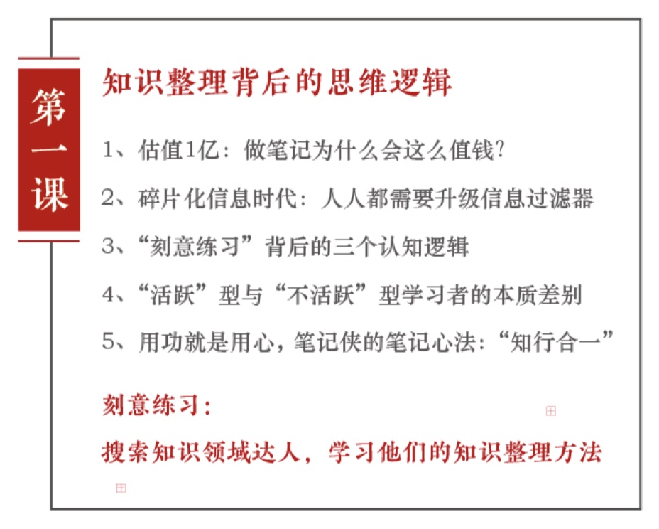
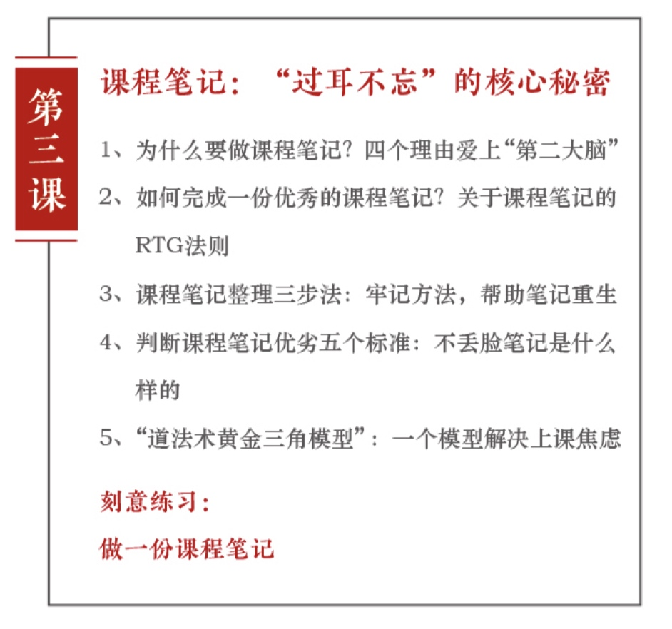
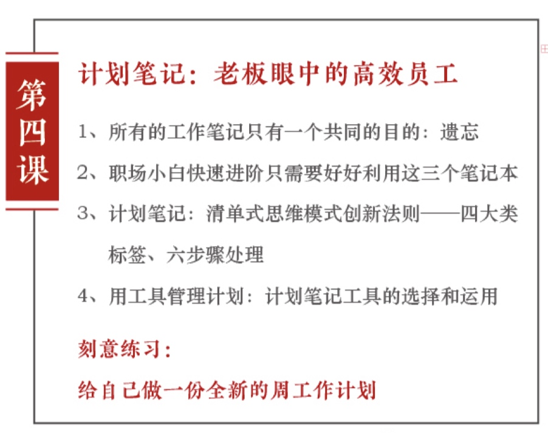
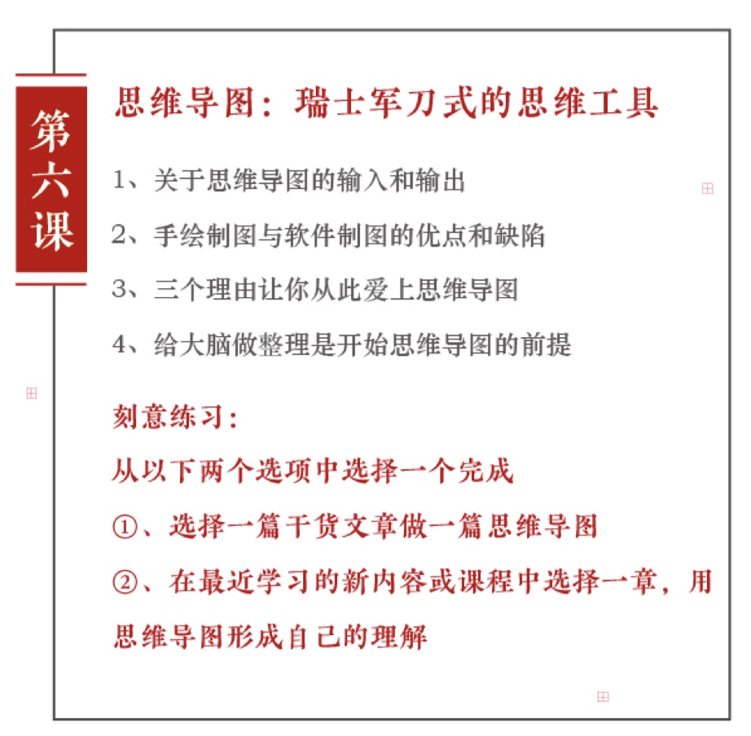

 
 <br/>
 
```
图文来源：《笔记侠柯洲教你做笔记》
整理者：Mr.Dragon
此内容仅供学习交流，不得用于其他用途。
```

<br/>
<br/>

**目录**：

[TOC]

<br/>
<br/>

# 第一课：知识整理背后的思维逻辑

知道却做不到，等于不知道。
当事情发生冲突的时候，如何抉择？
`结构性的知识，其实是最有力量的。
一本书不读完，不读第二本。`
这是我们第一次公开对外分享笔记侠：如何做笔记。

我是笔记侠，你的知识整理顾问。

今日要点：



<br/>


## 1.估值一个亿

你好，我是笔记侠创始人兼 CEO ：`柯洲`，同时也是一个笔记达人。

2015年年底，因为做笔记，我和我的合伙人创办了笔记侠，也获得了投资，目前的笔记侠`估值一个亿`。

你可能会问做笔记这件事情为什么这么值钱？
笔记侠提供的价值到底是什么？
其实这跟今天我要分享的主题有关，就是`知识整理`。
笔记侠挑选最有价值的内容，不管是课程还是书，摘笔记的形式呈现给读者，目的的是让读者更好的吸收。

当然，我们也因此让很多老师做出很多精彩的内容，这个能力的目前也已经得到了包括：
得到、虎嗅、i黑马等很多内容团队都在研究一种能力。
<br/>

## 2.碎片化信息时代

为什么呢？这是个数字化生存的时代，限制我们的不是信息太少，老是信息太多，阻塞了，我们获取有效信息的通道，使我们的`信息过滤器`失效。

而我们每个人其实都有对知识和信息的`焦虑`感，有选择的焦虑，有思考的焦虑，有行动的效率，
正因为这些焦虑，所以你会把大把的银子花在买线上和线下课程，
但不少人发现，听过就过了，到头来，还是只停留在表面上，
或者你花一个星期读一本书，发现重点内容还是没有消化，
你也不知道怎么对信息进行记录，筛选，怎么做知识整理，
也许你已经意识到了，做好笔记的重要性，但是不是没什么方法？

也不知道怎么用工具来帮助你更效率的学习和工作，

那么今天分享的实践经验，希望能帮到你。
<br/>

## 3.刻意练习


做记录很重要，很多人最终之所以纠结是因为他们从来不做记录。
总以为自己聪明到什么都记得住，事实呢，并非如此，我们总是忘掉很多东西，尤其是重要的东西，

然而，只要有记录，就可以回顾，就可以反思就会改进，就可以提炼，就可以通过不断的雕琢，最终形成完善的价值观体系，并且那保持记录，很可能是解决大多数人遇到事情`乱纠结`的最简单有效的手段，
不要小看积累的力量，时间久了，那些曾经用过的筛选原则，总是可以在意料之外的地方用上。

那么怎么通过记录筛选原则？建立自己知识体系呢？

首先一定要`建立知识与知识之间的联系`。

在看书的时候，看到每一个有用的知识，你都要停下来，记录一下，同时寻找它们之间的`联系`，因为真正导致人与人之间真是水平`差异`的，往往`并不是知识的数量，而是知识的联系`，为什么这么说呢？

因为我们人的大脑本身就是一个网络结构，当你有一个新知识的时候，增长一个新知识是一个，但当你有一万个旧知识的时候，再去接触一个新的知识，其实毕竟不是在增加一个新知识了，意味着你在用那个新的知识，跟你过去很多旧的知识建立联系。

所以，第一步就是`建立知识与知识之间的直接联系`。

第二步，要建立`知识与现实的联系`，看看有什么其他的现象能够被这个理论解释，然后能够不断地应用和实践，建立这个联系之后，还得`会用`，在你每次接受新知识的时候，一定要问自己，我的哪些行为可以被这个知识改进，这些知识要放在什么样的情境之下使用呢？

第三步，`回到现实`之后，你要开始学会`寻找事物背后的本质`，逐步地观察周边的事情进行思考和改进，
生活中的其实有很多现象都值得我们去思考背后的原因。

比如你在逛地铁的时候可以思考着流量的位置，这个过程本身就是一个不断闭环的过程，
用四个字来形容就是刻意练习，学习理论，想办法用多种现象解释他，然后在行为中运用改变，遇到现象多思考背后的本质，以及可以解释现象的理论，在这过程当中们都是一个记录和筛选的过程，反复建立这样的连接和联系，慢慢就能建立自己的网络了。
<br/>

## 4.“活跃型”和“不活跃型”的学习者的本质差别

这`三步缺一不可`，在长久的学习实践过程中，我们可以发现一个`现象`特别好玩，对个人知识管理感兴趣的人应该算的上是希望上进的人吧，其中有些人看的书，也在课堂上问过一些问题，后面那就`不知所终`了，不知道去哪里了，我们把这的人可以称之为所谓的`不活跃的学习者`。

然后还有的人，他们除了对个人知识管理感兴趣，还喜欢参加各种学习参加各种学习，各种拆书活动，去学习时间管理水平，各种激励演讲，参加各种社区。
这类人，我们可以把它称之为所有的`活跃的学习者`，但根据长时间的观察发现，几年过去了，这些活跃的学习者并没有因为他们的四处学习而有特别大的成就。

很奇怪吧，因为他们仅仅停留在更多的学习上，`只是成为了知识的容器`，反倒是那些看起来活跃的学习者，有不少做得风生水起，起码成了某个领域的高手，是不是让人特别匪夷所思。

因为这类人没有只停留在学习上，学习只是工具，不是为了学习而去学习，他们更愿意下功夫，并持之以恒去做。

真正去做好一件事情，边干边学，边学边敢做不罢休。
谁能当你有了一个`方向和目标`就去学习并且了行动的时候？
你会发现你没有时间去焦虑，你也就有了自己对信息和知识的过滤器，所谓的信息过滤器，其实就是将符合你的信息保留，不符合你的信息，过滤掉就可以了。

当然这个过程得要几个反复，一段时间，觉得自己懂了，但可能后来实践的时候又发现还是有许多盲点，遇到问题的时候，这个时候就需要你继续去`查漏补缺`。
<br/>

## 5.知行合一

基于上面的发现，跟你分享一句话，`知行合一，才是真知`。
王阳明说：“未有知而不行者，知而不行只是未知”。

简单来讲，就是`知道却做不到等于不知道`，其实是存在这种情况的，有一类人是知而不行，知道读书都有好就是挤不出时间，知道应该努力，但总给自己找托辞，说白了就是太急躁，没有切实可行的行动计划，整天空想更好，所以这并不是真正的知道。

然而还有一类人，不知每天过的浑浑噩噩，懵懵懂懂，任意而为，完全不知道思考工作，生活得过且过，不知道自己应该为什么而努力，不知道为什么自己做好了不好，没有目标方向和自知之明，找不到人生意义。

`知道和行动，它其实就是一回事`。
一个人说知道的时候就要`把行动包含在里面`，一个人在行动的时候就要把知道包含在里面。

真正的知和行是`同步`的。
只有知行合一才是`真知`，知而不行，行而不知，都将落入迷茫和困惑。

为了推行知行合一的学习方式，我们在笔记侠各种自己的线上实战营产品里，有华南大区笔记达人，铜陵，水晶呢  ，帮助我们是实战营搭建的一个个助教团，这些助教的人从哪里来呢？
就是从我们笔记达人社区里面热爱学习和实践的众多笔记达人聚在一起的。

这其实是一种非常不可思议的力量，因为这个过程也是帮助笔记达人打破自己框架的过程。
人要有由内而外跳出框架的机会和能力，当笔记达人在实在应当中找到`各自的价值`，发挥自己的能量，他们也会把这种能量带动到身边更多的人。

简单总结下今天的内容，我们说了一个`知行合一`的道理，以及通过记录和筛选的方式的方法论。

1. 要学会建立知识与知识之间的联系
2. 要建立知识与现实的联系，不断的实践
3. 要学会透过现实中的现象，寻找事物的本质，这样反复练习就会慢慢建立起自己的知识系统

然后呢，我们也举了一个所谓的活跃学习者和不活跃学习者的例子加以说明，
从一个道理，一个方法论到具体案例，这就是笔记侠一直践行的一个知识整理黄金法则。
就是：`道法术`金三角理论。

```
道就是一个道理
法就是一个方法论
术就是具体的操作案例
```

一个道理，加一个方法论，加具体案例。
你只要抓住这个稳固的金三角理论，能够好好的解决知识焦虑，同时开始做好知识整理。

最后那给你留一个`思考题`，运到知行合一的人有很多，发布个小任务：
> 你不妨搜索和查找一下资料，在这个方面还有哪些牛人，还有哪些牛的方法。
> 分析他们都做出了什么，为什么这么做？我们一起用行动加深理解。

欢迎在留言区分享你掌握的信息，或者留下你今天的心得和困惑，我们会和你一起进行这场知识整理的讨论。

下一讲，我会跟你分享`如何做读书笔记`。

我是笔记侠柯洲。
你的知识，整理顾问，感谢你的收听，下回再见。

<br/>
<br/>

# 第二课：读书笔记——知识达人的学习利器

首先，今天请你先思考两个问题。

第一个问题，为什么在一个新书层出不穷，好书汹涌而来的时代，我们依旧有`知识的贫穷感`？

其次，我们常说要多读书，读好书，究竟`能把书读好的人有多少`，你是其中之一吗？

今日要点：


<br/>


## 1. 完整式学习

我们常说书是人类通往文明的阶梯，记忆一旦消亡文明就会消失。
所以人类文明发展到今天最好的记录和记忆产品就是`书`，我们要学会读书。

关于如何读书，我先谈一个个人的浅见：
结构性的知识，其实是最有力量的，完整式的学习才最有效。

因为一旦知识结构片面或者学习片面，就会有漏洞，所以呢？
你要学会结构式看书学习，而不是泛泛地浏览。

曾国藩先生在给他儿子的信中说到，`避重就轻，是读书之大忌`。
他恪守`独一不二`的古训，也就是一本书不读完，不读的第二本，拒绝`游手好闲似的读书`。

在他看来，`读书就好比是打仗，必须攻下一个个大的据点，方能最终取胜`。
如果只是散意地随意地`攻下一个小村小寨，并因为这些微小的成就而自得自喜`。

最终其实空空如也，这里先给你推荐`三种高效阅读的方法`。

<br/>

### 同一个大主题下的多种子主题阅读

第一种，那就是在`同一个大主题下的多种子主题阅读`。

怎么理解呢？比如你要研究`品牌`方面的知识，可以同时研究：

- `艾.里斯(AI Ries)，杰克.特劳特(Jack Trout)`的定位理论
- `罗瑟.里夫斯(Rosser Reeves) `的独特销售主张
- `大卫.奥格威(David Ogilvy) `的品牌形象理论
- `Grey(美国广告公司)`的品牌个性理论
- `李奥贝纳`的人本主义和创意文化`
- `舒尔茨`的整合营销传播

包括后来出现的品牌资产理论，品牌社群理论等等。

这都属一个大主题下的多种子主题，如果你要学习这样一个领域的知识，你可以请`专家推荐或者自己查阅`相关资料，选择基本相互匹配的书，然后呢, 至少去读上两遍左右，包括快速通读和重点精读，
然后在这一定的时间内完成这个阅读，获得对书籍，对这个领域支持的整体理解。
<br/>

### 同一个子主题下多视角学习

第二种就是同一个子主题下多视角学习。

刚才提到了定位理论，你可以看 特劳特和里斯 写的也可以看 邓得龙和冯卫东 的演讲，
也可以选择其他不同的版本，不同作者的书，
然后从中对比参照，反复阅读，
这样可以帮助你更好的开拓这个主题里面的思路。

### 拟大纲，查漏补缺
第三种，就是对自己关注的领域，在有了一定的了解之后，可以尝试拟个大纲出来。

看看自己已经掌握了什么，还需要补充什么，哪里还需要深入？
然后在之后一段时间，可有针对性地阅读思考和时间，最终可能形成个人在这个领域的体系，

<br/>

## 2.输出带动输入的五个小建议

在以上了这个基础之上，再给一些其他的`小建议`：

1. 一定要`追问`一次
    用自己的思想去拷问，去反思自己。
2. `要学会提问`，问出好的问题胜过得到最好的答案
3. 第三：一定要建立一套完善的训练。来强化书中的经验，能够不断反复反复再反复。
4. 第四，就是很多人去关心怎么构建自己的知识体系？
    其实，知识体系的本人应该是你想成为怎样的人，适合我的，不见得也适合你。
5. 最后那读书和学习的方法中`最重要`的一个经验就是`用输出带动输入`。
    比如读书就一定要做摘录笔记啊，转述笔记啊，或者说做些书评，比如经常优秀的人在一起分享你所看到的东西啊，然后在交流碰撞中，你会得到更多的。
<br/>

## 3. 笔记三部曲RTG法则

刚才那我们讲到读书最重要经验就是要输出，因此那接下来我讲讲如何做读书笔记，`读书笔记有三种方法`，这三种方法对应笔记侠提倡的了一个概念，叫做`笔记三部曲`，RTG法。

- R Record 记录
- T Tidy 整理
- G Go 行动

RTG就可以对应三种笔记出来。
<br/>

### 摘录笔记

第一种：叫做`原文摘录`。Record：记录，我们可以称之为`摘录笔记`，通过记录来帮助记忆。

因为真正好的书是非常复杂的，它有多种的层面经得起细细的品读。
这里建议你可以先把书里面的`核心观点，方法论的案例摘录出来`，句子很重要的课`标红，或加粗`。

关于这种摘录的方法，现在有个很流行的快速读书方法就是`拆书`。
所谓的拆书就是`拆解一本复杂的书`，把其中的`骨架和知识点`找出来，用笔记的方式将它记录。

拆书有什么价值呢？有两个。

第一呢，就是`拆的过程`，他是一个快速又全面通读的过程，不会因为跳读而漏掉核心的信息。

第二个好处呢，就是这个`拆的结果`，要形成书的一个要点的笔记的记录，让人对书的整理，知识体系有全面的认识，拆书呢，很多人会做成一个思维导图。

我们这里呢，建议你用思维导图工具是**XMind**的，非常实用。

然而使用思维导图也要注意：
做思维导图的人呢？基本只有自己看得懂。

所以如果要给别人看的话就会比较麻烦一些，笔记侠和一些出版社，像中信,机械工业出版社，长期合作读书笔记。

每个月我们都会选出优秀的新商业类的书籍，然后发给全国感兴趣的笔记达人来完成读书笔记，在他们做笔记的时候，我们会非常强调她们有没有把这本书最基本的结构概念理解透彻？

一个人在学习的时候，比如对最基本的营销概念呢，市场概念的理解透彻后，就能够建立在这些观念之上的认识，形成市场判断的基础能力，人的学习水平在某种程度上，它就是拥有正确的底层关键知识的数量，以及调动这些关键知识解决问题的能力的综合体现。

所以。我们判断一个笔记达人摘录笔记做得好不好？
就判断他有没有`把知识结构和概念说清楚，说明白`，案例是否`详实`。
<br/>

### 转述笔记

不过那做好摘录笔记只是一个初级的读书学习者必须掌握的技能，我们刚才说到我们的三部曲，还有第二部`整理`(Tidy)，其实就是可以做成`转述笔记`。

你可以通过整理来帮助你思考，那就是用我们自己的语言还没掌握的整个框架，我们认为`非常重要的一部分`的知识，很好的转述出来，比如让我们华东大区的笔记达人`铜陵行走`，他在这个方面的能力就特别强，她今年也刚考到了麻省理工MBA，他就是经过长期的训练，形成了极强的归纳和演绎能力，然后呢，用自己的语言转述出来，通过再次的全是准确的解读，清晰的描述，证明他完成了对这本书的吸收。

那人在转述的时候，有时候描述感受也是非常重要的。
唉，我觉得这个模块特别好，特别能给我带来什么样的启发，他有评论点看法，根本其他有效的沟通作用，
然而大多数人并不清楚，关注自己的感受。

摘录笔记和转述笔记。
这些呢，其实都属于`学院式的学习`，就通过记录和整理，他是以知识为中心的学习，实现了对知识的记忆，理解和归纳，希望把书读完，把干货压缩。
自己的能够去记忆与分享。
<br/>

### 感想笔记

第三种：`记录整理后的行动`。

就是我们可以做一些感想笔记，什么意思呢？
感想笔记，还有另外一种说法，就是`读后感`，或者说，他也是富含笔记的一种。
做法是从书里找到一个`有感触的点`了，用自己的知识和经验，进行引申放大，试图对自己的行动有启发，这是一种`成人式的学习`。

因为成人的记忆能力是衰退的。

那这种启发性行动的感想笔记，就是以`自我为中心`的学习，强调学习的过程中关联的经验，强调运用和实践。
强调聚焦于解决实际问题，这点非常重要。
很多优秀的人，成功人，他在实践的时候，像专家一样严密细致，就是因为它能够很好的、完整的去理解这个`知识跟现实的关系`，所以在使用的时候可以随时调取出来。

这是可以通过训练的，通过这种持续的训练，我们就能够在学习当中，获取很多可以应用于生活和工作的好的创意和结构。
如果我们平常就刻意去努力，通过学习长期思考，给我们带来很多好的创意和结构，那是可以极好的帮助我们的，这样能够有清晰的框架和成长性思维。

最后，做完读书笔记，还可以参加或者建立读书社群。

可能过去在没互联网的时候，在没有电脑的时候，有很多纸质的笔记本。
今天我们非常发达，有手机有笔记本，手机里面还有各种应用。
我们在记录的时候，可能就开始东记录一点，西纪录一点，散落在各个地方。

我们要好好的使用这些新的工具，让他们从我们大脑的延伸，从我们个人知识和认知的延伸。
这个在后面，我们也会提到怎么使用这些工具？

避免说我们最终因为更多的工具让我们自己更加的混乱，那其实还有种工具，就是`社群`。
建议可以加入一些社群，比如那我们比一下其实也有读书社群。

像笔记达人的社区思维导图的社群，那还有像外面一些读书社群。
比如说`许晖`创办的`西山读书会`(后改名：溪山读书会)，这是一个很优秀的组织，这个组织目前的他们分别在专业领域，兴趣小组，两大类有近百个活跃的这种读书小组。

各个小组，都经常组织线上线下的分享讨论，以及各类主题的活动。

你也可以自己建立一些`单点突破`的群，现在那就很多人喜欢  `德鲁克` 的书，然后会根据他的书，做一些读书笔记，思维导图。

那是不是可以建立一个群来讨论学习呢？
根据这种方式就可以`链接`到其他很多的点，认识了很多志同道合者。

当你们学习了一定程度，是不是还可以邀请这个领域优秀的老师入群，一起解读，来帮大家固化这些知识。
<br/>

## 小结

讲到这里，我们做一下小结。

今天的主要讲了如何更好的读书学习以及做读书笔记了一些方法论，
简单来讲的读书笔记的道理在于通过完整式的学习，搭建结构性的知识系统，
帮助自己即使足不出户，就可以实现慢慢的内化，快快的成长，从记住到会用实现从知识到操作的关联，
通过一层的读书笔记法实现，刚才我们想要达到的完整是学习结构化的知识系统，

那么第二就是这个读书笔记怎么做？
有什么方法？有三种。

我们刚刚说到的：一种是原文摘录，记录精华的知识结构，概念案例。

第二种就转述，准确的解读，清晰的表达。
第三次是感想笔记，强调怎么用，怎么用于以解决实际问题。

通过以上这样的反复练习，又再次帮助我们建立这套知识系统。

第三个点就是我们知道了这个道理，方法之后，还可以加入或者自己建立读书社群。
相互促进，相互交流，加快让自己摆脱知识或者智慧的贫穷感。

---

最后发布个小任务，选一本自己喜欢的书，写上一篇读书笔记。
我们会给出点评，优秀的笔记，我们将会在笔记侠公众号刊登。

欢迎你在留言区分享你掌握的信息
或者留下你今天的心得和困惑，我会和你一起参与这场读书笔记的讨论，这就是第二讲的内容。

第三节课，我会教你怎么做`课程笔记`。

<br/>
<br/>

# 第三课：课程笔记——“过耳不忘”的核心秘密

今天跟大家讲讲为什么要做`课程笔记`，以及怎么做课程笔记？

今日要点：



----

我在这里先澄清一个概念，做课程笔记不是做`速记`，我给大家说一个工作小片段。

有一次呢，我有个女同事跟我一起去上课，她就坐在我的旁边，目瞪口呆了，她说他发现我并不是一个记录很快的人，我并没有速记能力啊，但我为什么那么老师讲的内容给记录下来。

她也才终于明白，那是因为我已经理解老师讲的内容，也许他十秒钟讲的话，虽然我没有速记的速度快，马上记下来，但是十秒后，我依然可以记下来，而他在这十秒钟那可能讲了一些话，并不是说真正可以值得记录的。

经济学家`张五常`老先生说过一句话：要`理解代替记忆`。
就是说理解可以帮助我们记住知识，理解才是我们上课，才是我们做课程笔记的精髓所在。

我们做课程笔记，强调了是：`有逻辑，有重点的记录内容`。

体现的是一个人的`理解能力，抓取能力`，这样才能做到才能做到：`边听边梳理逻辑`。

一定要对`讲者`讲的内容要理解，否则除非你打字很快，不然你肯定跟不上讲者的速度。

很多人在接受大信息量的时候，会漏掉很多东西，这是正常的。

比如一个教授，他在讲课的时候，那这个时候我们该录音，也是可以选择录音的。

我们有一位云南的笔记达人叫`青爷`，通过自己做课程笔记，通过看别人的课程笔记，他的消化能力，阅读速度迅速变强。

所以提高这个能力，那是可以训练的。
<br/>

## 1.为什么要做课程笔记

你可能会奇怪，我为什么做课程笔记？可以不做，我是不是可以看别人的课程笔记。

其实呢，做课程笔记有`四个好处`。
<br/>

### 收获

其实课程它本身就是有个严格的逻辑在里面的，但人的脑容量实在是有限。
笔记是人的第二大脑，我们就会通过这个笔记来帮助我们，而且我们在整理课程笔记的过程中，你会发现，这也是又一次刻意学习的过程，你能够深刻的理解这堂课究竟在表达什么？

所以我们有句话：`做课程笔记的人，他的收获其实是整个现场，仅次于老师的`，远远高于普通听众。
<br/>

### 传播

这个有什么好处呢？有助于`更好的向自己所要面向的人传播知识`。
因为有时候你学完这个课程，你可能回去之后，你可能会涉及到你的工作当中有其他角色需要掌握这个知识，那么你有了这个记录，你就会帮助他。
<br/>

### 有助于职业社交

第三呢，还有助于职业社交。

很多时侯，我们在职场中会因为某项工作做得格外出彩，要得到别人的重视，认可。
做好一篇好的课程笔记，也是其中的一项好技能哦。

尤其是现在的线上课程，线下培训，讲座，沙龙络绎不绝。
如果你能够在上课结束后，分享给大家一份：较为得体、全面、并且行文逻辑和结构缜密的笔记，你必然会成为大家关注的焦点。
<br/>

### 岗位技能提高

那除了职业社交之外，第四个好处就是：其实也是`有助于我们自己岗位技能提高`。

如果你是一家以支持产品为主要业务的企业，新媒体编辑必须在入职之后学会这项技能思考。
用于思考，考察员工的细心，耐心，认真的程度，而且也可以帮助员工尽快熟悉行业情况。

如果你的公司有人要进入内容编辑的岗位，或者你要进入内容编辑的岗位，也可以尝试从课程笔记开始。
<br/>

### 还有什么用途

除了以上的四个好处做课程笔记，还有什么用途呢？
<br/>

#### 自己看

咱们可以分`两类`，一类是给`自己看`，就是有时候我们为了方便自己快速记录，就会自创一些快捷的短语啊，特殊符号啊，但这也有个毛病，就是时间一长了你都会忘了这些玩意符号代表什么？
这类笔记一般表现为图片，手绘，思维导图，文字较少，关系较为复杂，可视化强。
<br/>

#### 给别人看

另外一类，那就是`给别人看`的就是我们一开始就提到的，可以让你的同学，可以让你领导，可以让你同事去看到的，这里比一般为文字版，他会搭配图片，关系清晰，结构性强。

最典型的就是笔记侠公众号工作笔记，大家可以关注，浏览，翻阅一下。
如果想提高这个能力，可以联络`笔记侠小二`。
她是我们的笔记侠的运营负责人，他会给你任务，然后教你做课程笔记。

我们今天那就是要把课程笔记的经验分享给你，就是我们第一次公开对外分享：笔记侠如何做课程笔记。
那我会把这个步骤，源源本本的分享给你。

然后呢，你做完之后会告诉你有几个原则来判断自己是否做得好。

`怎么做课程笔记呢`？
很多人以为说将分享者的内容大纲整理出来，或者说内容实录出来就可以了，这样对吗？
也对也不对，不对在哪里呢？

一个老师，我们打个比方，他有30分钟的录音，如果把他`实录`出来，那可是30分钟的好几倍啊，你觉得这样的投入产出是高效的吗？
<br/>

## 2.课程笔记RTG法则

那我们笔记侠怎么解决这个问题呢？
我们的方法是什么呢？就三步：记录，整理，`分享`。

我们之前说到了记录，整理行动，称之为笔记侠读书笔记的三部曲(RTG)。

记录整理，分享是我们做课程笔记的三部曲，它也叫RTG。

R就是Record：记录。
T就是Tidy整理。
G之前是Go行动，那之前的G是Go行动，这次的G是`Go Share` ,就是去分享。

每一步其实都没有那么难，但总有人做不好，所以我建议你把这三步打印下来，贴在自己办公室，时刻提醒自己。

<br/>

### 记录

那我们来分解一下这三大步怎么做的？第一步就是**`记录`**，这一部可以`分成三小步`。
<br/>

#### 课前预习

第一小步要做课前预习，课前准备很重要，为什么要做课前准备呢？
因为人的大脑，它不允许空白和问题的存在，如果你能在课前做好准备和问题，再课程中去调动起来，
你就能会去寻找答案，做课程笔记的预习，那我给大家一个方法。

你听课前，可以先看一些讲者讲过的内容。
这样你进入课堂的时候，老师的部分内容其实是透明的，不再是黑箱子，或者你可以提前看这个课程的相关知识，在上课之前就可以多一些理解。

然后如果你能够做完这个动作，那么不管你在现场有没有做笔记，你上课的理解能力都在提升了！

<br/>

#### 全神贯注听课

第二个小步骤，就是听课的时候一定要`全神贯注`。

千万不要或者少看手机，不要随意观察别人，努力在听的过程当中，全神贯注。

在这个过程当中的，如果老师讲的明白的你就跳过了，如果老师讲的不明白，你可以`记录`下来，打个问号做个`标记`。
如果有一些地方你觉得有疑议，你也可以`标注`出来，你可以事后跟他去`求证`、问询或者自己去查明搜索。

如果你能做到这一点，那么你在上课的时候就能够专心致志。

就好比我去考这个潜水证一样，考潜水证，如果我的动作多了，身体乱动、恐慌。
我可能就会在这个水面上，浮浮沉沉，最终不能很好的下潜，而且会消耗很多氧气，甚至还会吸进海水。

这跟上课的状态其实很像的，如果我们老是有些小动作、乱动，对吧，其实对我们消耗身子，我们走神了，或者错过很多好的内容。

<br/>

#### 语音转换成文字

之后记录才进入了最后的小步骤，就是你可以现场好好的记录，或者说课后用技术将语音转换成文字的思路。

如果你是一个平常记录比较快的人，你可以在现场就可以记录下来。
如果不是，那么你可以选择讯飞语音等工具，把你的音频转化成文字。

这个方法我可以告诉你一下，如果你音频有30多分钟，然后你`只想要其中的十几分钟`，有两种方法。

第一，**`剪辑出来`**，你需要的那十分钟上传到讯飞的网站上面去就可以了。
第二，那就是也可以把直接30分钟的传上去，然后之后再轻松的**`找到你所要十分钟对应的文字版本`**。

这个是我们刚才说的第一大步骤，记录。

<br/>

### 整理

第二大步步骤，就是整理。

这个步骤呢，里面还有些小方法，我来跟大家分享一下。

第一个小方法，在整理的时候，你把一些**`语气词啊，重复词，语气词删除掉`**，我们拿到稿的第一时间应该先通读，然后根据自己理解能力。
把一些：哎呀，这个啊，还有老师的**`口头禅，脏话都去掉`**。

然后呢，再**`去掉一些重复的话`**，一句话能说的明白，就不要一堆话，能直接说明白，就别反反复复。

当然的，这里有一些话可能是老师刻意讲述的时候强调的，这样的话，一般在他的PPT当中，我们就能够看到，所以可以格外注意一下。

再一个`小方法`，就是做完这个事情之后，我们开始进行**`逻辑的梳理，重新搭建文章结构`**，因为老师有时候会因为紧张，ppt操作或者准备不充分，存在一个跳节奏的情况。

所以整理的时候需要整理好：整个的`前后逻辑`。
甚至的我们对整个文章的结构要重新搭建，这个在我们笔记侠做课程笔记的时候，是会经常遇到的事情。

因为我们通过分享出去的时候，要考虑到读者的用户体验，他能够很快的得到一个知识点，或者得到一个方法论，这么好的逻辑，这么好的清晰的文章，才会提高别人阅读的**`爽感`**。

那再接下来呢？就是**`替换掉一些生僻词`**，什么叫生僻词呢？
比如在新媒体的这种演讲当中，我们会经常听到`KOL`(关键意见领袖 Key Opition Leader)、`用户`等词汇，也可以把这些词汇换成行业，意见领袖啊，但其实这样会显得不专业，这种并不叫做生僻词。

**`生僻词是指`**老师在自己工作环境下，跟他团队`默契配合产生的词汇`。

比如说有的人做公众号，有些自媒体会把公众号称之为`后台`啊，或者`老家`这样的词汇。
这个时候我们就要辨别出来，把它转换成大家能够接受理解的词汇。

还有个小方法就是`增加批注`。
就是文章有时候会出现一些`不能被替代的专业术语，特有名称`啊，陌生领域的专家，这个时候如果我们不加以批注和注解，用户在阅读当中，他会对这个知识点存在空白，如果你让他再去百度搜索，就增加了一个动作。

但如果再往下读，可能这个关键词非常重要，他如果没有理解透彻，就会影响了下面的阅读理解，这种情况是会经常出现的，所以我们的就要找出来进行批注，备注。

备注的这个内容可以用**`浅色的灰字`**，就像我们的`话外音`一样。
批注或者说备注了不只一次，还包括：比如说讲者分享的某个案例是否需要扩充？
因为他可能只是一笔带过，但是这个案例，其实是有很多信息需要给到读者或者用户的。

然后呢，老师可能在分享提到的某些现象，我们是否要加以说明。
比如说一篇文章里面提到**刘强东的微博大战**，但是可能对于后来者，他并不知道刘强东当时在微博上做的哪些大的战役，那么可以备注出来。

还有呢，其中可能提到一些**`概念`**，或者说**观点**是否需要一些链接，或者说`延伸的阅读`这个也很重要。

这些都是增加批注的过程，是我们要站在整个**信息的丰富度**来考虑的事情，这个时候你会不会感觉比之前的动作更加高级了？更有成就感了？而且那也在扩展自己的知识面。

通过以上这些动作，你还可以对整篇文章进行**`拆分`**，就是对每个结构取出**`小标题`**。

我们自己也有便于理解说：这个模块在讲什么。
<br/>

### 分享

完成了整理这个大的动作之后，就进入第三个大动作就是：`分享`。

如果你是做公众号的，或者说你是记录在`锤子便签`上面，把你的文章，给他配上版式，配图啊，再优化一下。

因为**好的版式，是可以提高阅读的心情**。
好的配图呢，其实是可以缓解文字的压力，也是一个很好的视觉美感。

<br/>

## 3.什么标准 评判一份课程笔记是否优秀？

给大家上面说了三个大步骤，你可能会问，那有**`什么标准`可以评判一份课程笔记是否优秀**？

这里我就要讲讲我们自己了，笔记侠工作整理的课程笔记，为什么可以长期阅读，经得起时间的考验。

就是因为我们在做笔记的时候，按照一套方式，一套标准。

这个标准的有`四个元素`，可以分享给大家。

- 1.就是逻辑性好不好？
    整篇的逻辑结构行不行？
    连不连贯通顺？

- 2.结构化如何？
    是否有注意自己或者别人全方位的思考
    是否能够让人感觉到整天是非常完整，

- 3.再者是信息量
    观点清楚
    推导过程明确，
    事实要素清晰，而非只是几个字的串联
    信息量足够到位

- 4.最后一点就是最重的，就是要**`符合道法术`**。
    也就我们之前反复强调的，就是这篇课程笔记：
    到底讲了一个什么道理，提到了什么方法论，涉及到什么实战操作。

<br/>

怎么理解呢？我们举一个具体的`例子`。

笔记侠之前的做过一篇：
关于`曾鸣`教授在湖畔大学的课程笔记，重点讲述了一家**企业在探索期的战略打法**。

主题是[卓越企业的孕育期，企业发展0-0.1的阶段](https://zhuanlan.zhihu.com/p/23837189)。

这个主题，它其实是在讲一个道理，就是：这个阶段，他是能够孕育出伟大的，他虽然是早期阶段，这是他的一个道理。

然后呢，他在这个探索阶段，公司应该怎样去做？具体怎么实施？
他又展开了充分的论述，这就是方法论，也就是法。

最后呢？他就用一些实在的例子来佐证。
这些例子呢，就是术。

因为证明教授很好的把`道法术`结合在一起，也就是道理清晰，方法论清晰，案例清晰，
从而大大降低了用户的理解成本，让你一看就明白，获得感非常强，这篇笔记，阅读量10w+。

得到了大量传送，我们在做这个标题的时候，也对这个文章的道法术进行了高度的提炼。
标题我们定为：**湖畔大学曾鸣演讲，从0-0.1最难，但伟大孕育一次**。

你从标题中就可以直接获取这个道理的关键信息了。

<br/>

我来做下小结，通过介绍做课程笔记的重要性，三大步骤以及标准，我们希望你理解以下三点：

1. 做课程笔记的道理，不是在课程上写出漂亮，工整的笔记颜值好，
而是以理解了课堂知识的道法术为目标，也就是掌握了道理，方法论和实战操作为目标。
否则那再好的笔记也没有什么用。

2. 课程笔记应该怎么做？有什么方法？
也就是三部曲：记录，整理，分享。
其中有些小的步骤，我在这里就不一一阐述了。

3. 当你知道了做课程笔记的道理和方法之后，你就会通过一次次的训练，通过加入一些社群，促进交流，加强自己的能力。

<br/>

今天我们给大家发布一个小任务，我们的笔记侠小二的已经为你准备了一份课程笔记任务。
你可以对比笔记侠做出了同样一篇课程笔记，来帮助你发现和提升这个能力。

欢迎你在留言区，分享你掌握了信息，或者留下你今天的心得和困惑，我会和你一起参与课程笔记的讨论。

想知道我怎么做日常的工作笔记吗？
在接下来第四讲，我会跟你分享，我的亲身实践的方法论，**`如何用笔记：记录计划，会议，灵感`**。

<br/>
<br/>

# 第四课：计划笔记——老板眼中的高效员工

我们说职场达人和普通人的最大区别就在：做工作笔记的方法。

奥运会选手，他有以往的成绩可以追踪，才能一再破纪录。
金牌销售员，妙用笔记本管理客户关系，业绩才能屡创新高。
策划经理，靠笔记本记录灵感，品牌影响力才能经久不衰。

今日要点：


<br/>

## 1. 工作笔记目的：遗忘

工作笔记他不同于我们前面讲到的课程笔记。

- **课程笔记，是为了`记忆`**。
- **工作笔记，是为了`遗忘`**。

面面俱到的笔记方法，已经不再适用于工作中了，而技巧比效率兼备的超级笔记法，才是职场达人的`必杀技`。

所以呢，今天我们要讲的主题是我们的`工作中如何做笔记`，让工作效率变得更高。

<br/>

## 2. 三个笔记本

首先在工作中，你可以准备`三个笔记本`。

<br/>

### 管理日程安排

第一是`管理日程安排`的日程笔记本，方便做一些计划。

这样的笔记本可以选**中等尺寸**的，方便画出`横轴`的日期以及`纵轴`的具体时间安排。
<br/>

### 记录信息
第二个笔记本是用来`记录信息`的航母笔记本，它方便于我们记录各种各样的会议。
**尺寸越大越好**，方便可以大量的记录信息。

<br/>

### 存储灵感

第三个笔记本都是用于`存储灵感`的笔记本，这样的笔记本可以选择**尺寸小**一点的，可以随身携带。

因此让工作顺利进行的关键：在工作的记录方法，也就是笔记本的使用方法。
<br/>

## 3.计划笔记

接下来呢？这节课我主要分享如何做`计划笔记`，如何做计划笔记呢？

我先讲，制定**年度、季度、月度、周计划**这件事情，在此我们需要掌握一个思维：`清单式思维`。

当一个人，许多事情要完成，或者说一个事情，需要许多人共同完成的时候，可以采用清单式模型。

**横轴**就是日期，**纵轴**就是要完成事项的具体时间。
采用这样的方式可以将任务条理化，当每一条都完成的时候，这件事情就会特别标准，这个方法非常适用于团队管理和项目管理，这个思维就是用来`筛选和检查`我们平常的工作，避免出错。

有人说事情多时间不够用，其实很简单。
你可以`把事情分类打标签`，然后只做前两类重要的就够了。

怎么分类打标签呢？首先学会`将事件收集分类`。

你的第一步可以做的事：罗列一下，这一周你这一天要做的事情。

当你试着写一下，你就会发现事情还蛮多的。

那我们最重要写的是哪一天？是周一。
周一，他是要列出一周和一天的清单。

写下来后，然后你就想打小怪兽一样，一个个去消灭他们，做一件你就划掉一件。
直到你打完所有的小怪兽就完成了这个整个的周计划了。

听到这里呢，你是否要开始准备做事件清单了？

<br/>
### 四大类标签

然后这个清单可以按`四大类分别标签`。
哪四个标签呢？**`重要、不重要，紧急、不紧急`**，用矩阵的方式发到四个小格子里。

首先，`马上处理`的事最重要，最紧急的。
`其次`，处理大部分紧急，但不重要的事情。
`接着`把大部分时间花在重要但不紧急的事情上。
`最后`有多余的时间，再慢慢就处理那些不重要也不紧急的事情。

按照以上的分类，你就给将事情分别罗列，进行`先后排序`。
那这些事情要如何处理呢？

<br/>

### 六步骤处理

有几个小步骤：

比如说你可以把那些`毫无价值的事`，你就不需要投入时间了，立即把他`删除`。

把一些有价值的事情，放入`归档`，说要处理。

把一些`需要未来实现`的，放到未来去，等待那个时间到来，再去提取出来，完成。

同时，有些事情需要`分派给别人完成`的，分开后你等待完成即可。

有些事情就等到你这件`做完才能进行的下一件`，那么你就把第一件做好，就会开始进行完成第二件。

然后有些`需要很长时间的`，你可以专门建一个大的`专项目录`，来进行跟踪。

因此你可以很好的在把你的计划变成文档，这时你会发现你的工作更加清晰了。
你也可以很快的找到自己要做的，未来要做的，做完之后马上要进行的事情。

当然做这些动作需要时间，如果你整理好之后，其实是为你节约更多的时间，能够高效的管理事情和计划。

还有一些工具可以使用呢？有的。

<br/>

## 4. 用工具管理计划

<br/>

### 便签纸

比如说最早的时候，很多人会使用`便签纸`、**及时贴**在自己电脑前面贴上一堆，这是一种方式。
但是最初级的方法。

<br/>

### 手写

第二种方法就是你`手写`下来，周清单日清单写下来，这是第二种方法。
这种方法其实是非常实用的，比较简单直接。

<br/>

### 电子版的记录清单

然而你如果能够进阶到第三种，也就是`电子版记录清单`，其实这是最有效的，它可以随时更改。

只要通过不断的练习，你最后其实是给很好的使用电子版记录清单。

熟练使用之后，你会发现他能够帮助你起到很好的作用。

那这里其实有几款APP是可以帮助我们做电子版的记录清单的。

<br/>

#### 提醒事项
第一款，苹果自带的`提醒事项`。

现在很多的APP比苹果提醒日历都是有关联的，比如说航旅纵横，他会根据你的行程马上在你的提醒日历里面呈现，因此，许多日程安排都可以在这个日历中自动生成，十分方便。
这个APP中主要将每周每月提前预支的大事项进行记录提醒。
<br/>

#### 365日历

第二个APP就是`365日历`。

这款日历呢，适合一个团队一起使用的，它可以生成某个项目，或者某个团队的共用日历，在日历中记录下整个团队需要完成了事件，团队每位成员都会收到提醒。

<br/>

#### 滴答清单

第三款，APP就是`滴答清单`。

这是一个专注`任务管理和日程提醒`的待办事项清单。
可以把自己的工作和生活分别罗列两个清单进行管理。

这三款工具呢，足够你在计划管理中加以使用，使用前呢，需要一点习惯养成，但一旦养成习惯后，就会十分地实用有效。

其实我们做计划管理最难做到事情就是习惯的养成。

因为计划的管理，它是一件持久的事情，我们要学会把事情分类，会安排时间的，需要练习，刻意练习之后才会变成习惯。

<br/>

### 运用

还会遇到有什么问题呢？
就是**当`事情发生冲突`的时候，如何抉择？**
我们最常遇见的就是她做一件事情的时候出现另外一件事情打断。

这时候你的思绪被打乱，时间被打碎，因此也需要些方法来进行`抉择的方法`就是：
最常用的方法就是：哪个需要先完成？然后把另外一个先扔到一边。

我们还会遇到个问题，以为自己做不了这个事情，坚持不了这个事情，其实能这还主要是信念的事情。
我们有时候是被我们自己的拖延症，懒惰症，给影响了。

`知行合一`真的是做一切事情的源头，想到了然后去做，这样时间久了他就会高效。
只要你能够克服以上几个问题，计划管理这个技巧，会给你`带来更多的时间`。

前面呢，我只是讲了周计划，其实我们还要锻炼自己，写年度计划，季度计划，月度计划。
等到一年一个季度，一个月过后你就会知道自己干的什么，没干哪些做的好，哪些没做好，也就能更好的评估自己。

因此呢，请务必把计划写出来，先规划全年计划，在写季度计划，再分到月，最后按 周推进。

长期积累，这些文档，你知道会有什么好处？

比如说我以前在做品牌服务的时候，活动计划，传播计划，产品开发计划。

当我在制定下一个月或者下个季度计划的时候，我就可以拿出以前的记录进行`回顾`。
看自己完成量如何？速度如何？效率如何？

通过`复盘`来自行下一步计划，而这些过去的计划记录，一定可以为你下一次制定计划带来帮助。

以前我就会把一个客户很多计划按照时间和类别分出来，于是让我到服务客户店里的时候，或者服务其他客户的时候遇到同样的问题、同样的事情、同样的挑战，我就可以拿出以前的做参考。

做好计划的笔记，真的可以帮助我们避免平常工作的`穷忙和瞎忙`，所以请你务必重视。

学习如何做读书笔记，课程笔记，工作笔记，实现知行合一。
用知识整理术提高工作和生活的效率，让自己成为更优秀的人。

<br/>
<br/>

# 第五课：会议笔记——职场达人的超级“保险箱”


上一讲我们讲到`职场达人`和`普通达人`最大的差别就在做工作笔记的方法。
讲完如何做计划笔记呢，接下来我主要讲`如何做会议笔记和灵感笔记`。

今日要点：


<br/>


## 1. 理清会议逻辑

我们在说到开会，如果你想要有效率的话，你做到以下`四点`。

`第一`，开会前要在笔记本上面写好今天的`日期，具体时间`，比如上午九点到，`参会人员`都有谁？
还有什么是`会议的主题`？

以便你日后检索翻阅，看看上一次会议什么时候举行，落实了多少。

`第二`，在开会的过程中，你可以记录，把你想到`点子`，写在上面。
千万记得，别人讲的时候不要打断。
你先记好，然后等别人讲好，等到你发言的时候，再把你想法说出来。

`第三`，开会结束之前把结论梳理好，跟大家`再三确认`。
这个确认的部分就可以变成会后的待办事项，照做就行了。

<br/>

有的人认为做笔记等于工作认真，每次开会的时候，无论谁的发言或者PPT上的文字都写到笔记本上。
其实这样记录的信息对工作的推进没有任何实质性的作用，怎么办呢？

这里有方法，首先开会前想清楚`会议目的`，每次开会基本会有个主题。
在开会前最好花2到5分钟，想清楚，通过这个会议，你要解决哪些问题？达到什么目的？

<br/>

比如呢？下午有个参加一个有关活动方案的讨论。
那你可以提前在本子上列出你想要解决问题，活动主题是否认可？
方案中哪些细节要调整，如何调整？活动时间，排期，配合人员是否有疑虑？
活动的执行，是外包还是自己做？等等。

这样就不会让你像搬运工一样，在会上什么都记，你会清楚地知道，什么信息与你解决问题相关。
千万别让**`战术的勤奋，掩盖战略上的懒惰`**。

会前的2到5分钟就是整理整个思路的过程，如果你以后有机会主持会议的话，这个简直太有用了。

然后在会的时候，同时要做到第二点就是：一定要**`区分事实和意见`**。

很多人对开会延长时间的行为很郁闷，为什么原计划40分钟的会议老是拖到两个小时才结束？
后来会开多了，慢慢明白，就是因为会议本来是用来陈述基于事实总结得出的想法的场所。

但是会总有不少人，不是我觉得，就是我猜，没有任何事实依据，凭空发言。

<br/>


回到我们会议笔记上，就是因为会上有太多的凭空发言，把整个思路打乱了，最后事实和意见傻傻分不清楚。

比如说运营总监说：我们要重点提高活动频率。
市场总监觉得：我们要聚焦在一件大的事件活动上。
或者市场总监觉得方案有问题，需要调整，那怎么调整？

这个时候如果你仅仅是记录下来，他对工作推进基本上没有意义，那怎么做呢？
首先呢，在听每个人发言的时候，我们要能够区分出事实和意见。
比如说后台数据，这就是亲眼所见的，是`事实`。
像比如说我建议啊，我觉得可以这样做，基本才归为`意见`。

如果只是单纯的提出意见，可以在后面补充问一句，**方便说一下，你这个意见理由吗？**
或者请问你是基于什么事实提出来的？

很多人在解释原因的时候，可能就会发觉自己的意见，毫无事实依据，个人喜好而已。

<br/>

那么到了这个时候，就可以很努力的将很虚的方向性意见，拆分成可执行的`落地性意见`。
比如某个总监的这个方案有问题，这个时候你把种信息记录下来是没有意义的，然而你可以在后续的对话中，逐步缩小对话范围。

比如接着问你说的问题，具体是指活动内容，活动主题还是方向错了？
如果对方说是活动内容，那你就不用管其他的了，集中在活动内容这部分`继续往下问`，慢慢你会发现，会议一结束你就知道该怎么行动了。

很多人做会议笔记，一开始想规规矩矩的写，写着写着就变成纸上哪里有空白，就算哪里的记下笔记，这其实是不利于会议后梳理信息，还会造成`思维混乱`。

<br/>

## 2. 康奈尔式笔记记录法
<br/>

`麦肯锡`对于记录工作笔记的解释很赞：
> **记工作笔记绝对不是一件机械的、麻木的重复劳动，而是一个思考的过程，不是为了记而记。**

特别在会议和工作中记笔记的目的是**帮助判断，最终得出结论**。
<br/>

那OK，一个会议基本上要结束了，这个时候请你再一次确认结论，因为很多人特别是负责人，经常会忘记开会中说过的话，在会议结束前要习惯快速的回顾本次会议笔记，查看需要确认的事项是否都有了明确的答案。
注意是`明确的，可执行的答案`。

都确认后有可能要说下面这些话：
我想耽误各位一分钟，刚刚讨论的结果大伙都再确认一下：

第一点是什么？
第二点是什么？
第三点是什么？
如果没问题，我们就照这样执行。
<br/>

大家没看到，这不仅是帮自己再次理清思路，更重要的是向大家再次强调已确认的事项，以及将如何执行。

<br/>

## 3. 灵感笔记

说完，我们在会议当中如何做笔记，那么最后分享一个工作笔记的需求，就是**`记录灵感`**。

你的的思考逻辑，最好能够当下就能够写下来，你想到了什么，你听到了什么，也可以马上把它写下来。

有时候会放在一些`很微妙的场合`。

比如说洗澡的时候，比如说上卫生间的时候，这个时候是人特别放松的时候，很容易出灵感，这说如果灵感来了怎么办呢？
可以记下来的，你可以在你的卫生间放一些便利贴，想到就马上记下来，因为很容易有时候洗完澡就忘了，就再也找不到了。
那个灵感仿佛掉到了失去了大海里面，你再找不出来。

今天我们介绍了在工作中做好计划会议和灵感的笔记，希望说大家的工作当中不要**穷忙瞎忙**。

在这里呢，请你理解一下三点：

1.做工作笔记的道理是为了记录，整理和行动。
2.工作笔记，具体怎么做呢？
3.有什么方法呢？

我们在上面都已经详细的阐述了，在这里就不在一复述，但总之要学会`高清具体`的做工作笔记。

<br/>

也发布一个小任务，按照我们今天讲的做会议笔记的方法，请你做一份会议纪要，同时体会这样的开会是不是更目标感是不是更清晰了？

欢迎你在留言区分享你掌握的信息，或者留下你今天的心得和困惑，我会和你一起参与这场工作笔记的讨论。

好了，感谢你跟着我一起学习如何做读书笔记，课程笔记，工作笔记。
实现知行合一，用知识整理术，提高工作和生活的效率，让自己成为更优秀的人。

<br/>
<br/>

# 第六课：思维导图——瑞士军刀式的思维工具


今日要点：




我的分享将从三个部分展开的。

- 1. 什么是思维导图？
- 2. 为什么要做思维导图？
- 3. 如何做思维导图？

<br/>

什么是思维导图呢？又被称作脑图，是发散性思维应用的一个最佳工具。
它从一个中心点展开，每个单词或者图像自身就成为一个只中心或者联想。
它可以有效地锻炼我们的可视化的思维模式。

<br/>


## 1. 思维导图的输入和输出

思维导图，从`用途上`可以分为`输入和输出`两种。

- 输入起了的`记录`的作用。
比如呢，通过输入一本书的精华，或者一堂课的重点，最后整理出一份读书笔记或者课程笔记等等。

- 输出有着`思考`的作用。
比如做策划方案的时候呢，你公司同事团队成员一起做头脑风暴，可以在白板上记录一个主题，发挥人的创造和发散性思维，然后利用好思维导图这个工具能够整合每个人的想法。
最后输出一个合理的解决方案。


<br/>
<br/>

## 2. 手绘和软件制图的优缺点

思维导图，从`表现形式上`来看呢，主要分为两种，一种是`手绘`的，一种是`软件`来制作的。
<br/>

### 手绘的思维导图

手绘的思维导图呢？可以调动更多的感官。
世界脑力锦标赛的创始人，教育专家，也是思维导图的发明人，`东尼博赞`曾经提出12项的原则。
其中一点就是`五官通感`，就是记忆事物的时候要伴随视觉、听觉、嗅觉、味觉和触觉。

在手绘的过程之中的我们，能够尽可能多的带动这些感官的体验。
进而加深印象，但在如今这个快节奏的生活会议和现场活动中，我们不一定能随身带着纸和彩笔。

因此，今天主要分享手围绕使用软件来制作思维导图。
<br/>

### 软件制作思维导图

`软件制作`有三个`优点`的呢？
- 1. 对整体结构没有要求
- 2. 字迹没有要求
- 3. 占用空间没有要求

第一，它对`整体结构没有要求`。
画错了，不会有心理负担，可以随心所欲地调整笔记的结构和内容。
做图之前的不需要有顾虑，不担心字体大小没有控制好，上面的空间不够。
这些都可以避免掉。

第二个好处就是对于你的`字迹没有要求`，写字不够工整的人，也不用担心说害怕写错字，影响美观。
这些都会避免，很重要的一点，就是你`做完以后，别人也可以看的懂`。

不知道大家有没有这个感觉，今天看到一位朋友制作了一幅`手绘的思维导图`，字写得很好看的样子。
但是有由于练笔或者字体的原因，内容读起来不那么清晰，最后的效果，不理想的。

用软件来做思维导图就可以避免这种情况，你可以选择简单大方的字体，比如说`微软雅黑`，就会很干净，很清爽的，向人们展现你的作品。

第三个用软件做思维导图的好处就是：

你在做图的时候，对于所需要`占用的空间，不再有要求`，你不需要平整的桌面，大白纸，很多彩色笔。
你只要有电脑或者手机就可以完成。
<br/>

## 3. 为什么要做思维导图？三个理由爱上思维导图

我们知道瑞士军刀是瑞士工匠精神的产物，人们赋予的瑞士军刀很多功能，剪刀，开瓶器，小刀等等。

其实思维导图就像多功能的瑞士军刀一样，能够实现很多功能，帮忙解决不同的问题。

可以运用在读书笔记，课程笔记，会议笔记等等方面。

推荐你做思维导图的原因有`三点`：

<br/>

`第一`，它能够让`关键的概念之间的联系，更加一目了然`，把脑海之中发散性思维的脉络，`具象化`。

举个学习中的`例子`吧，我们思维导图分舵的负责人`小猫妮`。

她在学法语的时候，发现其中的很多语法跟时态很复杂。
这个时候他就会做一张思维导图，理清自己的思绪，准确判断出同一个词，不同的应用场景。
<br/>

推荐你做思维导图的`第二个原因`是：
它能够`更好地建立知识与知识之间的联系`，建立好知识联系，就能够更容易加强记忆。

举个在生活中的`例子`吧，现在可能很多朋友已经接触到知识付费。
比如在得到APP上订的专栏或者在十点课堂等平台上购买了课程。

这个时候给你建议是：
在一个章节或模块结束的时候，可以通过制作一张思维导图来归纳所学习到的知识点，从中来丰富自己的知识体系。

所以，要尽量避免的是这种情况，文章我仔细读了，音频我也边做家务边听了。

然而读完听完之后没有在脑海当中留下什么内容。
<br/>

那推荐你做思维导图的`第三个好处`是：
它能够`依据事物的关联性连接在一起`，帮助你更快速的加以回顾。

如何做思维导图呢？由于需要借助视频手段，因此会在后续的实战营当中展开说明。
但在这之前，我们需要对大脑进行一次`断舍离`。

<br/>

## 4.开始做思维导图的前提

**`笔记，有一种对话的作用`**。

通过信息传递者的思维和能力，来与自身的需求和目标相结合，以此作为你`演讲者和作者之间的智力对话`。
思维导图就可以体现这个过程。

如果演讲者和作者所传达的信息，在被我们接收时，在我们的记忆阶段，就造成一定的混乱。

那么你的思维导图，就会反映出这种混乱出来。
给大脑进行断舍离这个概念，是在《`精进：如何成为一个厉害的人`》一本书所提到的。

断舍离的根本，可以说是`简化`。

简化，是清晰思考的前提，适当的简洁，意味着更丰富的内涵，把原本复杂重复的内容精简后，
头脑才能腾出空间处理其他的信息，并且进行更加复杂精微的思考。

今天，因为音频无法展现制作思维导图的全过程。
因此那我们今天留下了一个作业，供你完成。
你可以从以下两项，选择其一。

1. 从最近阅读的公号内容中选择最有收获的一篇干货文章，通过一张思维导图来进行经验总结。
2. 从最近学习的新内容或者知识付费产品中，选择一章用思维导图建立自己的知识联系。

<br/>

欢迎你在留言区分享你所掌握的信息，或者留下你今天的心得和困惑，我会和你一起参与这场思维导图的讨论。再次感谢你跟着我一起学习如何做读书笔记，课程笔记，工作笔记，思维导图。

实现知行合一，可以用知识整理术，提高工作和生活的效率，让自己成为更优秀的人。

end~
<br/>
<br/>

```
图文来源：《笔记侠柯洲教你做笔记》
整理者：Mr.Dragon
此内容仅供学习交流，不得用于其他用途。
```