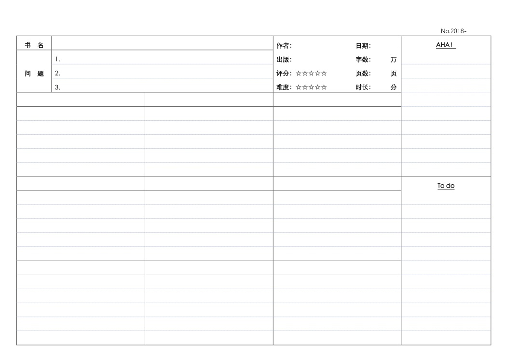
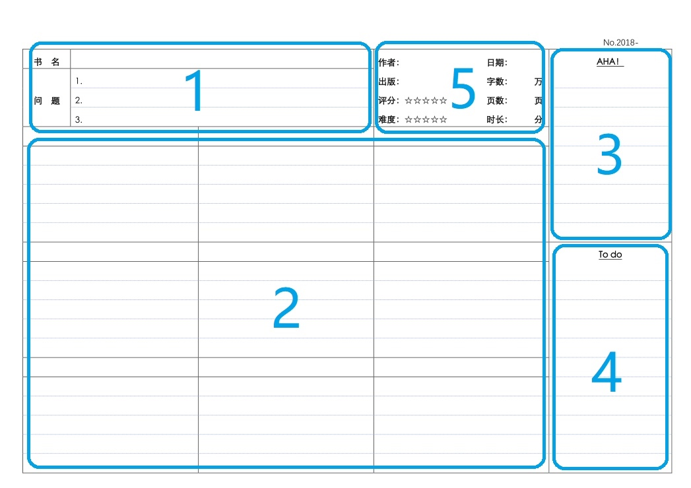
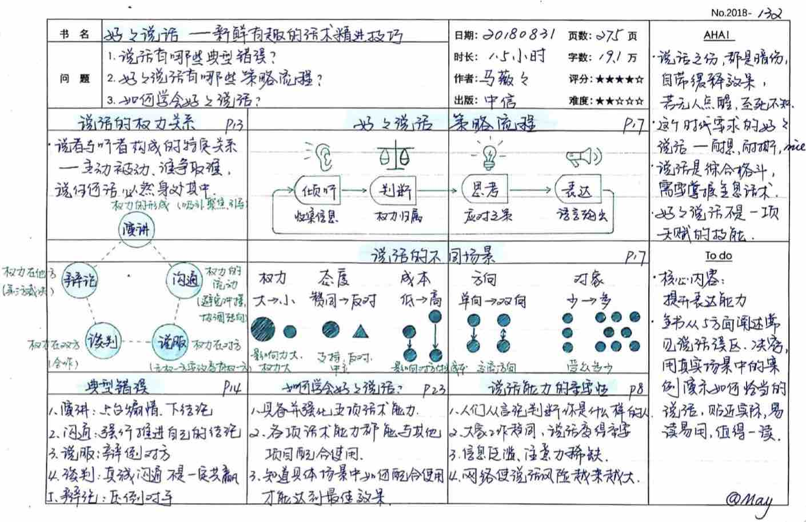
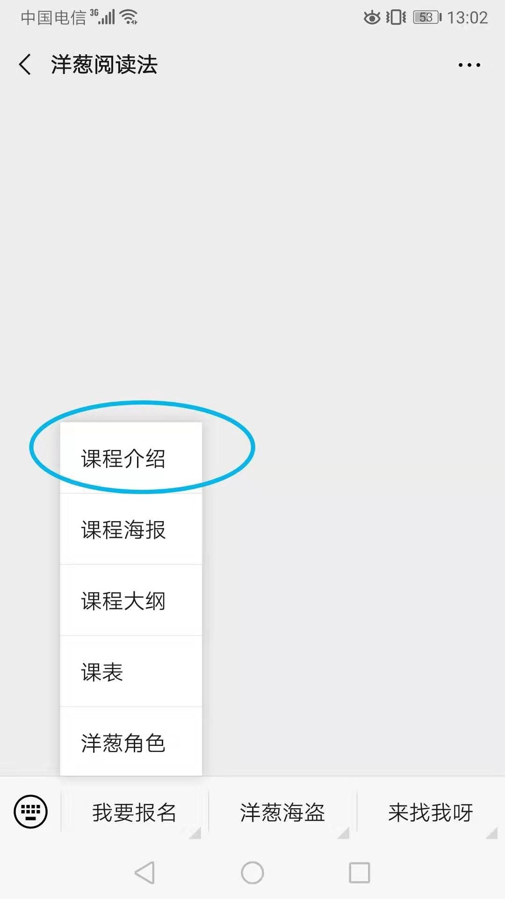
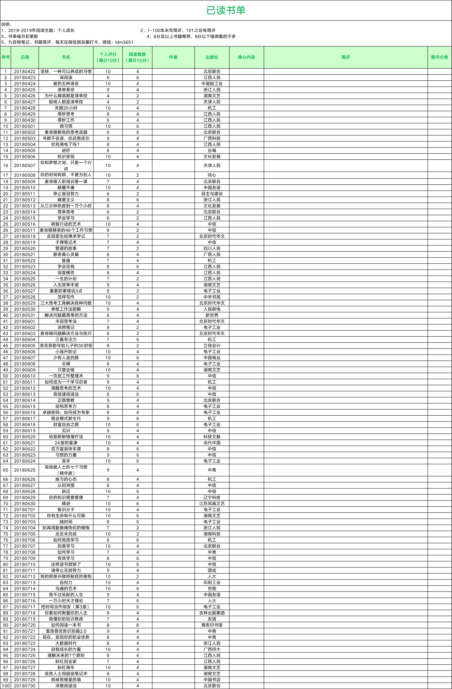
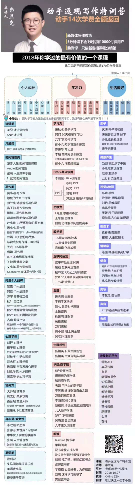
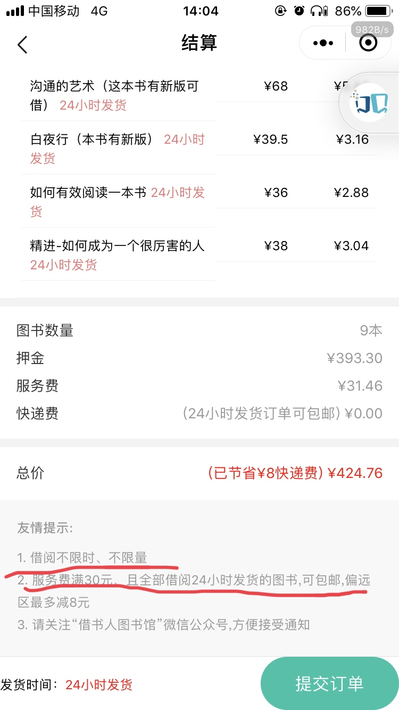
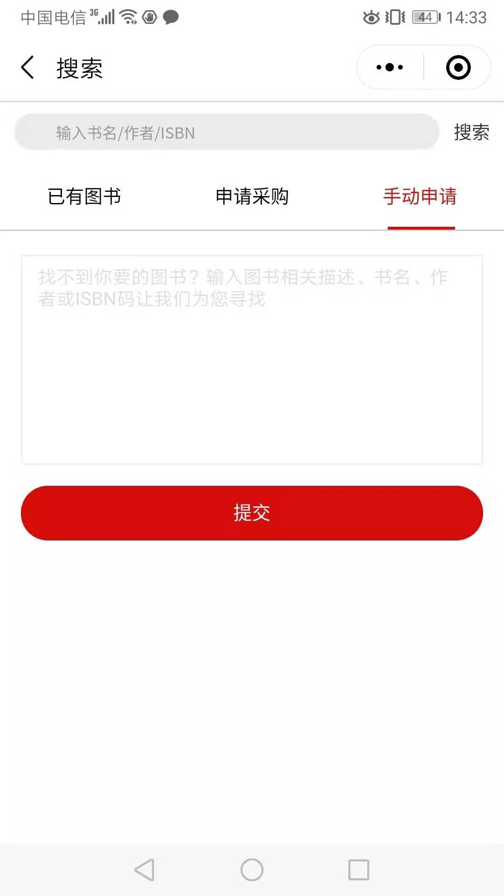
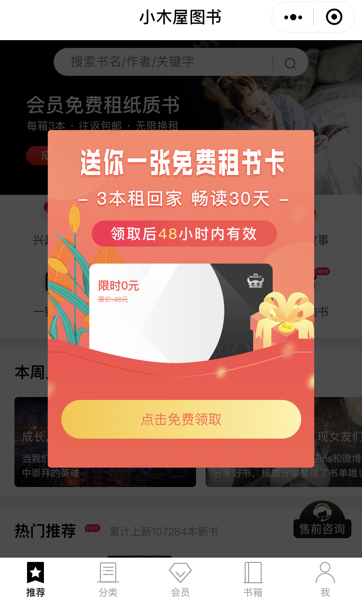
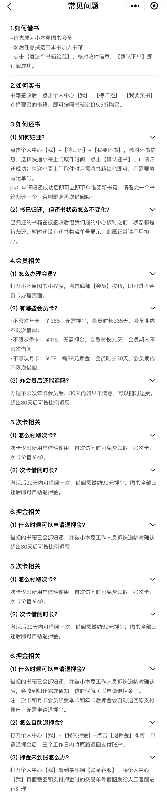

## 终身阅读者 May 的闭环读书方法

此文采用提问式向 May 请教阅读相关的问题，包含：选书，买书/借书，读书，笔记输出等方面的讨论和建议，值得细读研究，参考并摸索出自己的阅读方法。
May 很用心地回答了问题，并且对答案中仍有疑问的地方也进行了解惑，也引申出一些提问表单未提及的问题，两人进行交流讨论，由我进行整理成此文，再次感谢 May 的无私分享。

### 一、May 的 介绍

**May，从事金融行业，终身阅读者，每天一本书 + 一页笔记，连续495天，已读531本(20190830)。目标一生读10000本。**

连续4年用手帐进行时间管理。不断精进整理技能，践行断舍离。
近年重心：阅读、写作、知识变现。
其他关注领域：时间管理、收纳整理，培训，笔记侠。
下一步计划：学习读书笔记、知识卡片、思维导图这几个分支。
能提供的技能：1.阅读技能，2.时间管理，3.收纳整理。

### 二、QA列表

#### Q1：一生一万本想法是如何诞生的？让你坚持阅读的驱动力是什么？

1.一生一万本想法

20181231读到300本时，想在新的一年给自己立个更长远的目标。
刚好有同学提出一生争取读一万本，觉得这个想法很好，可以鞭策自己不停下阅读的脚步，就设为一生的目标。
只是目标，有待努力实现。要读的快，还要活得久，能否完成无法预知。

2.坚持阅读的动力

①兴趣——喜欢书，成为职业读书人，是多年的梦想
②成长——书里有一切问题的答案，能解决问题，让自己不断变好
③金钱——阅读变现

#### Q2：关于选书的您有什么建议？选好书后去什么渠道购买？

1.个人选书方法，也是建议

①最重要的是先想清楚：**自己为什么要读书？**
没想清楚，基本没可能坚持长期读下去。
然后**从个人需求出发选书**。以人为中心，不要以书为中心，`不建议照搬别人书单`。

②尽量先多读好书、经典。
读完会发现，同领域差一些的书都不必读了，或者快速翻阅，扫一下有没有新颖观点即可。可以节省很多时间。

③一本书能读进去、读完的基础：
这本书对自己有用的，或觉得有趣的，二者至少居其一。

④每年、每月定阅读主题，可以有效提高阅读效率、效果。

⑤具体选书参考：

★豆瓣8分以上
★各种课程老师、同学推荐
★读过的书中作者推荐
★大咖推荐
★亚马逊、豆瓣、出版机构的书籍排行榜和推荐书单
★公号【书单来了】

⑥选书流程
遇到好书随时记下书名（微信收藏为主）
→定期整理为《待读书单》文档
→近期想看的书批量借回
→按主题选书，列下个月书单

2.买书、借书渠道

①大部分书在微信公号【借书人图书馆】借阅。
②【小木屋图书】很多人说借书不错，不适合我，没有用过。
③急用，或者特别好的书，会买，去年大概只买了三十多本。
新书购买：京东、当当、淘宝。
二手书购买：多抓鱼、漫游鲸、孔夫子。

####  Q3：关于速读有什么建议？什么情况下才需要精读？

1.关于速读
个人所知速读有两种：

**①一目十行，甚至一眼一页**
只略有所知，没有专门练习过，所以不确定哪一种确实可行。
有很多书和培训班教方法，比如**东尼•博赞的《快速阅读》**，**保罗•R•席列的《高倍速阅读法》**。
**行动派PR阅读课**，讲《高倍速阅读法》的方法。
有些认识的同学听过PR，说如果听完认真足量练习，有效果，不练没用。多数人有进步，但程度因人而异。
我有计划去听一下。

**②运用二八法则，快速抓重点**
洋葱阅读课、王世民《学习力》讲的快速阅读，都是这个方法，大同小异。
简单流程见附件1，供参考。

最近一年多，我用的是方法②。
个人看法，阅读速度很重要，值得不断学习优秀的方法，提升阅读效率。
速读目的不只是快，是提升效能，读的又快又好。

2.关于精读
对自己有用的好书，值得反复深入去读。

问：速读应该避免回去看之前的内容，叫做：回读，出声读出来也会影响速度？
——回读这个行为是很影响速度，出声阅读这个有争议，不同专家有不同观点。我没有出声读的习惯，所以没有对比过速度。理论上，大部分人出声阅读和看，看的速度会更快。因为看是会有跳跃，猜字的，出声读，一个字都不能少。

问：如果一个概念，或者名词，很拗口，很难理解，你怎么处理这种情况？
——答：精读就多看几遍，多念叨几遍，速读，遇到它，知道是它就行了，不多纠结，所以没太刻意去解决这个问题。同类书读上几本，很多拗口的东西，会变得熟悉。

——回：有道理，很多同类的东西确实有很多共性，只需要读一份即可，最好是找到理论提出的源头书，其他的万变不离其宗。最近越发发现，学来学去都会遇到很多之前学过的词，概念，方法等，而且核心观点完全一样，只是不同的人做法不太一样，如：信息松鼠病(收集控)，知识管理……

——May回：是的。以前我读书很随性，只读自己喜欢的。读到一定数量 ，开始感觉有计划、有主题的读书很有必要。
从今年才开始，每月定主题，按计划选书读书。每个月，在一个细小的领域，可以更高效的积累。
连续读多本同类的书，越读发现重复的越多，读的轻松了。

#### Q4：我看您看完书后是输出到一张九宫格的纸上，这个纸有什么奥妙？

1.关于输出的笔记
是行动派，洋葱快速阅读法，**彭小六**老师的九宫格笔记，按自己习惯做了一点修改。
特点：简化笔记，减少压力，快速输出。

九宫格最重要三个区，是1、2、4：问题区、要点区、to do 区。

对应了学习的顺序：提出问题→解决问题→行动。

【个人建议】
★了解使用方法之后，先尝试用起来，很多问题在使用的过程中自己会找到答案，然后又会遇到新的问题，这很正常。
★九宫格只是一个笔记工具，不必想的太多太复杂。更不必拘泥于“一定要怎样用”。自己觉得怎样效果最好，就怎么用。
★每天读的书、写的九宫格笔记，都在微信朋友圈打卡。

**九宫格用途扩展**

- 精读笔记
- 主题阅读
- 听课笔记
- 备考笔记
- 收集资料
- 会议笔记

2.洋葱快速阅读法

课程名字：【洋葱阅读课】或【洋葱阅读法】

【快速阅读】是课程很多方法之一。其他还有深度阅读、主题阅读等等。
【九宫格】是课程很多工具之一。
【快速阅读】与【九宫格】，不是必须配套用。

【快速阅读】+ 其他笔记法 ✓
洋葱学员大部分用九宫格，少部分用思维导图。
【九宫格】+ 其他多种用途  ✓

##### 快速阅读法

分5个步骤：提问，预习，扫读，切重点，复习。

1.提问
拿到 一本书，先快速看一下封面、封底，想想自己读这本书，想了解什么，提出3个问题。

2.预习
带着问题读目录和序言、后记，了解一下全书结构和主要内容，判断一下3 个问题的答案大致在哪里。

3.扫读
快速把整本书翻一遍，重点关注段落开头结尾、大小标题、图表等。与3个问题相关内容、感兴趣内容，做标记。

4.切重点
再从头把做标记的地方逐一阅读，选9个重点概念、问题记入九宫格笔记（包括第一步3个问题的答案）。

5.复习
定期复习笔记，联系实际，学以致用。

以上步骤，一般半小时左右可以完成。

这是洋葱阅读课的方法之一，《洋葱阅读法》这本书里也有介绍，课程更细致一点。
课程介绍关注公号【洋葱阅读法】。

#### Q5：最推荐的5本书

推荐您觉得每个人都必读的5本书。此问题仅为建立一个待读书单。

1.个人觉得，读书是一件非常个性化的事，如同吃东西的口味，每个人需求、喜好都不同。
并不认为哪本书，是每个人都必须读的。
所以从不为别人列必读书单，觉得这事太主观了，意义不大。
如果是某个领域需要推荐书，会尽量把自己读过的好书多列一些，由阅读的人自己去挑选。

2.关于阅读，个人受益最多的书和课程，供参考：

①《小强升职记》
建立个人时间管理体系，简单照做，一本足矣。
时间管理对坚持阅读非常重要。

②《书都不会读 你还想成功》
可以学到如何建立长期阅读计划，用清晰的阅读规划助力自己成长；学到如何从不爱读书变为读书达人。
解决不爱读书、读到一定数量找不到方向的问题。

③《如何阅读一本书》
各种阅读方法的源头，阅读方法经典之作。
其他阅读方法书，大多是这本在具体方法上的扩展、延伸。

④《坚持，是一种可以养成的习惯》
习惯养成书很多，这本浅显好读，容易落地。

⑤《好好学习》
可以学到如何正确的学习、思考，提升学习效能；掌握底层思维的重要性。

⑥行动派：洋葱阅读课
重新思考阅读；学到多种实用工具和方法；开始持续大量阅读；找到知识变现之路。

3.每月初会对上个月学习情况复盘，发在朋友圈。
复盘中，会推荐上月个人觉得最好的5本书。有兴趣可参考。

4.建立了《已读书单》，每月底更新一次，包括难度、质量评分、简单书评。8分以上书，大多是好书、经典，可做为选书参考。

### 三、其他资料推荐

#### May读过的书单

请根据**自身需求**，以人选书。

#### 推荐一份网课清单

参加弗兰克写作训练营，请170位学员推荐自己学过的最有价值课程，这是汇总表，里面大部分是很不错的课程。

### 四、借书​平台

#### 借书人图书馆

以上为20190830测试结果，9本书，总押金400，服务费30，快递0元，选的都是24小时发货的书，供大家参考。

借书人图书馆收费规则：
1. 服务费满30元，24小时发货的书可以免邮费（国内大部分地区为8元），大概借9本左右服务费就可以满30元，上海寄到广东，一本的成本2.8-4元左右。
(标记“24小时发货”是有现货，一般当天或次日发货。
标记“3-5天发货”的，客户下订单后，借书人需要先采购、再发货。
如果数量不太多、没有不好采购的书，一般一周内能发货。
如果一次借书数量很多，比如几十本、上百本，会稍慢一些，一般两周内也会发出。)
2. 借书时长、数量不限，归还书籍时邮费自理，核实无问题返还押金。借书人目前不会因为图书破损扣费，由读者自愿支付磨损费。但多次出现会拉入黑名单，停止借书业务。
3. 如果感觉书很好，想留下，可以买相同正版新书归还，押金全退，等于先看后买。

疑问：
1. 借阅不限时的是吗？那就是看完借的书，然后自己出邮费全部一起寄回去对吧？
——不限时，可以一直在你这里放着。 什么时候想还了，随时快递回去即可，返回运费全部你负担。
无论时间长短，费用不变。
2. 可以画书吗？我喜欢把重点标记下，这样应该要扣钱 
——最好不画，阅读、保存、邮寄都尽量避免严重磨损。
借书人目前不会因为图书画线扣费，由读者自愿支付磨损费。但多次出现会拉入黑名单，停止借书业务。
同时，借书人的图书，就如同图书馆的书，归还后还会继续出借他人，所以尽量不画线、不影响他人阅读比较好。
3. 没有想要的书，会采购吗？
——没现货需要采购的，与有现货的书费用都一样。
先申请采购，如果同意，就能搜到这本书了，你想借时再下单，他们见到订单才会进行采购。
申请采购同意了，只是他们表示 以后可以买，不代表马上买，双方都没有成本。
是否借，你再决定就好，不借也没关系。

**已有图书**没有，到第二项搜，有，提交采购申请，没有，或提交不了，就到第三项**手动申请**，他们后台人工处理

#### 小木屋图书

总结如下：

1. 新用户，可以免费借，30天，3本(领取后48h有效)，押金99
2. 年卡：无押金，365块包365天，免费京东快递往返包邮，最快48小时到货，一个书箱可借3本，不限次，必须还旧的，借新的(箱子有容量才可再借)，30天内可退费，30后按比例退费。(季卡115，月卡59押金99)
3. 会员有专享读书会
4. 书到手后，可按定价的5.5折购买
5. 会员还书没有逾期，折损费
6. 所有押金都是全部书归还后，才可申请退还(升级季卡/年卡后押金自动原路返回)

### 五、总结

1. 选书方法 & 买书渠道
2. 速读和精读
3. 洋葱阅读法——快速阅读法
4. 洋葱阅读法——九宫格笔记
5. May的已读书单及经170人投票的课程列表
6. 借书平台介绍及规则